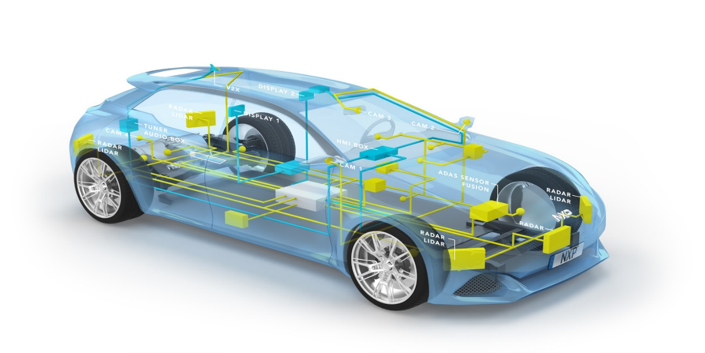
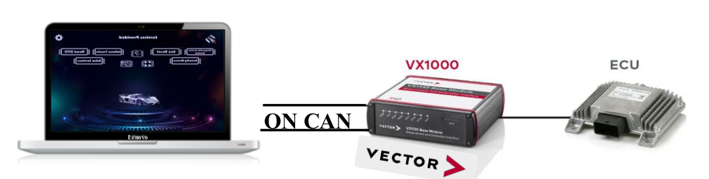
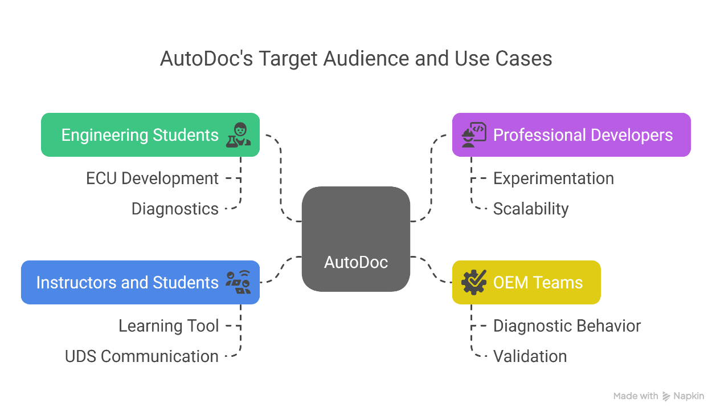
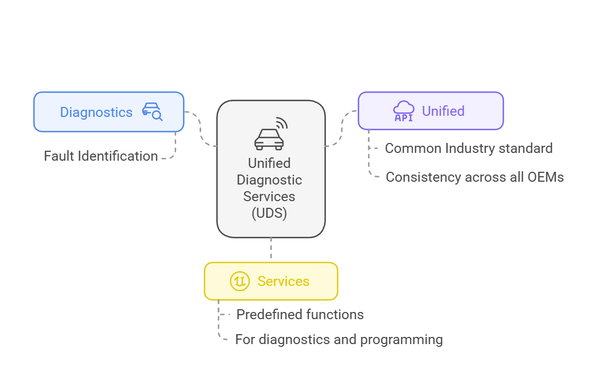
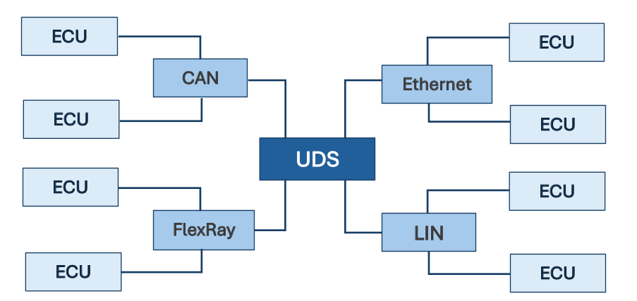
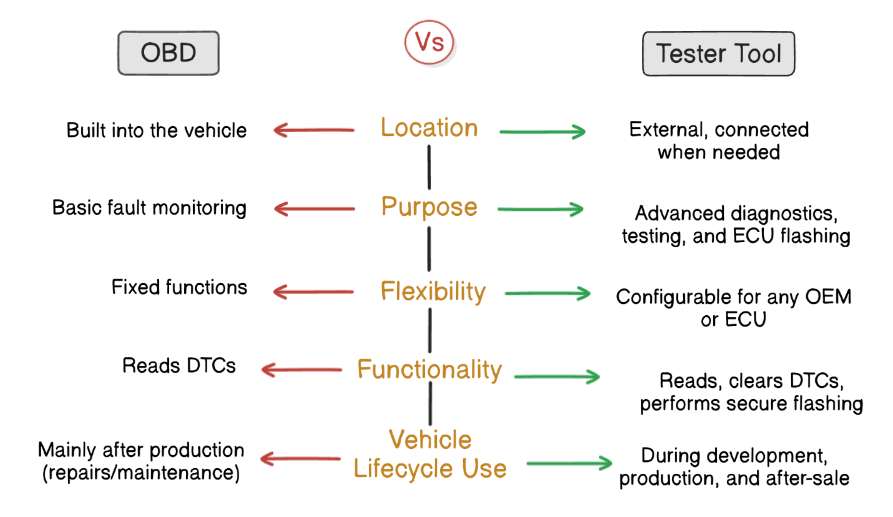
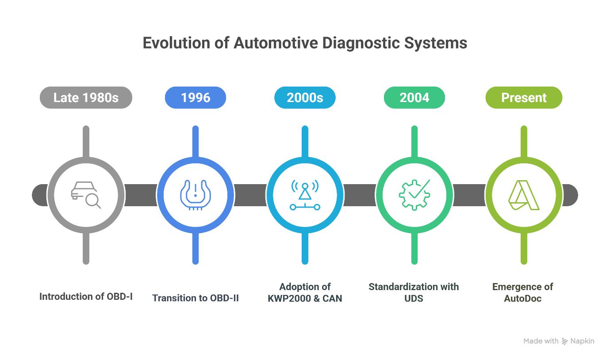

# Chapter 1: Introduction

> **Understanding Modern Automotive Diagnostics & The Need for XDT**

  
   
  <em>Figure 1: A visual representation of a modern vehicle's electronic architecture</em>

---

## 📌 Table of Contents

1. [Problem Definition](#11-problem-definition)
2. [Goal of Our Project](#12-goal-of-our-project)
3. [Target Audience](#13-target-audience-of-our-tool)
4. [Definition of UDS](#14-definition-of-uds)
5. [Communication vs Diagnostic Protocols](#15-difference-between-communication-and-diagnostic-protocols)
6. [UDS and Communication Protocols](#16-uds-and-communication-protocols)
7. [OBD vs Tester Tools](#17-obd-vs-tester-tools)
8. [Literature Review](#18-literature-review)

---

## 1.1. Problem Definition

Modern vehicles may appear simple from the outside, but beneath their sleek surfaces lies a complex ecosystem of **over 100 Electronic Control Units (ECUs)** working together to control every aspect of the car — from braking and power management to infotainment.

### The Challenge

- ECUs communicate through standardized protocols, not in plain language, but via **sessions, hex codes, and diagnostic services**
- When something goes wrong, a car doesn't describe the problem — it stores **Diagnostic Trouble Codes (DTCs)**
- Traditional diagnostic tools often fall short: they may retrieve fault codes but lack **flexibility, modularity, and adaptability** across different OEMs
- Identifying root causes requires navigating through **layers of communication protocols, timing constraints, and session handling logic**

### Our Vision

> Create a **smarter, modular UDS tester tool** — one that not only speaks the vehicle's diagnostic language but redefines how engineers interact with it.

---

## 1.2. Goal of Our Project

### XDT: eXpert Diagnostic Tool

**XDT** is an advanced vehicle diagnostic tool designed to communicate directly with a vehicle's ECUs and decode their internal status messages. It serves as a **real-time translator** between vehicle fault codes and human-readable information.

### Core Objectives

| Objective                   | Description                                                  |
| --------------------------- | ------------------------------------------------------------ |
| **Universal Compatibility** | Speak UDS — the industry standard for diagnostic communication |
| **Modular Architecture**    | Open, scalable design supporting deep configurability        |
| **OEM Adaptability**        | Seamless adaptation to different vehicle brands and configurations |
| **User-Friendly GUI**       | Modern, intuitive interface with clear visual feedback       |
| **Future-Ready**            | Support for AI integration, cloud connectivity, and protocol expansion |

  
   
  <em>Figure 2: Real XDT Tool Setup connecting laptop to ECU via VX1000 on CAN</em>

---

## 1.3. Target Audience of Our Tool

XDT is designed for anyone who needs to dive deep into a vehicle's electronic systems:

  
   
  <em>Figure 3: Target audiences of XDT</em>

### Primary Users

| Audience                    | Use Case                                           |
| --------------------------- | -------------------------------------------------- |
| **Engineering Students**    | ECU Development, Diagnostics, Learning UDS         |
| **Professional Developers** | Experimentation, Scalability, Tool Development     |
| **Instructors & Students**  | Learning Tool for UDS Communication                |
| **OEM Teams**               | Diagnostic Behavior Validation, Production Testing |

> **Key Advantage**: Not locked behind vendor-specific designs or limited use cases. If you want to understand, simulate, or interact with ECUs, XDT gives you the freedom to do it.

---

## 1.4. Definition of UDS

**UDS (Unified Diagnostic Services)** is a global standard providing a structured, standardized method for communicating with vehicle ECUs. It is the foundation for modern automotive diagnostics.

  
   
  <em>Figure 4: Definition of UDS — Unified, Diagnostic, Services</em>

### Breaking Down UDS

| Word           | Meaning                                                      |
| -------------- | ------------------------------------------------------------ |
| **Unified**    | Standardization across all vehicle systems and manufacturers — one interface, promoting interoperability |
| **Diagnostic** | Monitor system behavior, detect faults, retrieve DTCs, perform checks |
| **Services**   | Defined request-response operations (e.g., reading data, clearing faults, ECU programming) |

### Why UDS Matters

UDS forms the **communication backbone** between the diagnostic tester and the complex network of ECUs inside modern vehicles. It enables:

- Fault detection and reporting
- ECU programming and flashing
- Session control and security management
- Real-time data monitoring and calibration

---

## 1.5. Difference Between Communication and Diagnostic Protocols

Understanding how UDS works requires differentiating between two key protocol types:

| Type                        | Purpose                                                    | Examples                    |
| --------------------------- | ---------------------------------------------------------- | --------------------------- |
| **Communication Protocols** | Transfer data between microcontrollers or ECU and computer | CAN, LIN, FlexRay, Ethernet |
| **Diagnostic Protocols**    | Identify and resolve faults within ECUs                    | UDS (ISO 14229), OBD-II     |

> UDS is a **diagnostic protocol** that relies on **communication protocols** to transfer diagnostic data.

---

## 1.6. UDS and Communication Protocols

While UDS is a diagnostic protocol, it operates over multiple communication interfaces:

  
   
  <em>Figure 5: UDS connecting ECUs through different communication interfaces</em>

### Supported Communication Buses

| Protocol     | Characteristics                         | Use Case                               |
| ------------ | --------------------------------------- | -------------------------------------- |
| **CAN**      | High reliability, real-time performance | Most widely used vehicle communication |
| **LIN**      | Low-speed, cost-effective               | Window/seat controls                   |
| **FlexRay**  | High-speed, deterministic               | Brake-by-wire, drive-by-wire           |
| **Ethernet** | High bandwidth, rapid transfer          | Autonomous and connected vehicles      |

> UDS serves as a **universal solution** for diagnosing different vehicle architectures regardless of the underlying bus.

---

## 1.7. OBD vs Tester Tools

### On-Board Diagnostics (OBD)

- **Built into the vehicle** — continuously monitors health
- **Basic fault monitoring** — detects engine faults, emission issues
- **Fixed functions** — limited to standard checks
- **Reads DTCs** — passive data collection
- **Used after production** — repairs and maintenance

### XDT (Off-Board Tester Tool)

  
   
  <em>Figure 6: Comparison Between OBD and XDT Tools Across Key Diagnostic Aspects</em>

| Aspect                | OBD                     | XDT (Tester Tool)                              |
| --------------------- | ----------------------- | ---------------------------------------------- |
| **Location**          | Built into vehicle      | External, connected when needed                |
| **Purpose**           | Basic fault monitoring  | Advanced diagnostics, testing, ECU flashing    |
| **Flexibility**       | Fixed functions         | Configurable for any OEM or ECU                |
| **Functionality**     | Reads DTCs              | Reads, clears DTCs, performs secure flashing   |
| **Vehicle Lifecycle** | Mainly after production | During development, production, and after-sale |

> **XDT goes far beyond basic fault detection**: secure ECU flashing, advanced testing, session simulation, and diagnostics during manufacturing and after-sales.

---

## 1.8. Literature Review

### The Evolution of Automotive Diagnostics

  
   
  <em>Figure 7: Evolution of Automotive Diagnostics — From OBD-I to XDT</em>

### Historical Timeline

| Era            | Milestone                            | Significance                                      |
| -------------- | ------------------------------------ | ------------------------------------------------- |
| **Late 1980s** | Introduction of OBD-I                | First step toward standardized diagnostics        |
| **1996**       | Transition to OBD-II                 | One connector, one set of codes, universal access |
| **2000s**      | Adoption of KWP2000 & CAN            | More detailed and reliable communication          |
| **2004**       | Standardization with UDS (ISO 14229) | Unified, powerful, flexible diagnostic framework  |
| **Present**    | Emergence of XDT                     | Next-generation intelligent diagnostic platform   |

### Why UDS Won

- **Standardized as ISO 14229 in 2004**
- Handles everything from diagnostics and security to ECU programming
- **Backbone of vehicle communication worldwide**
- Enables tools like XDT to exist as vendor-independent solutions

---

## 🔗 Next Section

➡️ **[Chapter 2: Project Overview](../02-Project-Overview/README.md)** — System architecture, objectives, and layer breakdown

---

  © 2025 Cairo University — Faculty of Engineering. All rights reserved.

