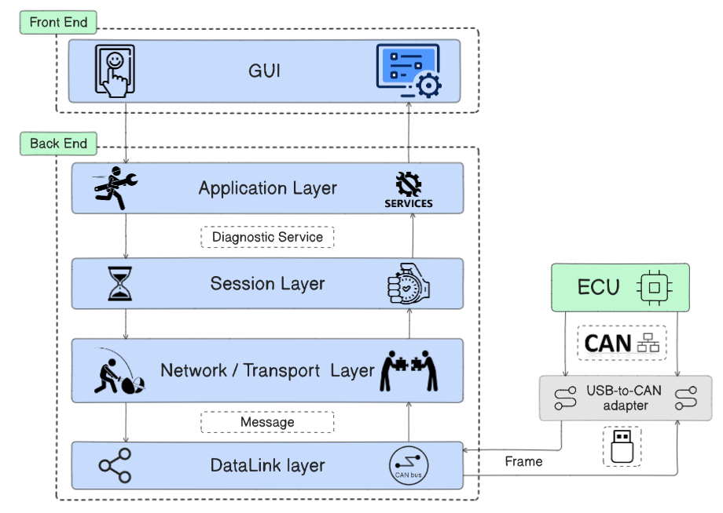
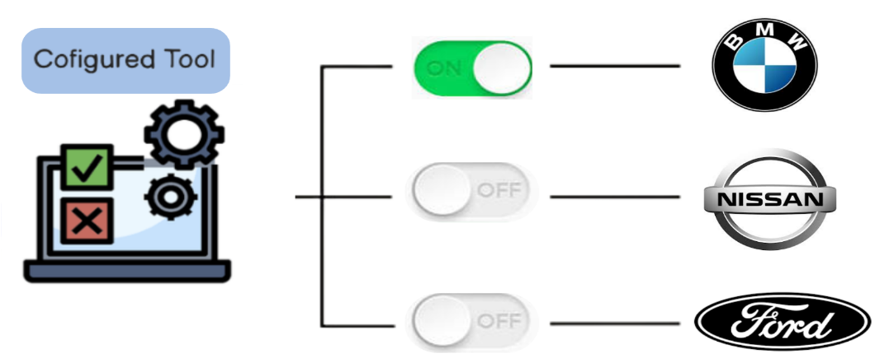
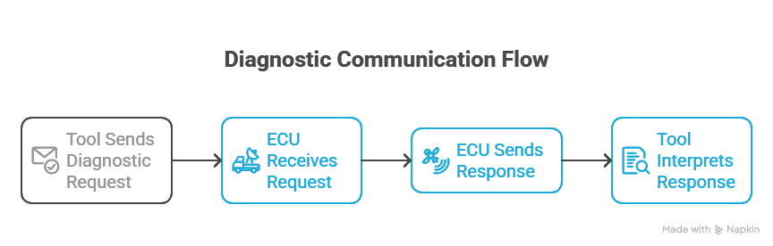
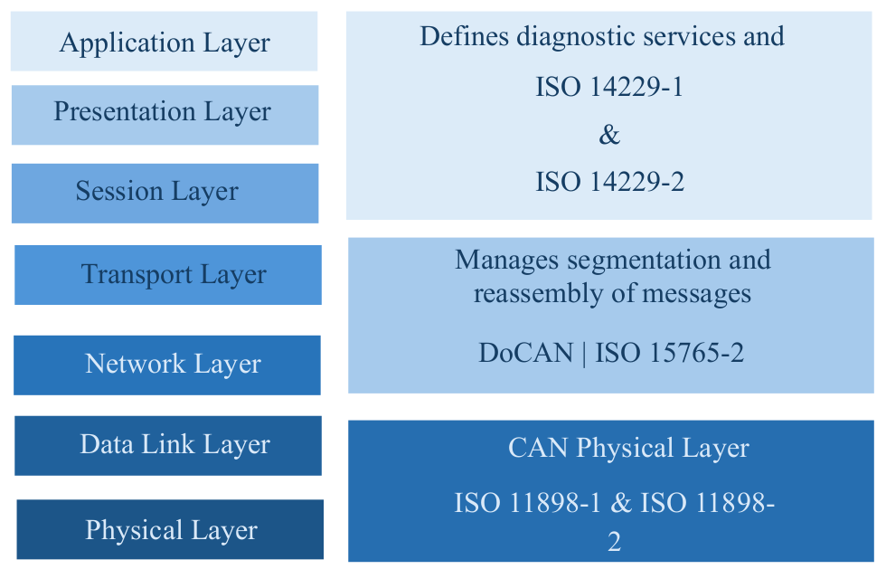
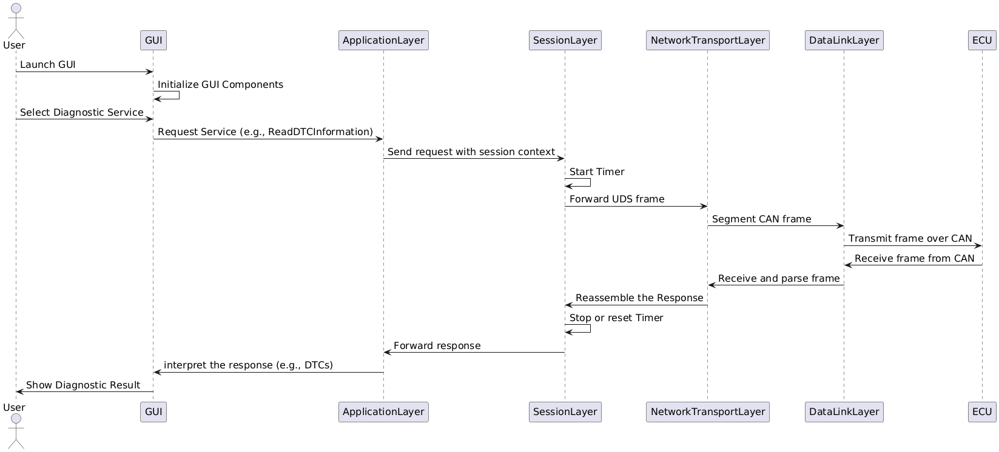
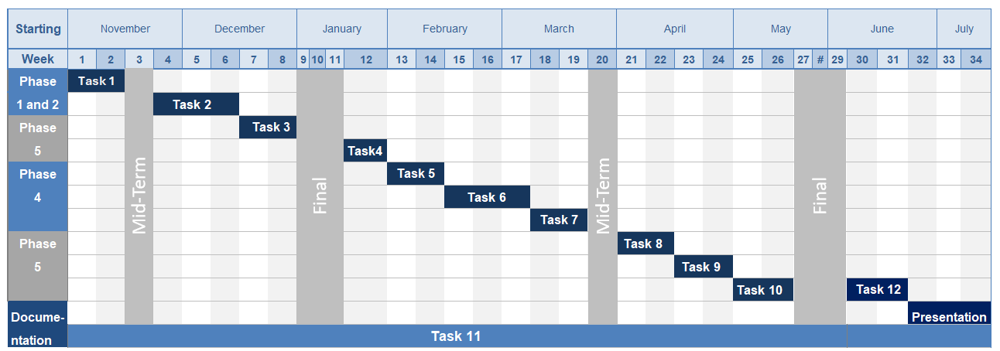
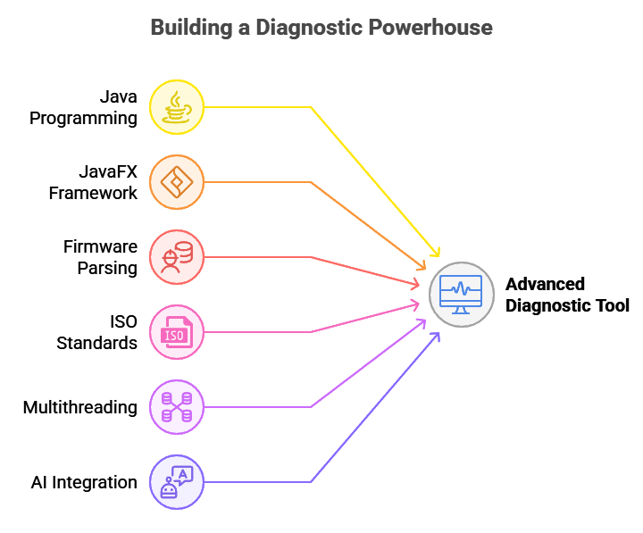
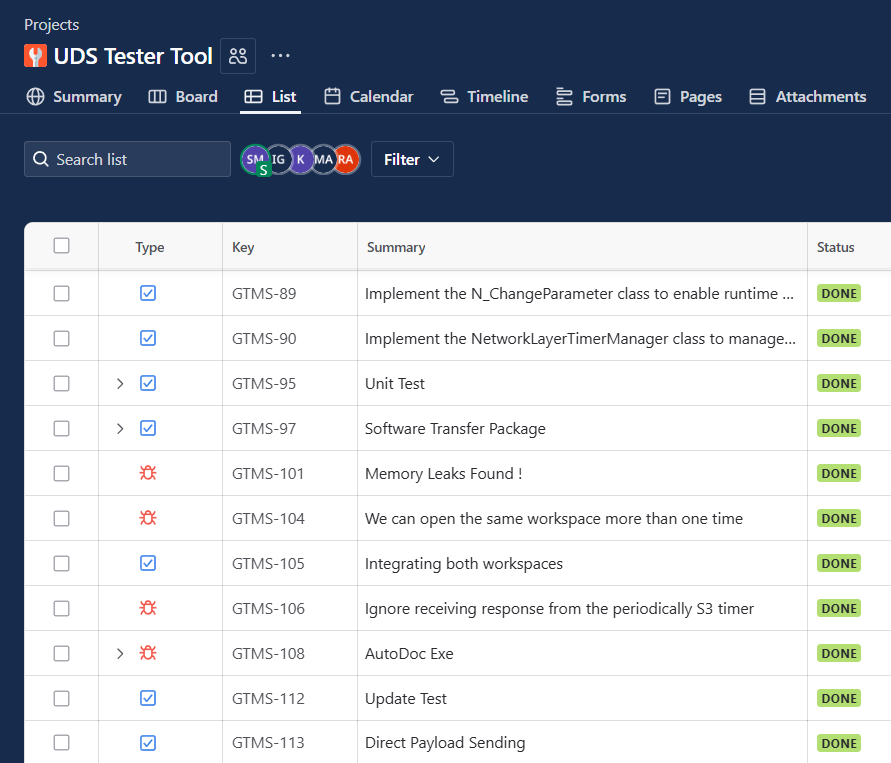
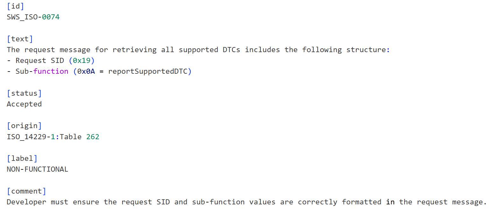
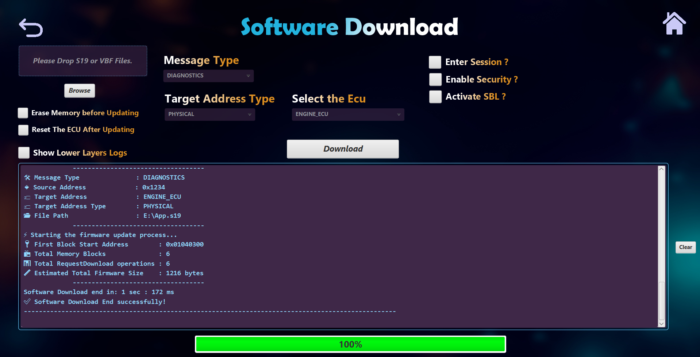

# Chapter 2: Project Overview

> **System Architecture, Objectives, and Technical Foundation**

<p align="center">
  
  <br/>
  <em>Figure 9: High-level block diagram outlining the major components of the XDT project</em>
</p>


---

## 📌 Table of Contents

1. [Project Objectives](#21-project-objectives)
2. [Project Layered Architecture](#22-project-layered-architecture)
3. [System Components and Roles](#23-breakdown-of-system-components-and-their-roles)
4. [Applied Standards](#24-applied-standards-in-our-system-architecture)
5. [Mapping ISO to OSI](#25-mapping-iso-standards-to-osi-layers)
6. [System Workflow](#26-system-workflow-through-sequence-diagram)
7. [Project Timeline](#27-project-timeline-and-phase-breakdown)
8. [Technical Background](#28-technical-background)
9. [Requirement Analysis](#29-requirement-analysis)
10. [Real Example](#210-real-example-from-our-tester-tool)

---

## 2.1. Project Objectives

The UDS (Unified Diagnostic Services) protocol provides the technical foundation for modern automotive diagnostics. XDT leverages this foundation to build something more flexible, intelligent, and developer-friendly.

### Why UDS Was the Right Choice

| Feature                       | How It Enabled XDT                                           |
| ----------------------------- | ------------------------------------------------------------ |
| **Universal Compatibility**   | Single tool talks to many different brands — a universal diagnostic language |
| **Flexible Access & Control** | Multiple diagnostic sessions from simple sensor reading to advanced ECU programming |
| **Multi-Protocol Support**    | Works with CAN, Ethernet (DoIP), FlexRay, LIN — one tool for many architectures |
| **Custom Configuration**      | Modular design allowing developers to add configurations, custom data sets, and features |
| **Smart Fault Handling**      | Standardized negative response codes (NRCs) for clear error diagnosis |

<p align="center">
  
  <br/>
  <em>Figure 8: Vendor-independent tester tool — configurable for any OEM</em>
</p>


---

## 2.2. Project Layered Architecture

XDT adopts a **modular architecture based on the OSI (Open Systems Interconnection) model**, providing clear separation of concerns across communication layers.

### Architecture Benefits

- **Modularity**: Each layer developed, tested, and maintained independently
- **Scalability**: System grows as vehicles become more complex
- **Collaboration**: Better task delegation and timely project execution
- **Adaptability**: Easy adaptation to various communication setups

### Layer Stack

```
┌─────────────────────────────────────────┐
│  Layer 7: Application Layer (ISO 14229-1) │  ← UDS Services
│  - Diagnostic Session Control (0x10)      │
│  - ECU Reset (0x11)                       │
│  - Security Access (0x27)                 │
│  - Read/Write Data By Identifier          │
│  - Routine Control (0x31)                 │
│  - Transfer Data (0x34-0x37)              │
├─────────────────────────────────────────┤
│  Layer 5: Session Layer (ISO 14229-2)     │  ← Timing Management
│  - P2/P2* Server/Client timers           │
│  - P3 Client timers                       │
│  - S3 Server/Client session keep-alive    │
│  - NRC 0x78 (Response Pending) handling    │
├─────────────────────────────────────────┤
│  Layer 4/3: Transport/Network (ISO 15765-2)│  ← DoCAN Protocol
│  - Segmentation & Reassembly             │
│  - Flow Control (FC) management           │
│  - Single Frame (SF) / Multi-Frame (FF/CF) │
├─────────────────────────────────────────┤
│  Layer 2/1: Data Link & Physical (ISO 11898)│  ← CAN Bus
│  - USB-to-CAN adapter integration         │
│  - Frame transmission/reception           │
│  - Classical CAN & CAN FD support        │
└─────────────────────────────────────────┘
```

---

## 2.3. Breakdown of System Components and Their Roles

### a. GUI (Graphical User Interface)

- **Purpose**: User-friendly front end making the system accessible without deep technical knowledge
- **Key Goals**: Simplify configuration, provide clear visual feedback, support different OEM requirements
- **Technology**: JavaFX with FXML and SceneBuilder
- **Standard**: Usability principles and creative design (no formal standard)

### b. Application Layer

- **Purpose**: Core functionality implementing all UDS services
- **Responsibilities**:
  - Construct valid diagnostic requests per ISO 14229-1
  - Parse received responses (positive and negative)
  - Communicate with GUI to display readable data
- **Standard**: ISO 14229-1

<p align="center">
  
  <br/>
  <em>Figure 10: Simple overview of diagnostic communication flow</em>
</p>


### c. Session Layer

- **Purpose**: Manage diagnostic communication timing to prevent blocking conditions
- **Responsibilities**:
  - Enforce timeout mechanisms (P2, P2*, P3, S3 timers)
  - Handle NRC 0x78 (Response Pending) extensions
  - Maintain session state across non-default sessions
- **Standard**: ISO 14229-2

### d. Network / Transport Layer (DoCAN)

- **Purpose**: Abstract physical communication medium limitations from the application layer
- **Responsibilities**:
  - Message segmentation for payloads exceeding CAN frame size
  - Message reassembly from received frames
  - Flow control management (BS, STmin)
- **Standard**: ISO 15765-2

### e. Data Link Layer

- **Purpose**: Interface between desktop tool and vehicle's CAN bus
- **Implementation**: USB-to-CAN adapter with open-source driver integration
- **Standard**: ISO 11898 (CAN protocol)

---

## 2.4. Applied Standards in Our System Architecture

### Why Standards Matter

Modern vehicles are complex systems made by different manufacturers. Despite diversity, they all need to communicate consistently. ISO standards provide the common ground connecting our tool with any compliant ECU.

### Why ISO?

- ISO 14229 (UDS) and ISO 15765 (CAN transport) define exactly how diagnostic services should be structured and transmitted
- Widely adopted by OEMs and Tier-1 suppliers
- Most reliable foundation for building a universal diagnostic tool

### How XDT Applies Standards

1. **Compatibility**: Works with multiple vehicles and ECUs without modification
2. **Safety**: Communicates safely during testing or flashing
3. **Usability**: Engineers and testers can rely on predictable behavior

---

## 2.5. Mapping ISO Standards to OSI Layers

<p align="center">
  
  <br/>
  <em>Figure 11: Visual mapping of automotive diagnostic standards to OSI layers</em>
</p>


### Layer Mapping Table

| OSI Layer                  | ISO Standard              | Purpose                                                   |
| -------------------------- | ------------------------- | --------------------------------------------------------- |
| **Application (Layer 7)**  | ISO 14229-1               | Defines diagnostic services (read DTCs, firmware updates) |
| **Presentation (Layer 6)** | ISO 14229-1 / ISO 14229-2 | Data formatting and session services                      |
| **Session (Layer 5)**      | ISO 14229-2               | Session management and timing control                     |
| **Transport (Layer 4)**    | ISO 15765-2               | Segmentation and reassembly of messages                   |
| **Network (Layer 3)**      | ISO 15765-2               | Message routing and addressing                            |
| **Data Link (Layer 2)**    | ISO 11898-1               | CAN frame transmission and error detection                |
| **Physical (Layer 1)**     | ISO 11898-2               | Physical signaling over CAN bus                           |

---

## 2.6. System Workflow Through Sequence Diagram

<p align="center">
  
  <br/>
  <em>Figure 12: Sequence diagram illustrating request and response flow across layers</em>
</p>


### Communication Flow

1. **User** launches GUI and selects a diagnostic service
2. **GUI** sends request to Application Layer
3. **Application Layer** constructs UDS request and passes to Session Layer
4. **Session Layer** starts P2Client timer and forwards to Network/Transport Layer
5. **Network/Transport Layer** segments message (if needed) and passes to Data Link Layer
6. **Data Link Layer** transmits CAN frames over USB-to-CAN adapter
7. **ECU** receives, processes, and sends response
8. **Response flows back** through all layers in reverse order
9. **Session Layer** stops timer and validates timing
10. **Application Layer** parses response and sends to GUI
11. **GUI** displays diagnostic result to user

---

## 2.7. Project Timeline and Phase Breakdown

<p align="center">
  
  <br/>
  <em>Figure 13: Project timeline with task breakdown across 8 months</em>
</p>


### Development Phases

| Phase       | Period  | Focus                 | Key Tasks                                                  |
| ----------- | ------- | --------------------- | ---------------------------------------------------------- |
| **Phase 1** | Nov–Dec | Learning              | UDS protocol, automotive diagnostics, tools                |
| **Phase 2** | Dec–Jan | Requirements          | Feature definition, functional/non-functional requirements |
| **Phase 3** | Jan–Feb | Architecture          | Modular design, ISO compliance, scalability                |
| **Phase 4** | Feb–Apr | Implementation        | Layer-by-layer development, UDS services                   |
| **Phase 5** | Apr–Jun | Integration & Testing | Component integration, usability testing, optimization     |

> **Note**: Optimization, enhancement, and documentation were continuous throughout all phases.

---

## 2.8. Technical Background

<p align="center">
  
  <br/>
  <em>Figure 14: Technical background needed for the XDT project</em>
</p>


### Core Competencies

| Area                  | Why It Matters                             | Technology                               |
| --------------------- | ------------------------------------------ | ---------------------------------------- |
| **ISO Standards**     | Proper ECU communication                   | ISO 14229-1, ISO 14229-2, ISO 15765-2    |
| **Java & JavaFX**     | OOP for layered architecture, modern GUI   | Java, JavaFX, FXML                       |
| **Firmware Parsing**  | ECU flashing capability                    | S19, VBF file formats                    |
| **XML Configuration** | Multi-vehicle support without code changes | Custom XML schemas                       |
| **AI Integration**    | Intelligent diagnostic assistance          | AI Copilot features                      |
| **Multithreading**    | Responsive UI during long operations       | Java concurrency                         |
| **OOP Principles**    | Clean, reusable, maintainable code         | Inheritance, polymorphism, encapsulation |

### Development Tools

<p align="center">
  
  <br/>
  <em>Figure 15: Real screenshot from our Jira board showing task tracking</em>
</p>


- **Jira**: Task tracking and sprint planning
- **Bitbucket**: Team collaboration and code review
- **Git**: Version control

---

## 2.9. Requirement Analysis

### R-File Structure

Instead of working directly with hundreds of pages from ISO standards, XDT simplifies the process by extracting each important rule into a **Requirement File (R-file)**.

<p align="center">
  
  <br/>
  <em>Figure 16: Structure of a requirement (R) file used in our implementation</em>
</p>


### R-File Components

| Field       | Description               | Example                                                      |
| ----------- | ------------------------- | ------------------------------------------------------------ |
| **id**      | Unique identifier         | `SWS_ISO-0074`                                               |
| **text**    | Actual rule from standard | "Request message must include SID = 0x19 and sub-function = 0x0A" |
| **status**  | Implementation status     | Accepted / Rejected                                          |
| **origin**  | Source in ISO document    | "ISO_14229-1 : Table 262"                                    |
| **label**   | Requirement type          | Functional / Non-functional                                  |
| **comment** | Developer notes           | "Ensure correct formatting in request message"               |

---

## 2.10. Real Example from Our Tester Tool

### Scenario: Diagnosing and Fixing an ECU Fault

**Step 1: Request DTC Information**

- Service: `0x19` (Read DTC Information)
- Subfunction: `0x02` (Report by Status Mask)
- DTC Status Mask: `0xFF` (return all possible DTCs)

**ECU Response:**

- DTC Record 1: `0x012345`, Status: `0x08`
- DTC Record 2: `0x023456`, Status: `0x08`

**Interpretation:** Two real, detectable problems stored in the ECU memory. XDT successfully communicated, filtered results, and provided exactly what was requested.

**Step 2: Firmware Update**

- Identified issue as software-related
- Used XDT to download new firmware to the ECU

<p align="center">
  
  <br/>
  <em>Figure 17: XDT performing software download to the ECU as part of issue resolution</em>
</p>


> **Key Takeaway**: XDT doesn't just read data — it fixes problems through structured firmware updates.

---

## 🔗 Navigation

⬅️ **[Chapter 1: Introduction](../01-Introduction/README.md)** — Project motivation and UDS fundamentals  
➡️ **[Chapter 3: Application Layer](../03-Application-Layer/README.md)** — UDS services implementation details

---

<p align="center">
  <sub>© 2025 Cairo University — Faculty of Engineering. All rights reserved.</sub>
</p>

