# Chapter 3: Application Layer

> **UDS Services Implementation (ISO 14229-1)**

<p align="center">
  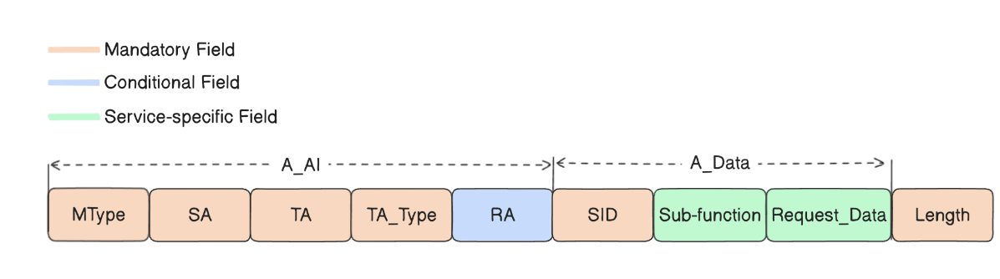
  <br/>
  <em>Figure 18: General application layer request payload structure</em>
</p>


---

## 📌 Table of Contents

1. [General Parameter Definitions](#31-general-parameter-definitions)
2. [Diagnostic Management Functional Unit](#32-diagnostic-management-functional-unit)
3. [Data Transmission Functional Unit](#33-data-transmission-functional-unit)
4. [Stored Data and Routine Functional Unit](#34-stored-data-and-routine-functional-unit)
5. [Upload Download Functional Unit](#35-upload-download-functional-unit)

---

## 3.1. General Parameter Definitions

The application layer services in UDS define a structured communication model between the diagnostic tester (client) and the ECU (server).

### General Application Layer Parameters

| Parameter     | Description                  | Possible Values                  |
| ------------- | ---------------------------- | -------------------------------- |
| **A_MType**   | Application message type     | Diagnostics / Remote Diagnostics |
| **A_SA**      | Source Address               | 2 bytes                          |
| **A_TA**      | Target Address               | 2 bytes                          |
| **A_TA_Type** | Target address type          | Physical / Functional            |
| **A_AE**      | Address Extension (optional) | 2 bytes                          |
| **A_Length**  | Total data length            | 4 bytes                          |
| **A_Data**    | Data payload                 | N bytes                          |

### Addressing Types

- **Physical (A_TA_Type = Physical)**: Point-to-point communication with a specific ECU
- **Functional (A_TA_Type = Functional)**: Broadcast communication to multiple ECUs

### Suppress Positive Response (SPRIB)

Bit 7 of the sub-function byte controls whether the ECU sends a positive response:

- **SPRIB = 0**: Positive response required (default)
- **SPRIB = 1**: Positive response suppressed (reduces bus traffic)

> Negative responses are always sent when errors occur, regardless of SPRIB.

### Response Message Structure

<p align="center">
  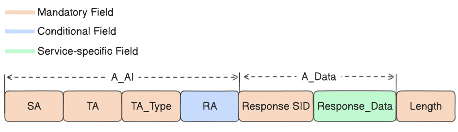
  <br/>
  <em>Figure 19: General application layer response payload structure</em>
</p>


#### Positive Response

- Response SID = Request SID + 0x40
- Example: Request SID `0x10` → Response SID `0x50`

#### Negative Response

- Response SID = 0x7F (always)
- Format: `[0x7F] [Request SID] [NRC]`
- Total length: 3 bytes

### Common Negative Response Codes (NRCs)

| NRC  | Meaning                    | Description                                                  |
| ---- | -------------------------- | ------------------------------------------------------------ |
| 0x10 | General Reject             | General service rejection                                    |
| 0x11 | Service Not Supported      | Requested service not implemented                            |
| 0x12 | Sub-function Not Supported | Sub-function not supported                                   |
| 0x13 | Incorrect Message Length   | Invalid message length or format                             |
| 0x22 | Conditions Not Correct     | Request message correct but current conditions prevent execution |
| 0x31 | Request Out Of Range       | Parameter value outside allowed range                        |
| 0x33 | Security Access Denied     | Security check failed                                        |
| 0x35 | Invalid Key                | Key sent in Security Access is invalid                       |
| 0x36 | Exceed Number Of Attempts  | Too many failed security attempts                            |
| 0x78 | Response Pending           | Request correctly received, response will be sent later      |

---

## 3.2. Diagnostic Management Functional Unit

### 3.2.1. Diagnostic Session Control (0x10)

Manages and transitions between diagnostic modes within an ECU.

#### Diagnostic Session Types

| Sub-Function | Session Type                     | Description                                         |
| ------------ | -------------------------------- | --------------------------------------------------- |
| 0x01         | Default Session                  | Initial mode, limited access, no timeout            |
| 0x02         | Programming Session              | For firmware updates, requires security access      |
| 0x03         | Extended Diagnostic Session      | Advanced diagnostics, DTC reading, actuator testing |
| 0x04         | Safety System Diagnostic Session | Safety-critical systems (airbags, ABS, ADAS)        |
| 0x40–0x7E    | Vehicle Manufacturer Specific    | Custom sessions for proprietary testing             |

#### Session Transition Diagram

<p align="center">
  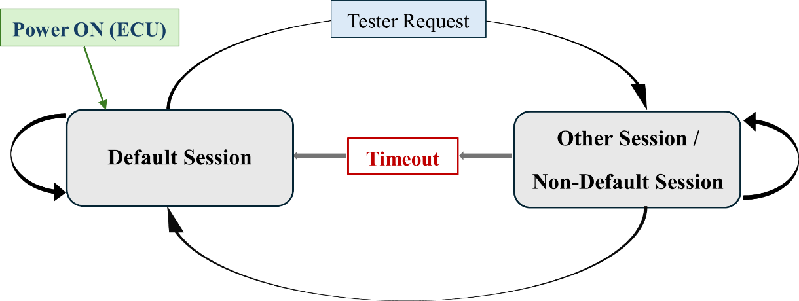
  <br/>
  <em>Figure 20: Diagnostic session transition diagram</em>
</p>


#### Supported Services in Default Session

| Service                                   | Restrictions                    |
| ----------------------------------------- | ------------------------------- |
| Diagnostic Session Control (0x10)         | Full access                     |
| ECU Reset (0x11)                          | Full access                     |
| Tester Present (0x3E)                     | Full access                     |
| Dynamically Define Data Identifier (0x2C) | Full access                     |
| Read DTC Information (0x19)               | Full access                     |
| Read Data By Identifier (0x22)            | Only unsecured DIDs             |
| Write Data By Identifier (0x2E)           | Not allowed                     |
| Routine Control (0x31)                    | Only unsecured, simple routines |

#### Message Flow Example

<p align="center">
  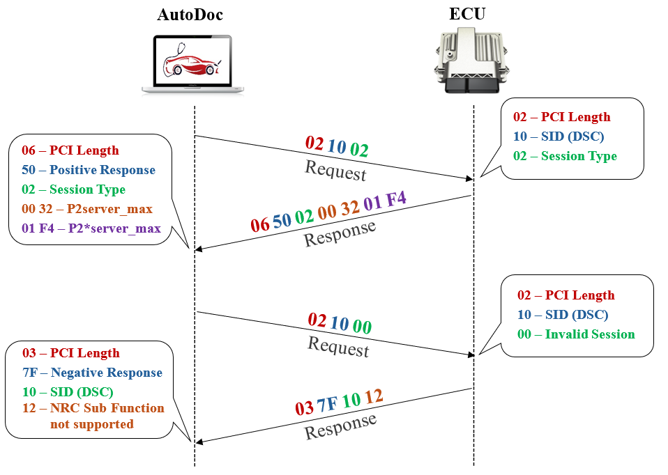
  <br/>
  <em>Figure 21: Diagnostic Session Control message flow example</em>
</p>


**Successful Programming Session Request:**

```
Tester → ECU: [02] [10] [02]          (PCI=2, SID=0x10, Sub=Programming)
ECU → Tester: [06] [50] [02] [00] [32] [01] [F4]
              (PCI=6, SID=0x50, Sub=echo, P2Server=50ms, P2*Server=5000ms)
```

**Negative Response (Invalid Session):**

```
Tester → ECU: [02] [10] [00]          (Invalid session type 0x00)
ECU → Tester: [03] [7F] [10] [12]     (NRC=0x12: Sub-function not supported)
```

---

### 3.2.2. ECU Reset (0x11)

Restarts the Electronic Control Unit. Critical for recovering from malfunctions or applying new configurations.

#### ECU Reset Types

| Sub-Function | Reset Type                   | Description                                          |
| ------------ | ---------------------------- | ---------------------------------------------------- |
| 0x01         | Hard Reset                   | Disconnects power, reinitializes hardware and memory |
| 0x02         | Key-Off-On Reset             | Simulates ignition cycle, graceful shutdown          |
| 0x03         | Soft Reset                   | Restarts main software without affecting hardware    |
| 0x04         | Enable Rapid Power Shutdown  | ECU goes to sleep mode, ready to wake up             |
| 0x05         | Disable Rapid Power Shutdown | Returns to standard shutdown sequence                |

#### Message Flow Example

<p align="center">
  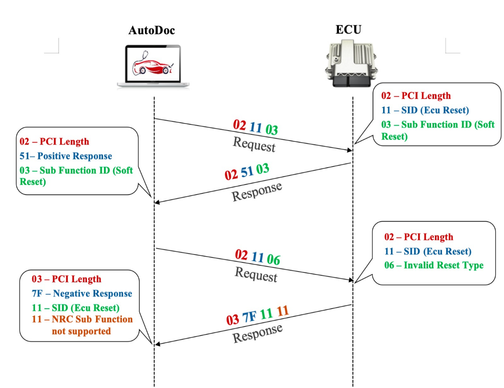
  <br/>
  <em>Figure 22: ECU Reset message structure example</em>
</p>


**Soft Reset Request:**

```
Tester → ECU: [02] [11] [03]          (PCI=2, SID=0x11, Sub=Soft Reset)
ECU → Tester: [02] [51] [03]          (SID=0x51, Sub=echo)
```

**Invalid Reset Type:**

```
Tester → ECU: [02] [11] [06]          (Invalid sub-function 0x06)
ECU → Tester: [03] [7F] [11] [11]     (NRC=0x11: Sub-function not supported)
```

---

### 3.2.3. Security Access (0x27)

Implements challenge-response mechanism (seed-key exchange) to prevent unauthorized access to restricted diagnostic functionalities.

#### Security Access Sub-functions

| Sub-Function           | Description                                |
| ---------------------- | ------------------------------------------ |
| 0x01, 0x03, ... (Odd)  | Request seed for a specific security level |
| 0x02, 0x04, ... (Even) | Send key for a specific security level     |

#### Why Security Access Matters

- **Data Integrity**: Prevents unauthorized modifications to calibration values or DTCs
- **Safety Compliance**: Restricts access to safety systems (airbags, ABS)
- **IP Protection**: Protects proprietary ECU software from reverse engineering
- **Controlled Operations**: Ensures only authorized tools perform advanced operations

#### Message Flow Example

<p align="center">
  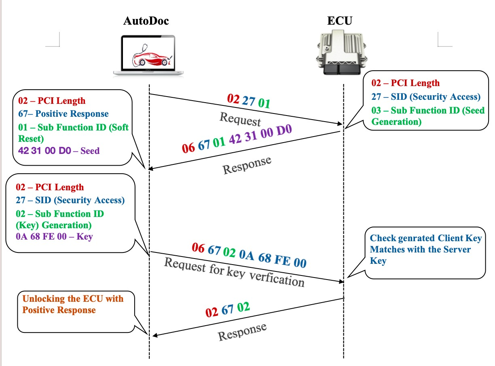
  <br/>
  <em>Figure 23: Security Access message structure — Seed-Key exchange</em>
</p>


**Security Level 1 Unlock Sequence:**

```
Step 1 - Request Seed:
Tester → ECU: [02] [27] [01]
ECU → Tester: [06] [67] [01] [42] [31] [00] [D0]  (Seed = 0x423100D0)

Step 2 - Send Key (calculated from seed using OEM algorithm):
Tester → ECU: [06] [27] [02] [0A] [68] [FE] [00]  (Key = 0x0A68FE00)
ECU → Tester: [02] [67] [02]                      (Access granted!)

Step 3 - Invalid Key:
Tester → ECU: [06] [27] [02] [AA] [BB] [CC] [DD]  (Wrong key)
ECU → Tester: [03] [7F] [27] [35]                 (NRC=0x35: Invalid key)
```

---

### 3.2.4. Tester Present (0x3E)

Maintains active diagnostic communication by periodically signaling that the tester is still connected.

#### Tester Present Sub-functions

| Sub-Function | Description                            |
| ------------ | -------------------------------------- |
| 0x00         | Normal response expected               |
| 0x80         | Suppress positive response (bit 7 set) |

#### Why Tester Present Matters

- Prevents ECU from reverting to default session due to timeout
- Essential during long operations (firmware flashing, calibration routines)
- Typical frequency: every 2–5 seconds
- Not restricted by session type or security level

#### Message Flow Example

<p align="center">
  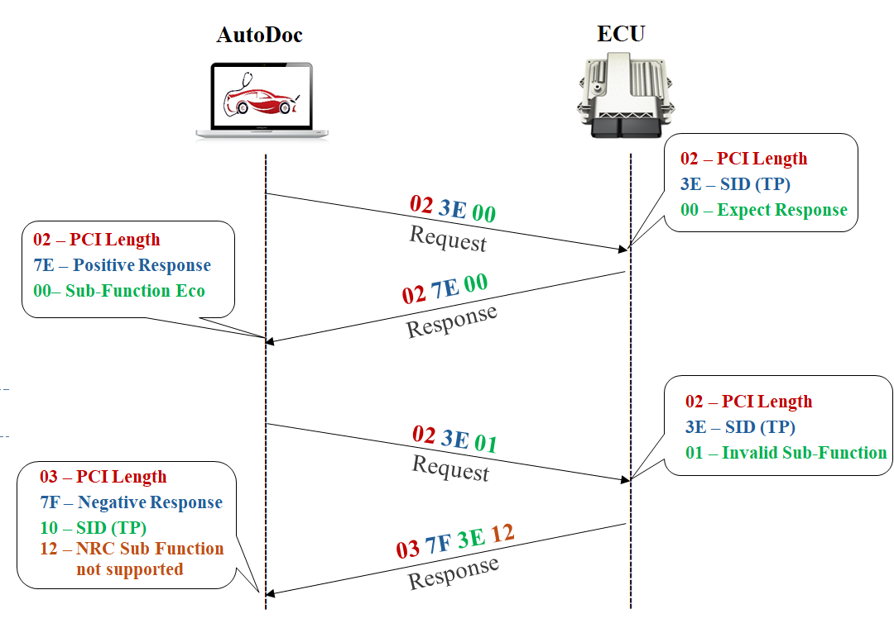
  <br/>
  <em>Figure 24: Tester Present message flow example</em>
</p>


**Normal Response:**

```
Tester → ECU: [02] [3E] [00]
ECU → Tester: [02] [7E] [00]
```

**Suppressed Response:**

```
Tester → ECU: [02] [3E] [80]          (No response expected)
(No response from ECU)
```

**Invalid Sub-function:**

```
Tester → ECU: [02] [3E] [01]          (Invalid sub-function)
ECU → Tester: [03] [7F] [3E] [12]     (NRC=0x12: Sub-function not supported)
```

---

## 3.3. Data Transmission Functional Unit

### 3.3.1. Read Data By Identifier (0x22)

Reads specific data from an ECU using Data Identifiers (DIDs).

#### Common Readable DIDs

| DID           | Name                     | Purpose                         |
| ------------- | ------------------------ | ------------------------------- |
| 0xF191        | ECU Part Number          | Identifies hardware part number |
| 0xF192        | Software Version Number  | Current software version        |
| 0xF401        | Vehicle Speed            | Real-time vehicle speed         |
| 0xFD00–0xFDFF | Diagnostic Trouble Codes | Stored or current DTCs          |

#### Message Flow Example

<p align="center">
  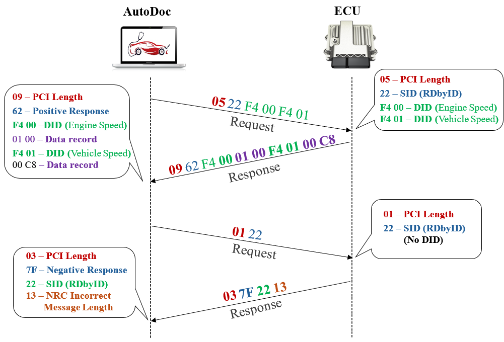
  <br/>
  <em>Figure 25: Read Data By Identifier message flow example</em>
</p>


**Reading Multiple DIDs (Engine Speed + Vehicle Speed):**

```
Tester → ECU: [05] [22] [F4] [00] [F4] [01]
ECU → Tester: [09] [62] [F4] [00] [01] [00] [F4] [01] [00] [C8]
              (Engine Speed = 0x0100, Vehicle Speed = 0x00C8)
```

---

### 3.3.2. Read Data By Periodic Identifier (0x2A)

Enables periodic transmission of specific data parameters for continuous monitoring.

#### Transmission Modes

| Mode        | Description                         |
| ----------- | ----------------------------------- |
| Slow Rate   | Relatively slow predefined interval |
| Medium Rate | Medium predefined interval          |
| Fast Rate   | Fast predefined interval            |
| Stop        | Cease periodic transmission         |

#### Message Flow Example

<p align="center">
  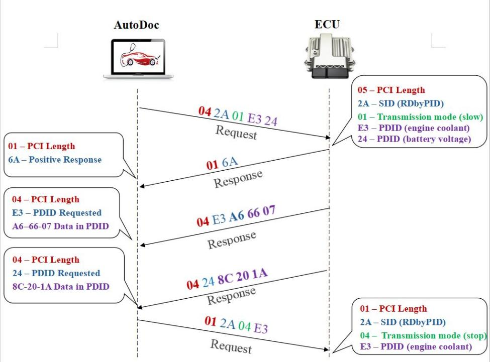
  <br/>
  <em>Figure 26: Read Data By Periodic Identifier message flow example</em>
</p>


**Start Periodic Transmission:**

```
Tester → ECU: [04] [2A] [01] [E3] [24]  (Mode=Slow, PIDs=0xE3, 0x24)
ECU → Tester: [01] [6A]                  (Acknowledged)
ECU → Tester: [04] [E3] [A6] [66] [07]  (Periodic data for PID 0xE3)
ECU → Tester: [04] [24] [8C] [20] [1A]  (Periodic data for PID 0x24)
```

**Stop Specific PID:**

```
Tester → ECU: [01] [2A] [04] [E3]       (Stop PID 0xE3)
ECU → Tester: [01] [6A]                  (Acknowledged, PID 0x24 continues)
```

---

### 3.3.3. Dynamically Define Data Identifier (0x2C)

Allows the tester to define custom DIDs by combining existing DIDs or memory addresses.

#### Sub-functions

| Sub-Function | Description                                               |
| ------------ | --------------------------------------------------------- |
| 0x01         | Define By Identifier — concatenate parts of existing DIDs |
| 0x02         | Define By Address — specify memory addresses and lengths  |
| 0x03         | Clear Dynamically Defined Data Identifier                 |

#### Dynamic DID Range

Valid dynamic DIDs must be in range: **0xF200–0xF2FF** or **0xF300–0xF3FF**

#### Message Flow Examples

<p align="center">
  
  <br/>
  <em>Figure 27: Dynamic DID By Define by Identifier message flow</em>
</p>


**Define By Identifier:**

```
Tester → ECU: [08] [2C] [01] [F3] [01] [12] [34] [01] [02]
              (Dynamic DID=F301, Source DID=1234, Position=1, Size=2)
ECU → Tester: [04] [6C] [01] [F3] [01]
```

<p align="center">
  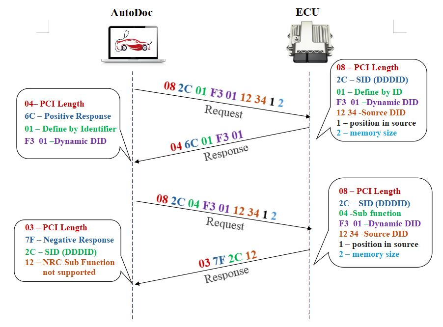
  <br/>
  <em>Figure 28: Dynamic DID By Define by Memory address message flow</em>
</p>


**Define By Memory Address:**

```
Tester → ECU: [10] [2C] [02] [F3] [01] [14] [21] [09] [19] [6B] [02]
              (Dynamic DID=F301, ALFID=14, Address=0x2109196B, Size=2)
ECU → Tester: [04] [6C] [02] [F3] [01]
```

<p align="center">
  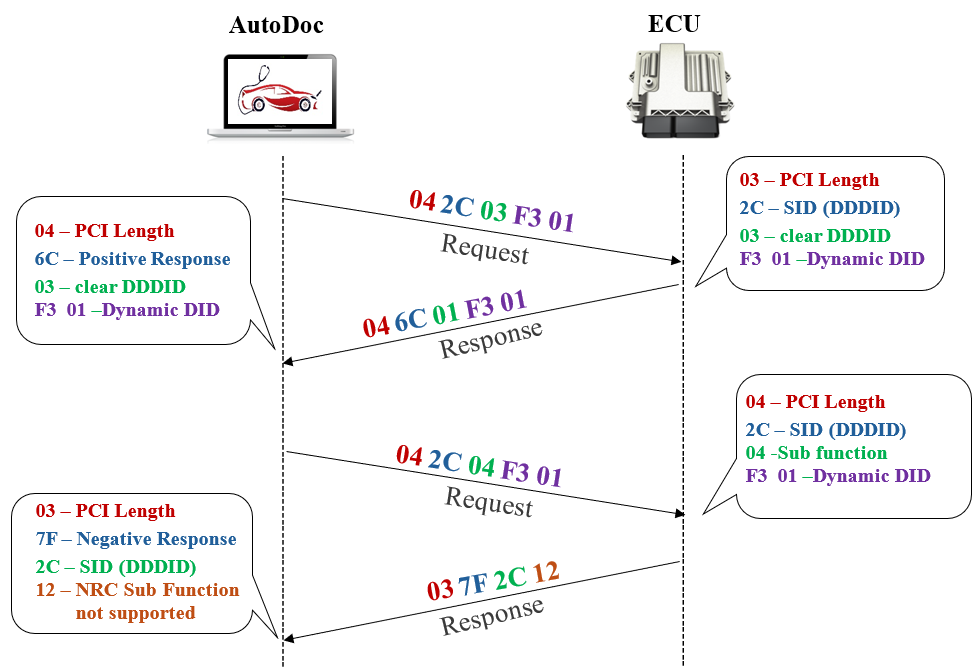
  <br/>
  <em>Figure 29: Clear Dynamic DID message flow example</em>
</p>


**Clear Dynamic DID:**

```
Tester → ECU: [04] [2C] [03] [F3] [01]
ECU → Tester: [04] [6C] [03] [F3] [01]
```

---

### 3.3.4. Write Data By Identifier (0x2E)

Writes specific data to an ECU at a location identified by a DID.

#### Typical Use Cases

- Programming Vehicle Identification Number (VIN)
- Updating calibration constants or configuration flags
- Resetting adaptive or learned values
- Enabling/disabling optional ECU features
- ECU personalization for regional/model-specific settings

#### Common Writable DIDs

| DID    | Name                                | Purpose                             |
| ------ | ----------------------------------- | ----------------------------------- |
| 0xF190 | Vehicle Identification Number (VIN) | Program VIN into ECU memory         |
| 0xF1C0 | Vehicle Configuration Data          | Feature/variant configuration flags |
| 0xF199 | Programming Date                    | Record last ECU programming date    |

#### Message Flow Example

<p align="center">
  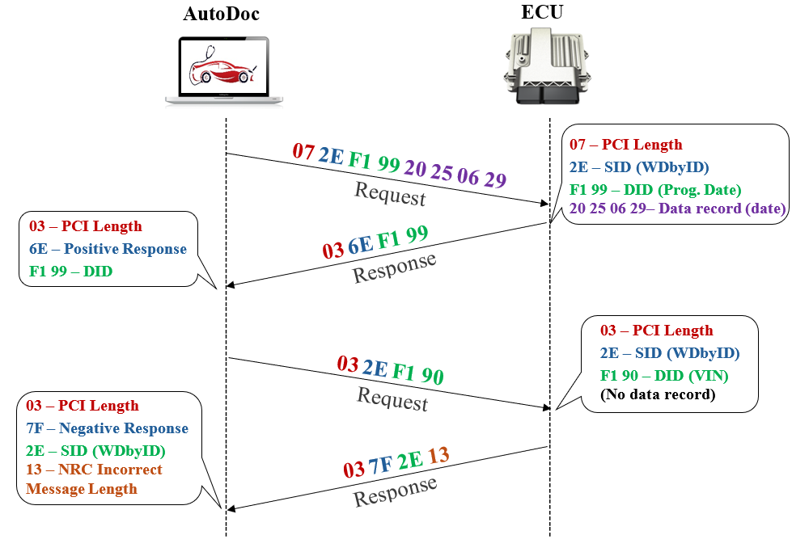
  <br/>
  <em>Figure 30: Write Data By Identifier message flow example</em>
</p>


**Write Programming Date (YY-MM-DD in BCD):**

```
Tester → ECU: [07] [2E] [F1] [99] [20] [25] [06] [21]
              (DID=F199, Data=2025-06-21)
ECU → Tester: [03] [6E] [F1] [99]
```

**Invalid Request (No Data):**

```
Tester → ECU: [03] [2E] [F1] [90]          (No data record provided)
ECU → Tester: [03] [7F] [2E] [13]          (NRC=0x13: Incorrect message length)
```

---

## 3.4. Stored Data and Routine Functional Unit

### 3.4.1. Read DTC Information (0x19)

Retrieves Diagnostic Trouble Codes (DTCs) and their status information from the ECU.

#### Sub-function Categories (27 Sub-functions Supported)

| Category               | Sub-functions                     | Purpose                                  |
| ---------------------- | --------------------------------- | ---------------------------------------- |
| **DTC Count & Status** | 0x01, 0x07, 0x11, 0x12            | Query number of DTCs matching conditions |
| **DTC List Retrieval** | 0x02, 0x0A, 0x0B–0x0F, 0x13, 0x15 | Retrieve actual DTC records              |
| **Snapshot Data**      | 0x03, 0x04                        | Access diagnostic snapshot records       |
| **Extended Data**      | 0x06, 0x10, 0x19                  | Retrieve detailed DTC information        |
| **Special Status**     | 0x09, 0x0B–0x0E, 0x14             | DTC history and state information        |
| **WWH-OBD**            | 0x42, 0x55                        | Worldwide Harmonized OBD diagnostics     |

#### Message Flow Example

<p align="center">
  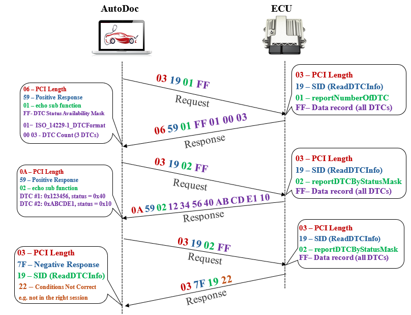
  <br/>
  <em>Figure 31: Read DTC Information message flow example</em>
</p>


**Request Number of DTCs:**

```
Tester → ECU: [03] [19] [01] [FF]
ECU → Tester: [06] [59] [01] [FF] [01] [00] [03]
              (Format=ISO_14229-1, Count=3 DTCs)
```

**Request DTCs by Status Mask:**

```
Tester → ECU: [03] [19] [02] [FF]
ECU → Tester: [0A] [59] [02] [12] [34] [56] [40] [AB] [CD] [E1] [10]
              (DTC1=0x123456, Status=0x40; DTC2=0xABCDE1, Status=0x10)
```

---

### 3.4.2. Routine Control (0x31)

Initiates, stops, or requests results of predefined routines in the ECU.

#### Routine Control Sub-functions

| Sub-Function | Description                                                  |
| ------------ | ------------------------------------------------------------ |
| 0x01         | Start Routine — begin execution of a specific routine        |
| 0x02         | Stop Routine — terminate an active routine                   |
| 0x03         | Request Routine Results — retrieve output of completed routine |

#### Example Routine Identifiers

| RID    | Routine            | Purpose                               |
| ------ | ------------------ | ------------------------------------- |
| 0xFF00 | Erase Memory       | Clear DTC memory or flash memory      |
| 0x0201 | Check O2 Sensor    | Verify O2 sensor heater functionality |
| 0x0A00 | Calibrate Throttle | Calibrate throttle position sensor    |

#### Message Flow Example

<p align="center">
  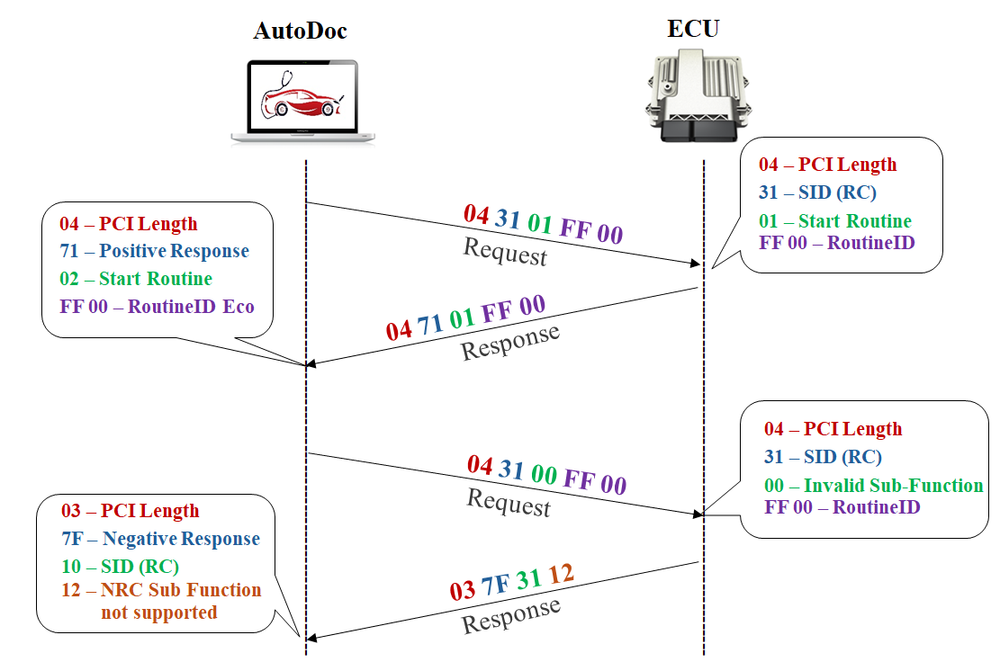
  <br/>
  <em>Figure 32: Routine Control message flow example</em>
</p>


**Start Memory Erase Routine:**

```
Tester → ECU: [04] [31] [01] [FF] [00]
ECU → Tester: [04] [71] [01] [FF] [00]
```

**Invalid Sub-function:**

```
Tester → ECU: [04] [31] [00] [FF] [00]          (Invalid sub-function 0x00)
ECU → Tester: [03] [7F] [31] [12]               (NRC=0x12: Sub-function not supported)
```

---

## 3.5. Upload Download Functional Unit

### 3.5.1. Request Download (0x34)

Initiates the process of writing data to ECU memory (firmware flashing).

#### Request Parameters

| Parameter                                    | Description                                           |
| -------------------------------------------- | ----------------------------------------------------- |
| Data Format Identifier (DFI)                 | Compression (high nibble) and encryption (low nibble) |
| Address And Length Format Identifier (ALFID) | Number of bytes for memory address and size           |
| Memory Address (MA)                          | Starting address for data write                       |
| Memory Size (MS)                             | Total bytes to be written                             |

#### Positive Response Parameters

| Parameter                          | Description                                    |
| ---------------------------------- | ---------------------------------------------- |
| Length Format Identifier (LFID)    | Number of bytes for Max Number of Block Length |
| Max Number of Block Length (MNROB) | Maximum bytes per Transfer Data (0x36) request |

#### Message Flow Example

<p align="center">
  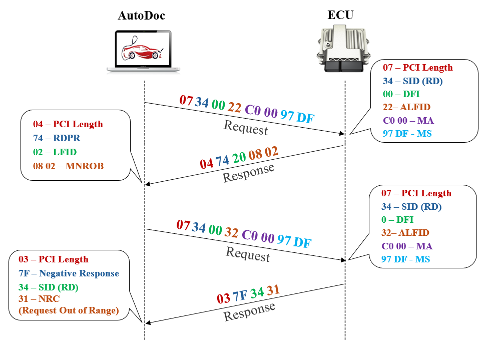
  <br/>
  <em>Figure 33: Request Download message flow example</em>
</p>


**Successful Download Request:**

```
Tester → ECU: [07] [34] [00] [22] [C0] [00] [97] [DF]
              (DFI=0x00, ALFID=0x22, MA=0xC000, MS=0x97DF)
ECU → Tester: [04] [74] [20] [08] [02]
              (LFID=0x20, MNROB=0x0802 = 2050 bytes per block)
```

**Invalid ALFID (Format Mismatch):**

```
Tester → ECU: [07] [34] [00] [32] [C0] [00] [97] [DF]
              (ALFID=0x32 expects 3 bytes for size, but only 2 provided)
ECU → Tester: [03] [7F] [34] [31]               (NRC=0x31: Request Out Of Range)
```

---

### 3.5.2. Request Upload (0x35)

Initiates memory content retrieval from the ECU (firmware extraction).

#### Structure

Identical to Request Download (0x34) except:

- **Request SID**: 0x35
- **Positive Response SID**: 0x75 (instead of 0x74)

#### Message Flow Example

<p align="center">
  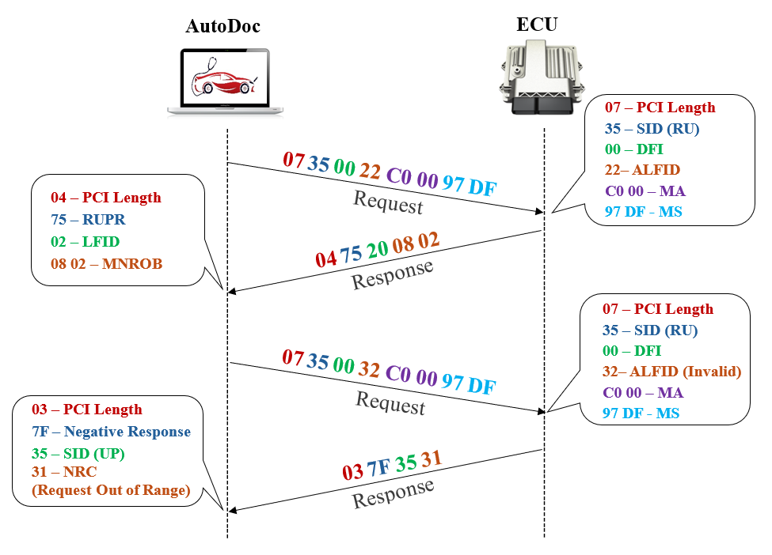
  <br/>
  <em>Figure 34: Request Upload message flow example</em>
</p>


**Successful Upload Request:**

```
Tester → ECU: [07] [35] [00] [22] [C0] [00] [97] [DF]
ECU → Tester: [04] [75] [20] [08] [02]
              (MNROB indicates max bytes ECU will send per block)
```

---

### 3.5.3. Transfer Data (0x36)

Transmits blocks of data between tester and ECU during an ongoing transfer session.

#### Request Parameters

| Parameter                                | Description                                               |
| ---------------------------------------- | --------------------------------------------------------- |
| Block Sequence Counter (BSC)             | Maintains order of data blocks (0x01–0xFF, wraps to 0x00) |
| Transfer Request Parameter Record (TRPR) | Actual data payload                                       |

#### Response Parameters

| Parameter                                  | Description                   |
| ------------------------------------------ | ----------------------------- |
| Block Sequence Counter (BSC)               | Echo of request BSC           |
| Transfer Response Parameter Record (TREPR) | Checksum or verification data |

#### Message Flow Examples

<p align="center">
  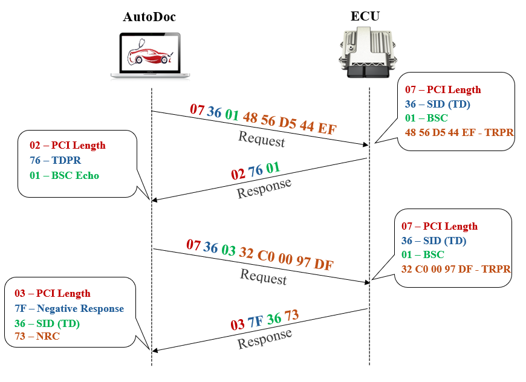
  <br/>
  <em>Figure 35: Message sequence for downloading data via Transfer Data</em>
</p>


**Download — Successful Block:**

```
Tester → ECU: [07] [36] [01] [48] [56] [D5] [44] [EF]
ECU → Tester: [02] [76] [01]
```

**Download — Invalid Sequence:**

```
Tester → ECU: [07] [36] [03] [32] [C0] [00] [97] [DF]  (Expected 0x02, got 0x03)
ECU → Tester: [03] [7F] [36] [73]                      (NRC=0x73: Request Sequence Error)
```

<p align="center">
  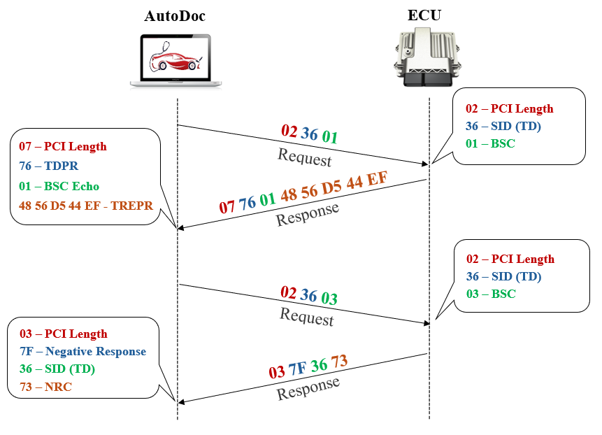
  <br/>
  <em>Figure 36: Message sequence for uploading data via Transfer Data</em>
</p>


**Upload — Successful Block:**

```
Tester → ECU: [02] [36] [01]
ECU → Tester: [07] [76] [01] [48] [56] [D5] [44] [EF]
```

---

### 3.5.4. Request Transfer Exit (0x37)

Marks the conclusion of a data transfer session.

#### Message Flow Example

<p align="center">
  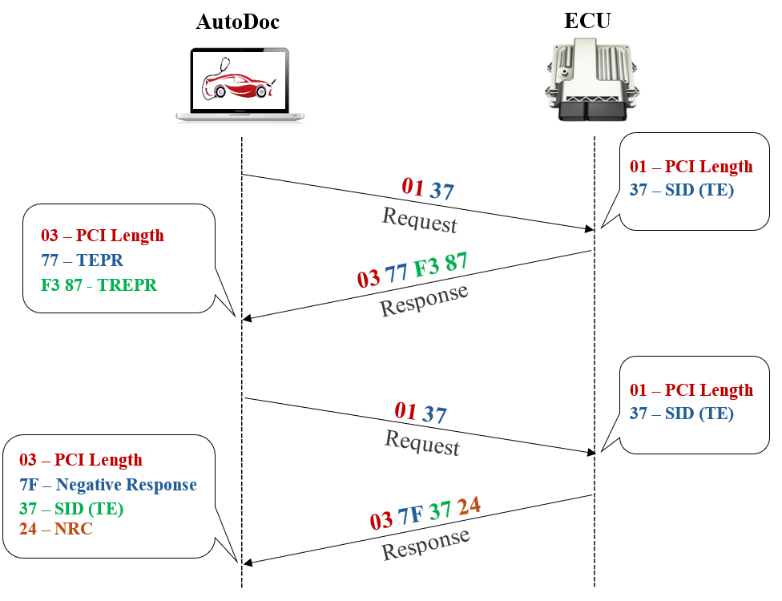
  <br/>
  <em>Figure 37: Transfer Exit message flow example</em>
</p>


**Successful Transfer Exit:**

```
Tester → ECU: [01] [37]
ECU → Tester: [03] [77] [F3] [87]
              (TREPR = CRC value for data integrity verification)
```

**Incomplete Transfer:**

```
Tester → ECU: [01] [37]
ECU → Tester: [03] [7F] [37] [24]     (NRC=0x24: Request Sequence Error)
```

---

## 🔗 Navigation

⬅️ **[Chapter 2: Project Overview](../02-Project-Overview/README.md)** — System architecture and objectives  
➡️ **[Chapter 4: Session Layer](../04-Session-Layer/README.md)** — Timing parameters and session management

---

<p align="center">
  <sub>© 2025 Cairo University — Faculty of Engineering. All rights reserved.</sub>
</p>

