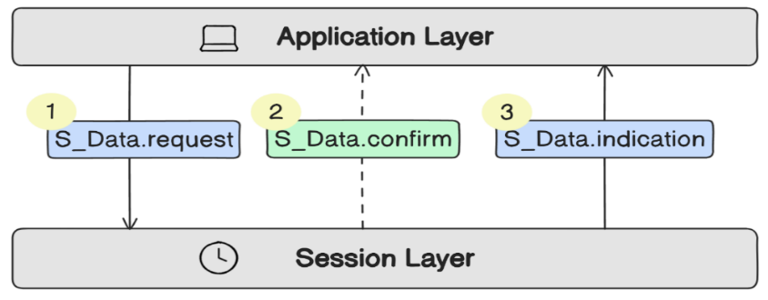
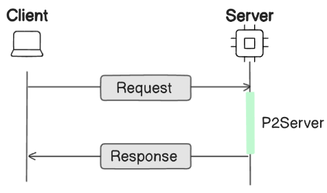
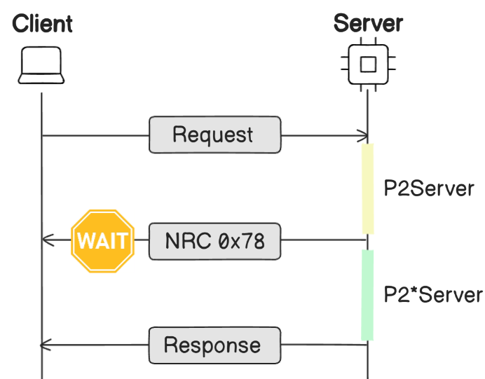
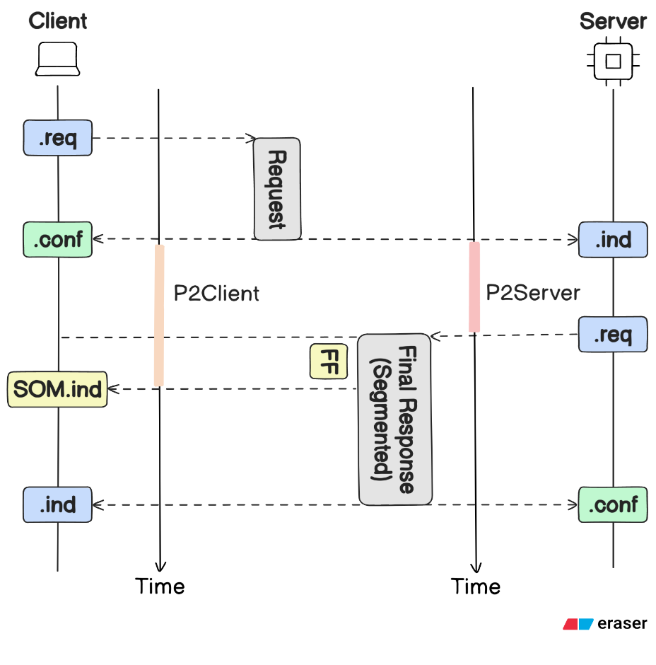
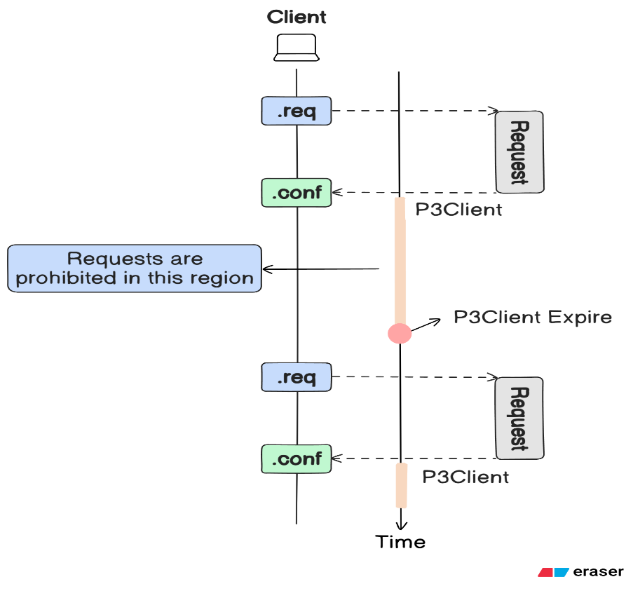
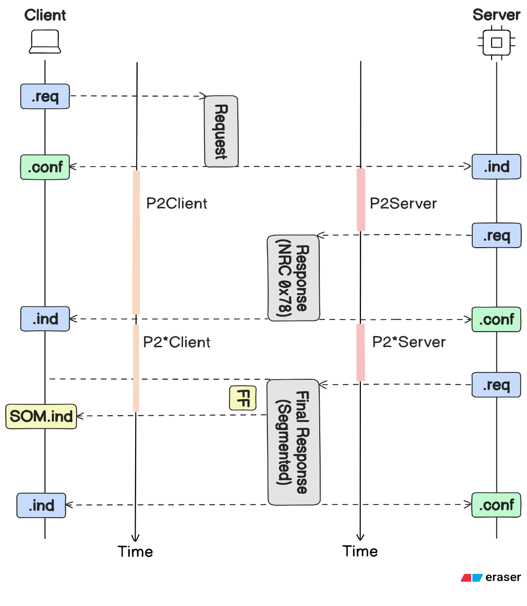
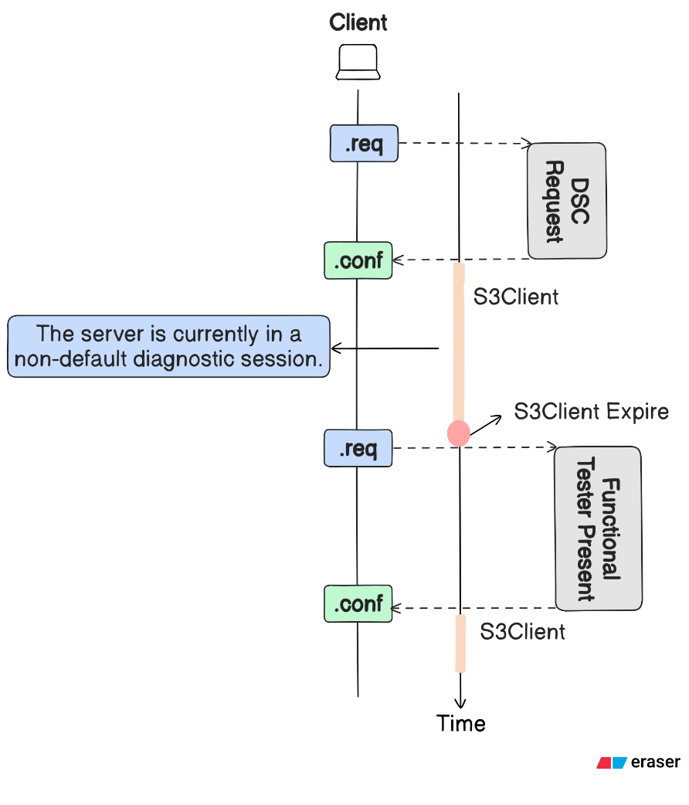
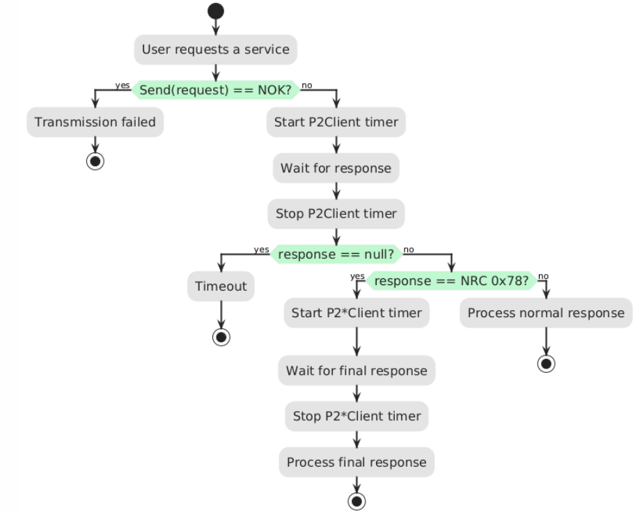
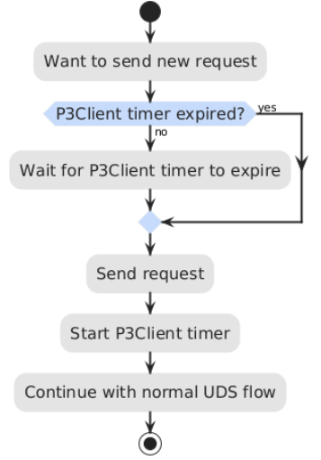
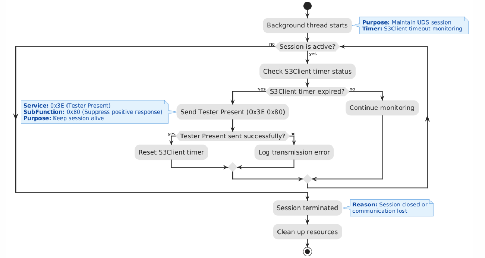

# Chapter 4: Session Layer

> **Timing Parameters and Session Management (ISO 14229-2)**

  
   
  <em>Figure 38: Interaction between Application and Session Layers using Session Primitives</em>

---

## 📌 Table of Contents

1. [Introduction](#41-introduction)
2. [Timing Parameters in Default Session](#42-timing-parameters-in-the-default-session)
3. [Timing Parameters in Non-Default Sessions](#43-timing-parameters-in-the-non-default-sessions)
4. [Approaches for Maintaining Active Sessions](#44-approaches-for-maintaining-active-non-default-sessions)
5. [Implementation Details](#45-implementation-details)

---

## 4.1. Introduction

The Session Layer (ISO 14229-2) sits between the Application Layer and the Transport/Network Layers, facilitating structured exchange of diagnostic messages between client (tester) and server (ECU).

### Core Responsibilities

- **Timing Control**: Ensures all communication occurs within specified time constraints
- **PDU Transmission/Reception**: Handles Protocol Data Units across the network
- **Session Lifecycle Management**: Initiation, maintenance, and termination of diagnostic sessions
- **Protocol Parameter Configuration**: Timeouts and response behavior settings
- **Multi-Node Communication**: Supports local and remote nodes, including gateways and telematics

### Session Layer Primitives

| Primitive                | Direction     | Purpose                                 |
| ------------------------ | ------------- | --------------------------------------- |
| **S_Data.request**       | App → Session | Send data or control commands           |
| **S_Data.indication**    | Session → App | Notify of received data or events       |
| **S_Data.confirm**       | Session → App | Confirm result of transmission (OK/NOK) |
| **S_DataSOM.indication** | Session → App | Start of multi-frame message received   |

### Primitive Parameters

All request and indication primitives share:

- `S_Mtype`, `S_SA`, `S_TA`, `S_TAtype`, `S_AE`, `S_Data[]`, `S_Length`

> **Note**: The confirm primitive carries no payload — only a status value (OK/NOK).

---

## 4.2. Timing Parameters in the Default Session

### Timing Parameter Definitions

| Timing Parameter  | Minimum                      | Maximum                        | Description                             |
| ----------------- | ---------------------------- | ------------------------------ | --------------------------------------- |
| **ΔP2**           | 0 ms                         | ΔP2_request + ΔP2_response     | Network delay margin                    |
| **P2Server**      | 0 ms                         | Server-specific (rec: 50 ms)   | Max time for ECU to respond             |
| **P2*Server**     | 0 ms                         | Server-specific (rec: 5000 ms) | Extended time after NRC 0x78            |
| **P2Client**      | P2Server_max + ΔP2           | Client-specific                | Max time tester waits for response      |
| **P2*Client**     | P2*Server_max + ΔP2_response | Client-specific                | Extended wait after NRC 0x78            |
| **P3Client_Phys** | P2Server_max + ΔP2           | —                              | Min wait before next physical request   |
| **P3Client_Func** | P2Server_max + ΔP2           | —                              | Min wait before next functional request |

### NRC 0x78 — Response Pending

When the ECU needs additional time to process a request, it responds with NRC 0x78. This:

- Notifies the client to extend its waiting period
- Prevents premature timeout
- Allows the server more time to complete processing

### Parameter Descriptions

#### a. ΔP2 (Network Delay Margin)

Accounts for system-dependent network delays:

- Gateway traversal delays
- Bus bandwidth limitations
- Safety margin (~50% of worst-case delay)

Factors affecting ΔP2:

- Number of gateways in communication path
- Frame transmission time (determined by baud rate)
- Overall bus utilization and traffic load

#### b. P2Server

  
   
  <em>Figure 39: Illustrative diagram for P2Server timer</em>

- **Start**: When ECU receives diagnostic request
- **Stop**: When ECU begins transmitting final response
- **Purpose**: Maximum time ECU has to process and respond
- **Communication**: Value sent in positive response to Diagnostic Session Control (0x10)

#### c. P2Client

- **Start**: When client sends diagnostic request
- **Stop**: When client receives server response
- **Purpose**: Maximum time client waits for standard response
- **Timeout Action**: Retry or abort if no response received

#### d. P2*Server

  
   
  <em>Figure 40: Illustrative diagram for P2*Server timer</em>

- **Start**: After sending NRC 0x78
- **Stop**: When ECU sends final response
- **Purpose**: Extended window for ECU to complete processing
- **Communication**: Value sent in positive response to Diagnostic Session Control (0x10)

#### e. P2*Client

- **Start**: When client receives NRC 0x78
- **Stop**: When client receives final response
- **Purpose**: Extended waiting period for long-running services (e.g., memory operations)

#### f. P3Client_Phys / P3Client_Func

- **Purpose**: Minimum wait time between consecutive requests
- **Prevents**: Bus overload and gives ECU time to process

### Timing Diagrams

  
   
  <em>Figure 41: Timing of P2Client and P2Server during default session</em>

  
   
  <em>Figure 42: Timing overview of P3Client during physical communication</em>

  
   
  <em>Figure 43: Timing overview of P2*Client and P2*Server during default session</em>

---

## 4.3. Timing Parameters in the Non-Default Sessions

In non-default sessions (Extended, Programming, Safety), additional timing mechanisms manage session continuity.

### Additional Session Timers

| Timing Parameter | Minimum | Maximum    | Description                                     |
| ---------------- | ------- | ---------- | ----------------------------------------------- |
| **S3Server**     | 2000 ms | 5000 ms    | ECU timeout for maintaining non-default session |
| **S3Client**     | —       | < S3Server | Client-side timer for session keep-alive        |

### S3Server

- **Purpose**: Determines how long ECU maintains non-default session without valid requests
- **Restart Condition**: Reinitialized on any valid diagnostic request (including Tester Present)
- **Timeout Action**: ECU automatically transitions back to Default Session
- **Typical Value**: ~5 seconds (server-specific)

### S3Client

- **Purpose**: Ensures session remains active by periodically sending requests
- **Typical Request**: Tester Present (0x3E) with suppressed response (0x80)
- **Must Be**: Less than S3Server to account for communication delays
- **Critical For**: Multi-ECU environments and functional communication

> **Note**: S3 timers are extensions of P2/P2* timers. While P2-based timers handle response timing, S3 timers specifically manage session lifetime.

---

## 4.4. Approaches for Maintaining Active Non-Default Sessions

### Approach 1: Functional Communication (Periodic Tester Present)

The client periodically sends functionally addressed Tester Present messages (0x3E 0x80) at fixed intervals.

**Advantages:**

- Ensures robustness by periodically reaffirming active session state
- Supports both functional and physical addressing
- Suitable for multi-ECU environments

**Disadvantages:**

- Generates more network traffic
- Requires precise timing management

### Approach 2: Physical Communication (Sequential Requests)

The session is kept alive by sending any physically addressed diagnostic request before S3Client expires.

**Advantages:**

- Simpler implementation for single-ECU communication
- Reduces unnecessary Tester Present traffic

**Disadvantages:**

- Not suitable for multi-ECU communication
- Risk of session timeout if no new request is issued

### XDT Implementation

XDT adopts **Approach 1** (Functional Communication with Periodic Tester Present) for maximum flexibility and multi-ECU support.

  
   
  <em>Figure 44: S3Client timer in a non-default session with functional Tester Present</em>

---

## 4.5. Implementation Details

### Default Session Timer Implementation

  
   
  <em>Figure 45: Flowchart for implementation logic of session layer P2 timer in default session</em>

**Logic Flow:**

1. User requests a service
2. Send request to ECU
3. If send fails → Report transmission error
4. If send succeeds → Start P2Client timer
5. Wait for response
6. If response received:
   - If response is NRC 0x78 → Start P2*Client timer, wait for final response
   - If normal response → Process and display result
7. If timeout → Report timeout error

### XDT Default Session Values

| Parameter | Value          | Notes                |
| --------- | -------------- | -------------------- |
| P2Server  | 50 ms          | Recommended by ISO   |
| P2*Server | 5000 ms        | Recommended by ISO   |
| ΔP2       | 0 ms (default) | Configurable by user |

### P3Client Timer Implementation

  
   
  <em>Figure 46: Flowchart illustrating the implementation logic of session layer P3 timer</em>

**Logic Flow:**

1. Want to send new request
2. Check if P3Client timer expired
3. If not expired → Wait for timer to expire
4. If expired → Send request
5. Start P3Client timer
6. Continue with normal UDS flow

### S3Client Timer Implementation (Non-Default Session)

  
   
  <em>Figure 47: Flowchart for implementation logic of S3 timer during non-default session</em>

**Background Thread Logic:**

1. Background thread starts (only active in non-default sessions)
2. Check if session is active
3. If not active → Clean up resources and terminate
4. If active → Check S3Client timer status
5. If timer expired:
   - Send Tester Present (0x3E 0x80) with suppressed response
   - If sent successfully → Reset S3Client timer
   - If send failed → Log transmission error
6. If timer not expired → Continue monitoring
7. Loop back to step 2

> **Note**: The background thread remains dormant (sleep state) when in Default Session.

---

## 🔗 Navigation

⬅️ **[Chapter 3: Application Layer](../03-Application-Layer/README.md)** — UDS services implementation  
➡️ **[Chapter 5: Network/Transport Layer (DoCAN)](../05-Network-Transport-Layer-DoCAN/README.md)** — Segmentation and flow control

---

  © 2025 Cairo University — Faculty of Engineering. All rights reserved.

