# Chapter 5: Network / Transport Layers (DoCAN)

> **Diagnostic Communication over CAN (ISO 15765-2)**

<p align="center">
  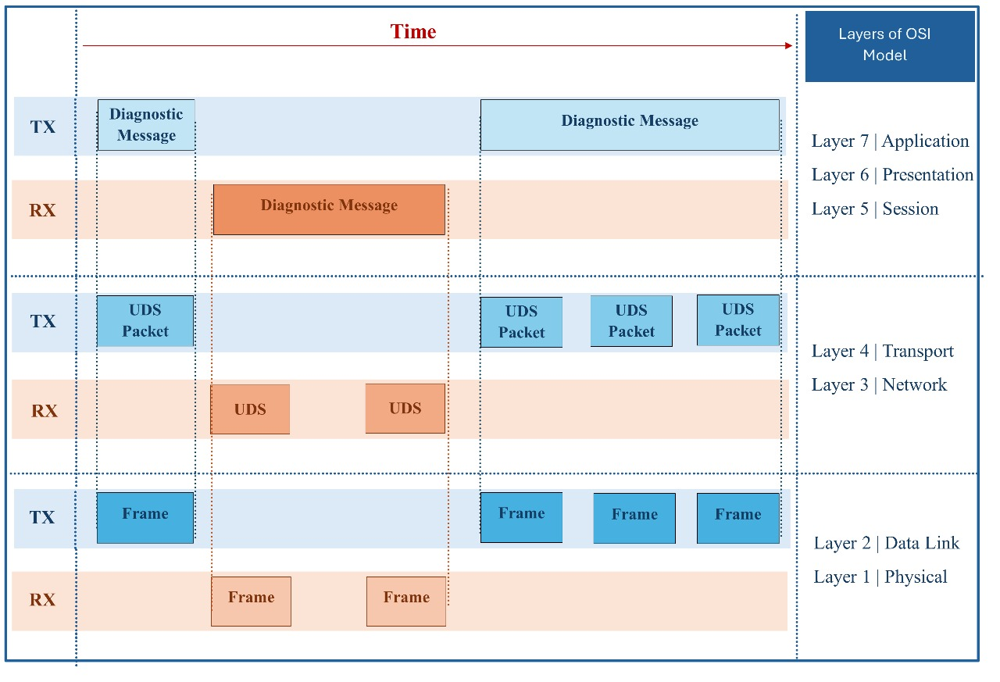
  <br/>
  <em>Figure 48: Diagram for message flow across OSI with segmentation and reassembly</em>
</p>


---

## 📌 Table of Contents

1. [Introduction to ISO 15765-2](#51-introduction-to-iso-15765-2)
2. [Purpose of DoCAN Layer](#52-purpose-of-the-docan-layer-in-uds-over-can)
3. [Functional Responsibilities](#53-functional-responsibilities-of-the-docan-protocol)
4. [Terminology and Definitions](#54-terminology-and-definitions-needed-for-docan)
5. [General Parameter Definitions](#55-general-parameter-definitions-at-docan-layer)
6. [Interaction with Application Layer](#56-interaction-between-application-and-docan-layers)
7. [DoCAN Layer Timing](#57-docan-layer-timing)
8. [Implementation Details](#58-implementation-details)

---

## 5.1. Introduction to ISO 15765-2

ISO 15765-2 defines the **Network and Transport layers** for diagnostic communication over **Controller Area Network (CAN)**. It enables structured communication between vehicle ECUs and external diagnostic testers.

### Key Characteristics

- **Unconfirmed protocol**: No network-level acknowledgment required for every message
- **TX_DL (Transmit Data Length)**: Configurable frame size parameter determined by Data Link Layer
- **Segmentation support**: Handles messages larger than single CAN frame capacity
- **Reassembly support**: Reconstructs segmented messages at the receiver

### Message Size Support

DoCAN supports message sizes up to **2³² - 1 bytes** (4,294,967,295 bytes), far beyond the TX_DL limit of a single CAN frame.

---

## 5.2. Purpose of the DoCAN Layer in UDS over CAN

Many UDS services involve transmitting data that cannot fit into a single CAN frame:

- Reading large memory blocks
- Writing data to ECUs
- Performing firmware updates

The DoCAN layer handles these challenges by:

- Managing **fragmentation and reassembly** of data
- Controlling **message flow** between sender and receiver
- Handling **retransmissions** when necessary

<p align="center">
  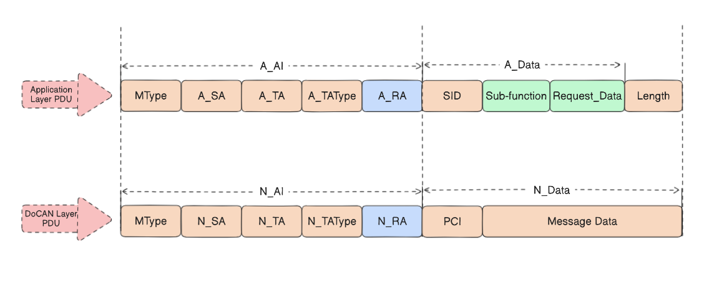
  <br/>
  <em>Figure 49: Mapping between Application layer PDU and DoCAN PDU</em>
</p>


---

## 5.3. Functional Responsibilities of the DoCAN Protocol

### 5.3.1. Support for Large Messages

DoCAN enables key diagnostic operations:

- Reading extensive Data Identifiers
- Transferring large memory blocks
- ECU reprogramming and flashing procedures

### 5.3.2. Segmentation and Reassembly

When a message exceeds TX_DL, DoCAN initiates segmentation:

| Frame Type                  | Purpose                                                      |
| --------------------------- | ------------------------------------------------------------ |
| **First Frame (FF)**        | Initiates transmission, carries message length and first segment |
| **Consecutive Frames (CF)** | Carry subsequent portions of the message                     |
| **Flow Control (FC)**       | Regulates flow of Consecutive Frames                         |

### 5.3.3. Flow Control and Transport Mechanisms

The FC frame includes:

| Parameter            | Description                                            |
| -------------------- | ------------------------------------------------------ |
| **Block Size (BS)**  | Number of CFs allowed before new FC is required        |
| **STmin**            | Minimum delay between consecutive frames               |
| **Flow Status (FS)** | Continue To Send (CTS), Wait (WT), or Overflow (OVFLW) |

---

## 5.4. Terminology and Definitions

### Classical CAN vs. CAN FD

| Feature          | Classical CAN | CAN FD                          |
| ---------------- | ------------- | ------------------------------- |
| Max Data Payload | 8 bytes       | 64 bytes                        |
| Frame Format     | Fixed         | Enhanced with faster data phase |
| Data Rates       | Standard      | Higher during data phase        |

### TX_DL (Transmit Data Length)

- **Classical CAN**: 0–8 bytes
- **CAN FD**: 0–64 bytes (depending on node capability)

### DLC (Data Length Code)

Encodes the number of data bytes in the CAN frame. In CAN FD, DLC values 9–15 represent data lengths greater than 8 bytes:

| DLC  | CAN FD Data Length |
| ---- | ------------------ |
| 9    | 12 bytes           |
| 10   | 16 bytes           |
| 11   | 20 bytes           |
| 12   | 24 bytes           |
| 13   | 32 bytes           |
| 14   | 48 bytes           |
| 15   | 64 bytes           |

---

## 5.5. General Parameter Definitions at DoCAN Layer

### DoCAN Parameters

| Parameter     | Description                  | Possible Values                     |
| ------------- | ---------------------------- | ----------------------------------- |
| **N_MType**   | Message type                 | Diagnostics / Remote Diagnostics    |
| **N_SA**      | Source Address               | 1 byte                              |
| **N_TA**      | Target Address               | 1 byte                              |
| **N_TA_Type** | Target address type          | 8 possible values (see table below) |
| **N_AE**      | Address Extension (optional) | 1 byte                              |
| **N_PCI**     | Protocol Control Information | 1 nibble (4 bits)                   |
| **N_Data**    | Data payload                 | N bytes                             |

### N_TA_Type Communication Models

| N_TA_Type | Addressing | CAN Format | CAN Type      |
| --------- | ---------- | ---------- | ------------- |
| #1        | Physical   | 11-bit     | Classical CAN |
| #2        | Functional | 11-bit     | Classical CAN |
| #3        | Physical   | 11-bit     | CAN FD        |
| #4        | Functional | 11-bit     | CAN FD        |
| #5        | Physical   | 29-bit     | Classical CAN |
| #6        | Functional | 29-bit     | Classical CAN |
| #7        | Physical   | 29-bit     | CAN FD        |
| #8        | Functional | 29-bit     | CAN FD        |

### N_PCI Types

| N_PCI Value | Frame Type             | Purpose                       |
| ----------- | ---------------------- | ----------------------------- |
| 0           | Single Frame (SF)      | Complete message in one frame |
| 1           | First Frame (FF)       | Start of segmented message    |
| 2           | Consecutive Frame (CF) | Subsequent data segments      |
| 3           | Flow Control (FC)      | Regulate transmission flow    |

---

## 5.6. Interaction Between Application and DoCAN Layers

### Addressing Information Mapping

The Application Layer (2-byte addresses) maps to the Network Layer (1-byte addresses):

| Application Layer | ↔    | Network Layer |
| ----------------- | ---- | ------------- |
| A_SA (2 bytes)    | ↔    | N_SA (1 byte) |
| A_TA (2 bytes)    | ↔    | N_TA (1 byte) |
| A_AE (2 bytes)    | ↔    | N_AE (1 byte) |
| A_TA_Type         | ↔    | N_TA_Type     |
| A_MType           | ↔    | N_MType       |

### A_TA_Type to N_TA_Type Mapping

| A_TA_Type  | CAN Type      | CAN ID Format | N_TA_Type |
| ---------- | ------------- | ------------- | --------- |
| Physical   | Classical CAN | 11-bit        | #1        |
| Functional | Classical CAN | 11-bit        | #2        |
| Physical   | CAN FD        | 11-bit        | #3        |
| Functional | CAN FD        | 11-bit        | #4        |
| Physical   | Classical CAN | 29-bit        | #5        |
| Functional | Classical CAN | 29-bit        | #6        |
| Physical   | CAN FD        | 29-bit        | #7        |
| Functional | CAN FD        | 29-bit        | #8        |

### Single Frame Operation

<p align="center">
  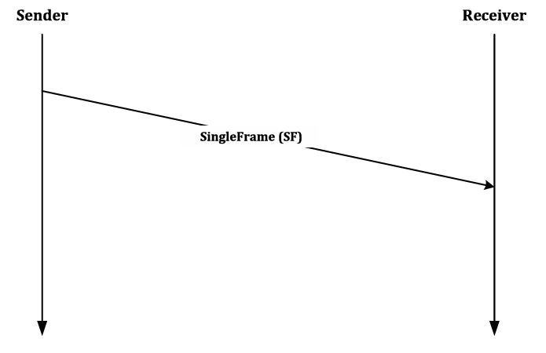
  <br/>
  <em>Figure 50: Simplified illustration of Single Frame transmission process</em>
</p>


#### Option 1: Frame Length ≤ 8 (Classical CAN)

| Byte # | 0 (1st nibble) | 0 (2nd nibble) | 1–7               |
| ------ | -------------- | -------------- | ----------------- |
| SF_PDU | N_PCI Type (0) | SF_DL          | Single Frame Data |

**SF_DL Values:**

- `0000`: Reserved (must not be used)
- `0001`–`0111`: Valid (1–7 bytes)
- Others: Invalid

#### Option 2: Frame Length > 8 (CAN FD)

| Byte # | 0 (1st nibble) | 0 (2nd nibble) | 1     | 2–N               |
| ------ | -------------- | -------------- | ----- | ----------------- |
| SF_PDU | N_PCI Type (0) | 0000           | SF_DL | Single Frame Data |

**SF_DL Values:**

- `0000 0000`–`0000 0111`: Reserved
- `0000 1000`–`(TX_DL - 2)`: Valid
- Others: Invalid

### Single Frame Examples

<p align="center">
  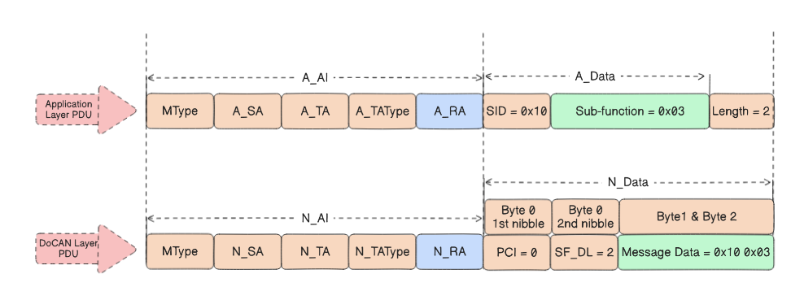
  <br/>
  <em>Figure 51: Example for PDU mapping for Classical CAN (Frame Length ≤ 8)</em>
</p>


**Diagnostic Session Control (0x10) in Classical CAN:**

```
Application: SID=0x10, Sub-function=0x03, Length=2
DoCAN: PCI=0, SF_DL=2, Data=[0x10, 0x03]
CAN Frame: [0x02] [0x10] [0x03] [0x00] [0x00] [0x00] [0x00] [0x00]
```

<p align="center">
  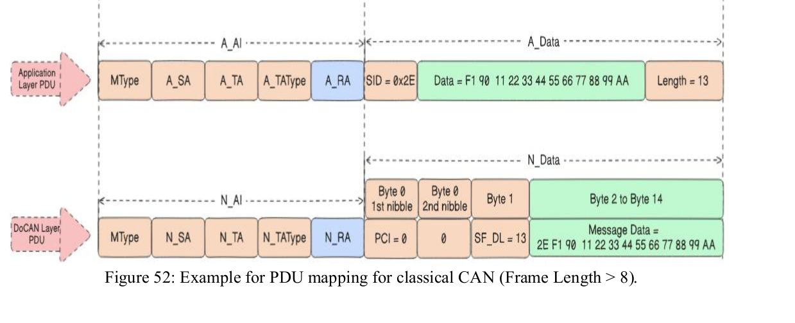
  <br/>
  <em>Figure 52: Example for PDU mapping for CAN FD (Frame Length > 8)</em>
</p>


**Write Data By Identifier (0x2E) in CAN FD:**

```
Application: SID=0x2E, Data=13 bytes, Length=13
DoCAN: PCI=0, SF_DL=13, Data=[0x2E, 0xF1, 0x90, ...]
CAN FD Frame: [0x00] [0x0D] [0x2E] [0xF1] [0x90] ...
```

### Multi-Frame Operation

<p align="center">
  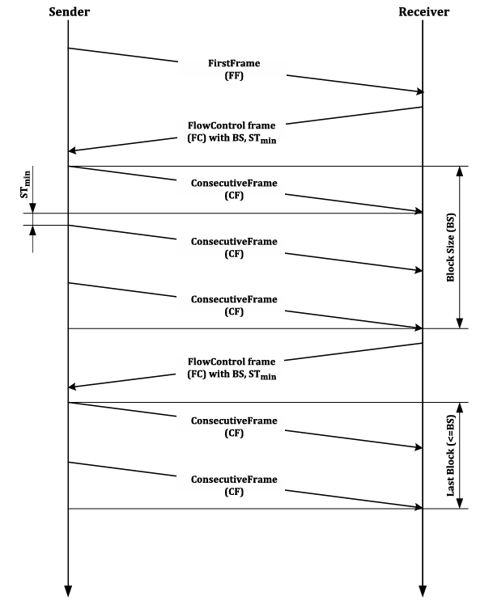
  <br/>
  <em>Figure 53: Simplified illustration of a segmented message transmission process</em>
</p>


#### First Frame (FF) Format

**Option 1: FF_DL ≤ 4,095 bytes**

| Byte # | 0 (1st nibble) | 0 (2nd nibble) | 1           | 2–N        |
| ------ | -------------- | -------------- | ----------- | ---------- |
| FF_PDU | N_PCI Type (1) | FF_DL (MSB)    | FF_DL (LSB) | First Data |

**Option 2: FF_DL > 4,095 bytes**

<p align="center">
  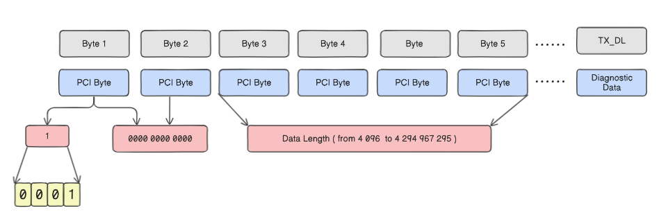
  <br/>
  <em>Figure 54: Simplified format of First Frame (FF) for FF_DL > 4,095 bytes</em>
</p>


| Byte # | 0 (1st nibble) | 0 (2nd nibble) | 1–2       | 3–6            | 7–N        |
| ------ | -------------- | -------------- | --------- | -------------- | ---------- |
| FF_PDU | N_PCI Type (1) | 0000           | 0000 0000 | FF_DL (32-bit) | First Data |

#### Consecutive Frame (CF) Format

| Byte # | 0 (1st nibble) | 0 (2nd nibble)       | 1–N                    |
| ------ | -------------- | -------------------- | ---------------------- |
| CF_PDU | N_PCI Type (2) | Sequence Number (SN) | Consecutive Frame Data |

**Sequence Number Rules:**

- First CF after FF: SN = 1
- Each subsequent CF: SN increments by 1
- After SN = 15 (0xF): wraps to 0
- FC frames do not affect SN

<p align="center">
  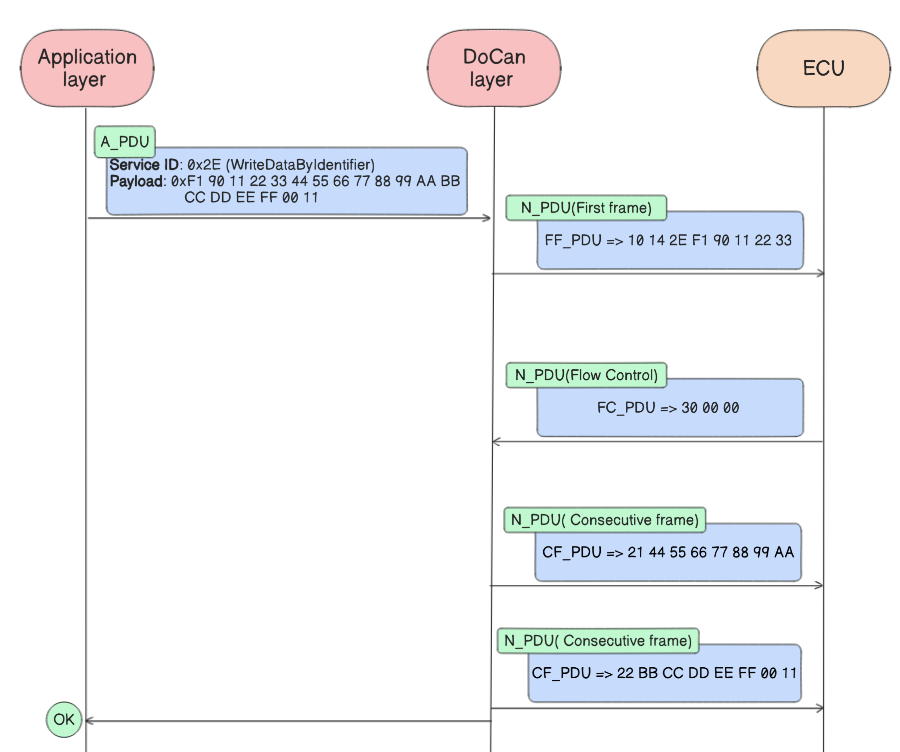
  <br/>
  <em>Figure 55: Example for multi-frame operation transmission</em>
</p>


#### Flow Control (FC) Format

| Byte # | 0 (1st nibble) | 0 (2nd nibble)   | 1               | 2     |
| ------ | -------------- | ---------------- | --------------- | ----- |
| FC_PDU | N_PCI Type (3) | Flow Status (FS) | Block Size (BS) | STmin |

**Flow Status (FS) Values:**

| Value   | Status                 | Description                              |
| ------- | ---------------------- | ---------------------------------------- |
| 0x0     | Continue To Send (CTS) | Receiver ready, send up to BS CFs        |
| 0x1     | Wait (WT)              | Sender must pause and wait for new FC    |
| 0x2     | Overflow (OVFLW)       | Abort transmission (insufficient buffer) |
| 0x3–0xF | Reserved               | Must not be used                         |

**Block Size (BS) Values:**

| Value     | Description                                             |
| --------- | ------------------------------------------------------- |
| 0x00      | No additional FC frames needed (send all remaining CFs) |
| 0x01–0xFF | Maximum CFs allowed before next FC                      |

**STmin Values:**

| Value Range | Unit | Description                        |
| ----------- | ---- | ---------------------------------- |
| 0x00–0x7F   | ms   | 0–127 milliseconds                 |
| 0x80–0xF0   | —    | Reserved                           |
| 0xF1–0xF9   | μs   | 100–900 microseconds (100μs steps) |
| 0xFA–0xFF   | —    | Reserved                           |

---

## 5.7. DoCAN Layer Timing

### Timer Definitions

| Timer    | Purpose                                                      |
| -------- | ------------------------------------------------------------ |
| **N_As** | Time for sender's Network Layer to transmit any N_PDU        |
| **N_Ar** | Time for receiver's Network Layer to transmit any N_PDU      |
| **N_Bs** | Time until sender receives next FC after sending FF or CF block |
| **N_Br** | Time for receiver's Network Layer to send FC frame           |
| **N_Cs** | Time for sender to send next CF after receiving FC           |
| **N_Cr** | Time receiver waits for next CF after sending FC             |

### Timer Start/Stop Conditions

#### N_As

- **Start**: Network Layer passes data to Data Link Layer
- **Stop**: Data Link Layer confirms successful transmission

#### N_Ar

- **Start**: Receiver's Network Layer initiates transmission (e.g., FC)
- **Stop**: Data Link Layer confirms transmission

#### N_Bs

- **Start**: Data Link Layer confirms transmission of FF or last CF in block
- **Stop**: Data Link Layer receives FC frame

#### N_Br

- **Start**: Data Link Layer receives FF or CF frame
- **Stop**: Receiver's Network Layer passes FC to Data Link Layer

#### N_Cs

- **Start**: Sender's Network Layer receives FC frame
- **Stop**: Sender's Network Layer sends next CF to Data Link Layer

#### N_Cr

- **Start**: Receiver's Data Link Layer confirms FC transmission
- **Stop**: Receiver's Data Link Layer receives next CF

### Unsegmented Message Timing

<p align="center">
  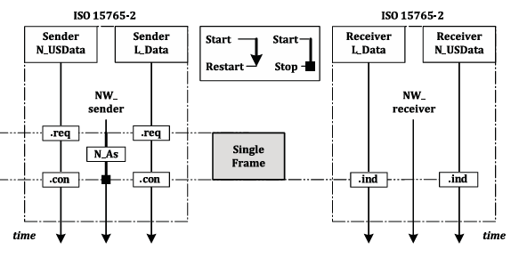
  <br/>
  <em>Figure 56: Sequence diagram for unsegmented message transmission</em>
</p>


For Single Frame transmissions, only **N_As** is relevant.

### Segmented Message Timing

<p align="center">
  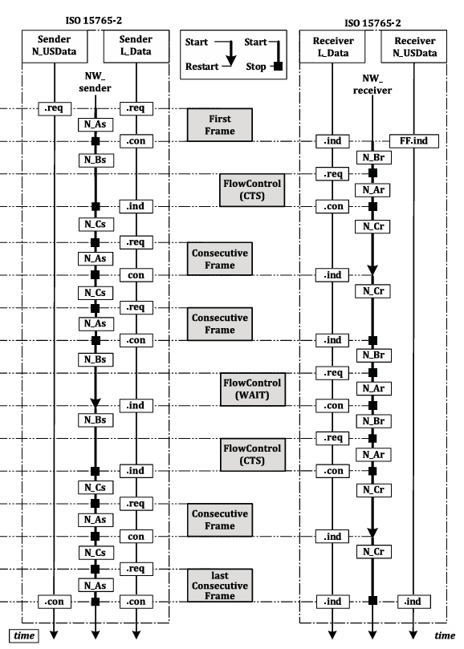
  <br/>
  <em>Figure 57: Sequence diagram for segmented message transmission</em>
</p>


For multi-frame transmissions, all six timers (N_As, N_Ar, N_Bs, N_Br, N_Cs, N_Cr) are utilized.

---

## 5.8. Implementation Details

### Segmentation Process

<p align="center">
  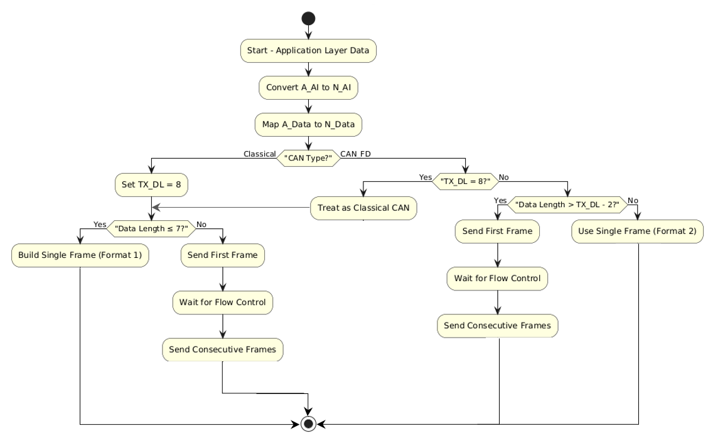
  <br/>
  <em>Figure 58: Flowchart of segmentation logic in the DoCAN transmission process</em>
</p>


**Logic Flow:**

1. Start with Application Layer data
2. Convert A_AI to N_AI
3. Map A_Data to N_Data
4. Determine CAN type (Classical or CAN FD)
5. If Classical CAN:
   - Set TX_DL = 8
   - If data length ≤ 7 → Build Single Frame (Format 1)
   - If data length > 7 → Send First Frame, wait for FC, send Consecutive Frames
6. If CAN FD:
   - If TX_DL = 8 → Treat as Classical CAN
   - If data length > TX_DL - 2 → Send First Frame, wait for FC, send Consecutive Frames
   - If data length ≤ TX_DL - 2 → Use Single Frame (Format 2)

### Reassembly Process

<p align="center">
  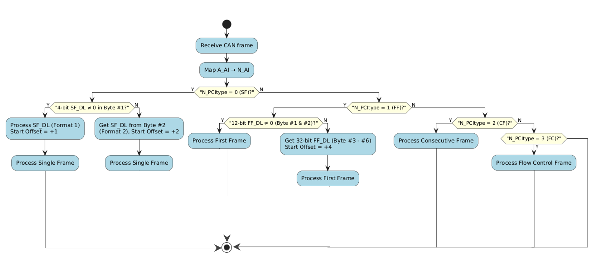
  <br/>
  <em>Figure 59: Simplified flowchart of reassembly logic in the DoCAN reception process</em>
</p>


**Logic Flow:**

1. Receive CAN frame
2. Map A_AI to N_AI
3. Check N_PCI type:
   - If SF (0): Check if 4-bit SF_DL ≠ 0 → Process Format 1, else Process Format 2
   - If FF (1): Check if 12-bit FF_DL ≠ 0 → Process Format 1, else Process Format 2 (32-bit length)
   - If CF (2): Process Consecutive Frame
   - If FC (3): Process Flow Control Frame
4. Reassemble complete message and deliver to upper layer

> **Note**: Associated network timing mechanisms (N_As, N_Bs, N_Cs timers) are fully implemented but not shown in flowcharts for clarity.

---

## 🔗 Navigation

⬅️ **[Chapter 4: Session Layer](../04-Session-Layer/README.md)** — Timing parameters and session management  
➡️ **[Chapter 6: Data Link Layer](../06-Data-Link-Layer/README.md)** — CAN integration and hardware bridge

---

<p align="center">
  <sub>© 2025 Cairo University — Faculty of Engineering. All rights reserved.</sub>
</p>

