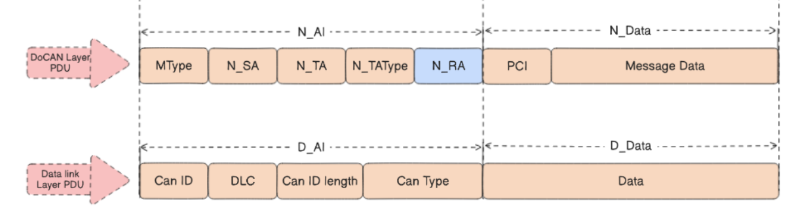
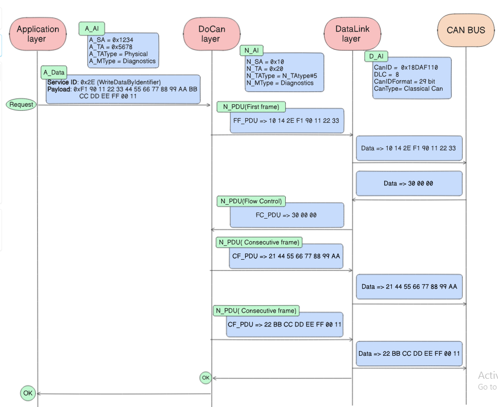
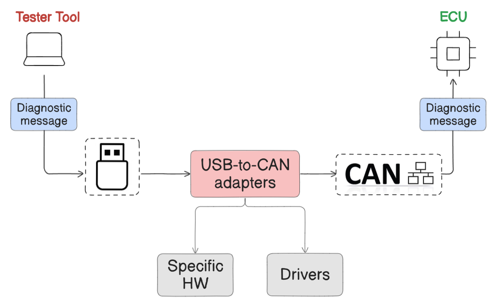
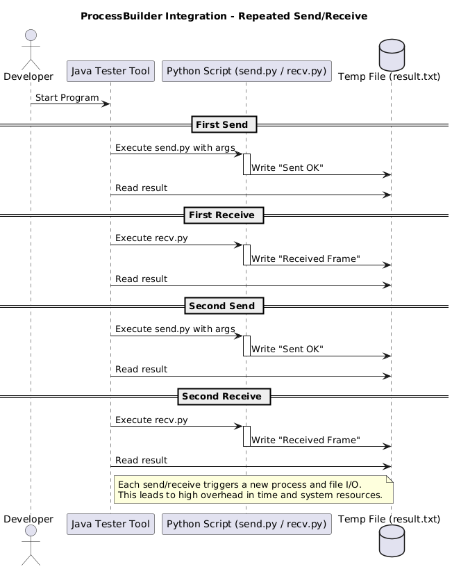
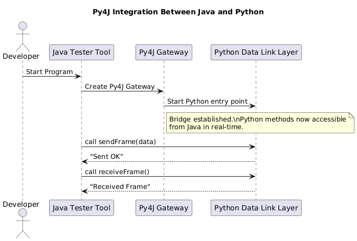

# Chapter 6: Data Link Layer

> **CAN Integration and Hardware Bridge Implementation**

<p align="center">
  
  <br/>
  <em>Figure 60: Mapping between DoCAN layer PDU and Data Link layer PDU</em>
</p>


---

## 📌 Table of Contents

1. [Introduction](#61-introduction-to-this-layer)
2. [Shape of the Data](#62-shape-of-the-data-at-the-data-link-layer)
3. [Interaction with DoCAN](#63-interaction-between-docan-and-data-link-layers)
4. [Implementation Details](#64-implementation-details)

---

## 6.1. Introduction to this Layer

The Data Link Layer in a CAN-based communication stack is responsible for reliable transmission and reception of CAN frames between ECUs. It acts as the immediate interface between higher software layers and the physical CAN bus.

### Core Functions

| Function                            | Description                                           |
| ----------------------------------- | ----------------------------------------------------- |
| **Message Framing**                 | Structuring data into standard or extended CAN frames |
| **Arbitration Handling**            | Priority-based bus access (lowest CAN ID wins)        |
| **Error Detection**                 | CRC, bit stuffing, frame delimiters                   |
| **Acknowledgment & Retransmission** | Reliable delivery with retransmission on errors       |
| **Data Length Control**             | Correct DLC association for payload size              |

### CAN Variants Supported

| Feature          | Classical CAN  | CAN FD                             |
| ---------------- | -------------- | ---------------------------------- |
| Max Data Payload | 8 bytes        | 64 bytes                           |
| Frame Format     | Fixed          | Enhanced with faster data phase    |
| Use Case         | Legacy systems | Modern high-bandwidth applications |

---

## 6.2. Shape of the Data at the Data Link Layer

### CAN Frame Structure

| Field             | Description                                           |
| ----------------- | ----------------------------------------------------- |
| **CAN Type**      | Classical CAN or CAN FD                               |
| **CAN ID Length** | 11-bit (Standard) or 29-bit (Extended)                |
| **CAN ID**        | Unique identifier for arbitration and routing         |
| **DLC**           | Data Length Code (0–8 for Classical, 0–64 for CAN FD) |
| **Data Field**    | Actual payload (length determined by DLC)             |

### DLC to CAN_DL Mapping

| DLC  | Classical CAN Data Length | CAN FD Data Length |
| ---- | ------------------------- | ------------------ |
| 0–8  | 0–8 bytes (1:1)           | 0–8 bytes (1:1)    |
| 9    | 8 bytes (reduced)         | 12 bytes           |
| 10   | 8 bytes (reduced)         | 16 bytes           |
| 11   | 8 bytes (reduced)         | 20 bytes           |
| 12   | 8 bytes (reduced)         | 24 bytes           |
| 13   | 8 bytes (reduced)         | 32 bytes           |
| 14   | 8 bytes (reduced)         | 48 bytes           |
| 15   | 8 bytes (reduced)         | 64 bytes           |

> For Classical CAN, DLC values 9–15 are automatically reduced to 8 bytes.

---

## 6.3. Interaction Between DoCAN and Data Link Layers

### Addressing Information Mapping

The DoCAN layer transforms its addressing parameters into a CAN Identifier:

| DoCAN Parameter | Data Link Layer                       |
| --------------- | ------------------------------------- |
| N_SA (1 byte)   | Part of CAN ID mapping                |
| N_TA (1 byte)   | Part of CAN ID mapping                |
| N_TA_Type       | Determines CAN Type and CAN ID Format |
| N_AE (optional) | Extended addressing                   |

### N_TA_Type to CAN Configuration Mapping

| N_TA_Type | CAN Type      | CAN ID Format |
| --------- | ------------- | ------------- |
| #1        | Classical CAN | 11-bit        |
| #2        | Classical CAN | 11-bit        |
| #3        | CAN FD        | 11-bit        |
| #4        | CAN FD        | 11-bit        |
| #5        | Classical CAN | 29-bit        |
| #6        | Classical CAN | 29-bit        |
| #7        | CAN FD        | 29-bit        |
| #8        | CAN FD        | 29-bit        |

### Address Mapping Database

A centralized mapping database maintains unique relationships between each N_TA and its corresponding CAN ID. This ensures:

- Consistency across all communications
- No address conflicts
- Configurable address pairs for different OEM setups

### Mapping Network Data to CAN Payload

After addressing information is mapped, the diagnostic payload (N_Data) from the DoCAN layer is forwarded directly to the Data Link Layer without additional metadata.

### Full Example: Multi-Frame Operation Across All Layers

<p align="center">
  
  <br/>
  <em>Figure 61: Example for multi-frame operation across all layers</em>
</p>


**Scenario**: Write Data By Identifier (0x2E) with 20-byte payload

```
Application Layer:
  A_AI: A_SA=0x1234, A_TA=0x5678, A_TAType=Physical, A_MType=Diagnostics
  A_Data: SID=0x2E, DID=0xF190, Data=20 bytes

DoCAN Layer:
  N_AI: N_SA=0x10, N_TA=0x20, N_TAType=#5, N_MType=Diagnostics
  N_PDU (First Frame): [10] [14] [2E] [F1] [90] [11] [22] [33]
  N_PDU (Flow Control): [30] [00] [00]
  N_PDU (CF #1): [21] [44] [55] [66] [77] [88] [99] [AA]
  N_PDU (CF #2): [22] [BB] [CC] [DD] [EE] [FF] [00] [11]

Data Link Layer:
  D_AI: CanID=0x18DAF110, DLC=8, CanIDFormat=29-bit, CanType=Classical CAN
  Frame 1: [10] [14] [2E] [F1] [90] [11] [22] [33]
  Frame 2: [30] [00] [00] [00] [00] [00] [00] [00]
  Frame 3: [21] [44] [55] [66] [77] [88] [99] [AA]
  Frame 4: [22] [BB] [CC] [DD] [EE] [FF] [00] [11]
```

---

## 6.4. Implementation Details

### Hardware Setup

<p align="center">
  
  <br/>
  <em>Figure 62: Connection between XDT and the ECU through USB-to-CAN adapter</em>
</p>


**Components:**

- **Tester Tool**: Runs on PC (Java application)
- **USB-to-CAN Adapter**: Hardware bridge (e.g., Vector VX1000, PCAN, Kvaser)
- **ECU**: Target vehicle controller communicating via CAN

### Why Integration Over Custom Development

| Challenge                                                   | Solution                                        |
| ----------------------------------------------------------- | ----------------------------------------------- |
| Writing custom drivers requires intimate hardware knowledge | Use existing open-source drivers                |
| Hardware internals not publicly available                   | Leverage proven community solutions             |
| Time constraints                                            | Avoid reinventing the wheel                     |
| Need broad hardware support                                 | Open-source libraries support multiple adapters |

**Open-source CAN libraries support:** Socket CAN, PCAN, Kvaser, USB2CAN, and more.

### Integration Methods

#### Method 1: Process Builder (Java → Python via Process)

<p align="center">
  
  <br/>
  <em>Figure 63: Sequence diagram illustrating ProcessBuilder integration in Data Link Layer</em>
</p>


**Approach:**

1. Java launches Python script using ProcessBuilder
2. Pass arguments (CAN ID, data, mode) to Python process
3. Python performs operation and writes result to temp file
4. Java waits for process completion and reads result

**Disadvantages:**

- High latency (few seconds per operation)
- Process spawning overhead for each send/receive
- File I/O bottleneck

#### Method 2: Py4J Gateway (Java ↔ Python Bridge)

<p align="center">
  
  <br/>
  <em>Figure 64: Sequence diagram illustrating Py4J integration between Java and Python</em>
</p>


**Approach:**

1. Initialize Py4J gateway connection once at startup
2. Call Python methods directly from Java (e.g., `send_can_frame()`, `receive_can_frame()`)
3. Communication over live socket-based bridge

**Advantages:**

- High performance (millisecond response times)
- No process spawning overhead
- Cleaner, modular architecture
- Real-time bidirectional communication

### XDT Implementation Choice

XDT adopts **Py4J Gateway** for optimal performance, combining:

- Java-based UDS protocol stack
- Python-based CAN communication library
- Low-latency, real-time frame transmission and reception

---

## 🔗 Navigation

⬅️ **[Chapter 5: Network/Transport Layer (DoCAN)](../05-Network-Transport-Layer-DoCAN/README.md)** — Segmentation and flow control  
➡️ **[Chapter 7: File Parsing](../07-File-Parsing/README.md)** — Firmware file formats (S19, VBF)

---

<p align="center">
  <sub>© 2025 Cairo University — Faculty of Engineering. All rights reserved.</sub>
</p>

