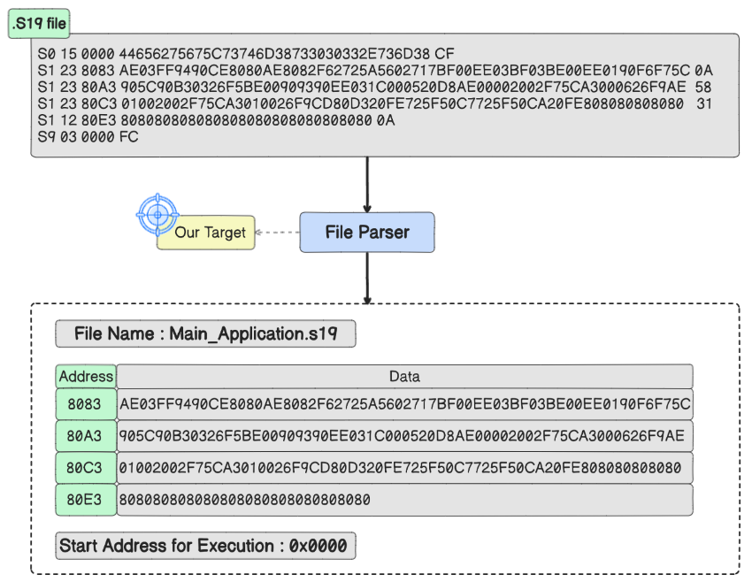
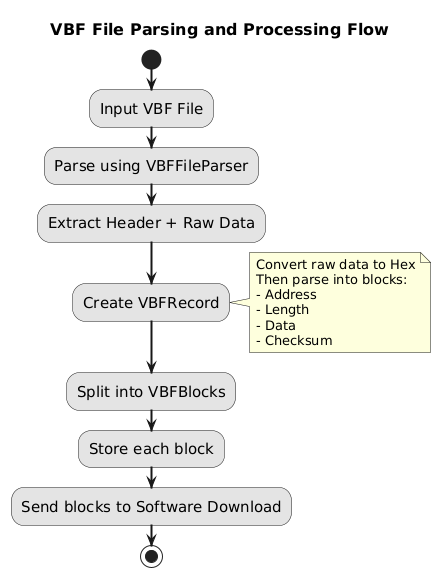

# Chapter 7: File Parsing Structure and Format

> **Firmware File Formats for ECU Flashing (S19 and VBF)**

<p align="center">
  
  <br/>
  <em>Figure 65: Example about parsing S19 file</em>
</p>


---

## 📌 Table of Contents

1. [The Role of the File Parser](#71-the-role-of-the-file-parser)
2. [Why Support Different File Formats](#72-why-support-different-file-formats)
3. [S19 File Format](#73-s19-file-format)
4. [VBF File Format](#74-vbf-file-format)

---

## 7.1. The Role of the File Parser

The file parser is a crucial component that interprets firmware or binary data files meant for programming ECUs. These files are structured formats containing both application data and metadata.

### Parsed Information

| Element              | Description                                     |
| -------------------- | ----------------------------------------------- |
| **Data Bytes**       | Actual payload to be programmed into ECU memory |
| **Memory Addresses** | Target locations where data should be written   |
| **Metadata**         | Data length, checksums, version information     |

### Parser Function

The file parser acts as a **format-agnostic regulator** — regardless of input format (Intel HEX, Motorola S-records, VBF, etc.), it provides a uniform output:

- A list or map of addresses and corresponding data bytes
- Ready to be passed to the Data Link Layer for transmission to the ECU

---

## 7.2. Why Support Different File Formats

### a. Compatibility with Tools and Microcontrollers

| Format  | Typical Use                                      |
| ------- | ------------------------------------------------ |
| **S19** | NXP/Motorola systems                             |
| **HEX** | Intel-based and general-purpose microcontrollers |
| **VBF** | Automotive ECUs with UDS-based flashing          |

### b. Integration with OEM and Flashing Tools

- Tools like CANoe, DTS, or OEM-specific bootloaders support only certain formats
- Supporting multiple formats enables seamless integration without preprocessing

### c. Format-Specific Features

| Format        | Characteristics                                              |
| ------------- | ------------------------------------------------------------ |
| **S19 & HEX** | Compact, line-based, easy for low-level parsers              |
| **VBF**       | Metadata support, multiple address blocks, checksums — ideal for secure ECU flashing |

### d. Cross-Vendor Collaboration

Ensures the tool works with files from different suppliers, OEMs, or toolchains.

### e. Broader Testing and Validation

- Test flashing system with variety of real-world input formats
- Increases robustness and reliability

### f. Industry and OEM Standards Compliance

- Some formats (e.g., VBF) are required by automotive standards or OEMs
- Mandatory for project acceptance and certification

### g. Avoiding Format Conversion Overhead

Reduces need for preprocessing tools and eliminates errors from format conversion.

---

## 7.3. S19 File Format

The **Motorola S-record (S19)** is a text-based ASCII format used to convey binary data in a structured, human-readable way.

### Record Structure

```
S<Type><Byte Count><Address><Data><Checksum>
```

### Field Definitions

| Field          | Size            | Description                                                  |
| -------------- | --------------- | ------------------------------------------------------------ |
| **S**          | 1 character     | Always starts with "S"                                       |
| **Type**       | 1 character     | Record type (0–9)                                            |
| **Byte Count** | 2 hex chars     | Total bytes following this field (Address + Data + Checksum) |
| **Address**    | 4/6/8 hex chars | Target memory address (length depends on type)               |
| **Data**       | Variable (0–N)  | Actual payload to be written                                 |
| **Checksum**   | 2 hex chars     | Integrity verification                                       |

### S-Record Types

| Record | Use                       | Address Size | Description                               |
| ------ | ------------------------- | ------------ | ----------------------------------------- |
| **S0** | Metadata/Header           | 2 bytes      | File name, description, version info      |
| **S1** | Data with 16-bit address  | 2 bytes      | Main data record (low address space)      |
| **S2** | Data with 24-bit address  | 3 bytes      | Extended addressing                       |
| **S3** | Data with 32-bit address  | 4 bytes      | Full address range for large systems      |
| **S4** | Reserved                  | —            | Not used in practice                      |
| **S5** | Count of data records     | 2 bytes      | Number of S1/S2/S3 records (16-bit count) |
| **S6** | Count of data records     | 3 bytes      | Number of S1/S2/S3 records (24-bit count) |
| **S7** | Start execution (with S3) | 4 bytes      | Entry point for 32-bit systems            |
| **S8** | Start execution (with S2) | 3 bytes      | Entry point for 24-bit systems            |
| **S9** | Start execution (with S1) | 2 bytes      | Entry point for 16-bit systems            |

### Record Type Examples

#### S0 — Header/Metadata Record

```
S00F000068656C6C6F202020202000003C
```

| Type | Byte Count    | Address        | Data    | Checksum |
| ---- | ------------- | -------------- | ------- | -------- |
| S0   | 0F (15 bytes) | 0000 (ignored) | "hello" | 3C       |

#### S1 — Data with 16-bit Address

```
S1137AF000021A1100AA2233445566778899AABBCC34
```

| Type | Byte Count    | Address | Data             | Checksum |
| ---- | ------------- | ------- | ---------------- | -------- |
| S1   | 13 (19 bytes) | 7AF0    | 16 bytes of data | 34       |

#### S2 — Data with 24-bit Address

```
S21400100048656C6C6F2C20576F726C64210A0042
```

| Type | Byte Count    | Address | Data             | Checksum |
| ---- | ------------- | ------- | ---------------- | -------- |
| S2   | 14 (20 bytes) | 001000  | 16 bytes of data | 42       |

#### S3 — Data with 32-bit Address

```
S3250010000048656C6C6F205C6E5C7420576F726C64210D0A0048
```

| Type | Byte Count    | Address  | Data             | Checksum |
| ---- | ------------- | -------- | ---------------- | -------- |
| S3   | 25 (37 bytes) | 00100000 | 32 bytes of data | 48       |

#### S5 — Count of Data Records (16-bit)

```
S5030003F9
```

| Type | Byte Count   | Address (Count)  | Checksum |
| ---- | ------------ | ---------------- | -------- |
| S5   | 03 (3 bytes) | 0003 (3 records) | F9       |

#### S6 — Count of Data Records (24-bit)

```
S604000003F8
```

| Type | Byte Count   | Address (Count)    | Checksum |
| ---- | ------------ | ------------------ | -------- |
| S6   | 04 (4 bytes) | 000003 (3 records) | F8       |

#### S7 — Start Address (32-bit)

```
S70500100000EA
```

| Type | Byte Count   | Address  | Checksum |
| ---- | ------------ | -------- | -------- |
| S7   | 05 (5 bytes) | 00100000 | EA       |

#### S8 — Start Address (24-bit)

```
S804001000FB
```

| Type | Byte Count   | Address | Checksum |
| ---- | ------------ | ------- | -------- |
| S8   | 04 (4 bytes) | 001000  | FB       |

#### S9 — Start Address (16-bit)

```
S9030000FC
```

| Type | Byte Count   | Address | Checksum |
| ---- | ------------ | ------- | -------- |
| S9   | 03 (3 bytes) | 0000    | FC       |

### Parsing Example

<p align="center">
  
  <br/>
  <em>Figure 65: Example about parsing S19 file — extracting addresses and data</em>
</p>


**Input S19 File:**

```
S0 15 0000 446562756E6373746F6F6C2032303235 CF
S1 23 8083 AE03FF9490CE8080AE8082F62725A56027117BF00EE03BF03BE00EE0190F6F75C 0A
S1 23 80A3 905C90B30326F5BE009099390EE031C000520D8AE00002002F75CA3000626F9AE 58
S1 23 80C3 01002002F75CA3010026F9CD80D320FE725F50C7725F50CA20FE808080808080 31
S1 12 80E3 80808080808080808080808080808080 0A
S9 03 0000 FC
```

**Parsed Output:**

| Address | Data                                                         |
| ------- | ------------------------------------------------------------ |
| 0x8083  | AE03FF9490CE8080AE8082F62725A56027117BF00EE03BF03BE00EE0190F6F75C |
| 0x80A3  | 905C90B30326F5BE009099390EE031C000520D8AE00002002F75CA3000626F9AE |
| 0x80C3  | 01002002F75CA3010026F9CD80D320FE725F50C7725F50CA20FE808080808080 |
| 0x80E3  | 80808080808080808080808080808080                             |

**Start Address for Execution:** 0x0000

---

## 7.4. VBF File Format

The **Versatile Binary Format (VBF)** is widely used in the automotive industry for ECU software updates.

### Why VBF is Common

1. **Standardization**: Supported by major OEMs (Volvo, Ford) and tier-1 suppliers
2. **Security & Structure**: Includes versioning, part numbers, addresses, erase regions, checksums
3. **UDS Integration**: Designed for compatibility with UDS diagnostic protocols
4. **Flexibility**: Supports compressed/uncompressed data, single or multiple memory blocks
5. **Industry Standard**: De facto standard for production plants, service centers, and OTA updates

### VBF File Structure

A VBF file consists of two main parts:

#### Header Section (Text-based)

Human-readable metadata required to interpret and flash the file:

| Metadata                              | Description                                                  |
| ------------------------------------- | ------------------------------------------------------------ |
| **vbf_version**                       | VBF format version used                                      |
| **sw_part_number**                    | Software image part number for traceability                  |
| **sw_version**                        | Software version identifier                                  |
| **sw_part_type**                      | Type classification of the software part                     |
| **data_format_identifier**            | Compression status (0x00 = uncompressed, 0x10 = compressed)  |
| **ecu_address**                       | CAN address of the target ECU                                |
| **verification_block_start & length** | Location and size of verification block                      |
| **verification_block_root_hash**      | Cryptographic hash (e.g., SHA-256) for integrity verification |
| **file_checksum**                     | Checksum for entire VBF file validation                      |

#### Data Section (Binary)

Contains the actual firmware payload:

| Element            | Description                           |
| ------------------ | ------------------------------------- |
| **Memory Address** | Target location in ECU memory         |
| **Data Length**    | Number of bytes to write              |
| **Data Bytes**     | Actual firmware payload               |
| **Checksum**       | Integrity verification for each block |

### VBF Parsing Workflow

<p align="center">
  
  <br/>
  <em>Figure 66: VBF File Parsing and Block Preparation Workflow for ECU Programming</em>
</p>


**Parsing Steps:**

1. Input VBF file
2. Parse using VBFFileParser
3. Extract Header + Raw Data
4. Create VBFRecord (convert raw data to hex)
5. Parse into structured blocks: Address, Length, Data, Checksum
6. Split into VBFBlock instances
7. Store each block
8. Send blocks to Software Download module

### VBFBlock Structure

```java
class VBFBlock {
    long address;      // Target memory address
    int length;        // Data length in bytes
    byte[] data;       // Actual firmware data
    int checksum;      // Block integrity checksum
}
```

---

## 🔗 Navigation

⬅️ **[Chapter 6: Data Link Layer](../06-Data-Link-Layer/README.md)** — CAN integration and hardware bridge  
➡️ **[Chapter 8: Graphical User Interface](../08-Graphical-User-Interface/README.md)** — GUI design and implementation

---

<p align="center">
  <sub>© 2025 Cairo University — Faculty of Engineering. All rights reserved.</sub>
</p>

