# Chapter 8: Graphical User Interface (GUI)

> **Modern, Responsive, and Professional Diagnostic Interface**

<p align="center">
  
</p>


---

## 📌 Table of Contents

1. [Introduction](#81-introduction)
2. [Design Principles](#82-design-principles)
3. [Technology Stack](#83-technology-stack)
4. [GUI Architecture](#84-gui-architecture)
5. [Layout and Navigation](#85-layout-and-navigation-design)
6. [Home Page](#home-page)
7. [Settings & Configuration](#settings--configuration)
8. [Diagnostic Services UI](#diagnostic-services-ui)
9. [Software Transfer](#software-transfer)
10. [Sequence Automation](#sequence-automation)
11. [ECU Testing](#ecu-testing)
12. [Advanced Features](#advanced-features)
13. [Styling and Responsiveness](#86-styling-responsiveness-and-accessibility)
14. [Performance Optimization](#89-performance-optimization-and-system-requirements)
15. [Error Handling](#810-error-handling-and-input-validation)
16. [Final Overview](#811-final-overview)

---

## 8.1. Introduction

The XDT GUI provides an interactive interface for automotive technicians, engineers, and technical service personnel. It simplifies complex diagnostic workflows while providing:

- Diagnostic data visualization
- ECU response management
- Runtime parameter configuration
- Guided tool workflows

---

## 8.2. Design Principles

The GUI follows **Object-Oriented Programming (OOP)** principles:

| Principle             | Application                                |
| --------------------- | ------------------------------------------ |
| **Modularity**        | Independent UI components for each feature |
| **Maintainability**   | Clean separation between view and logic    |
| **Extensibility**     | Easy to add new services and screens       |
| **Memory Efficiency** | Optimized for resource-constrained systems |
| **Thread Safety**     | Smooth operation during long-running tasks |

---

## 8.3. Technology Stack

| Technology       | Purpose                                                      |
| ---------------- | ------------------------------------------------------------ |
| **Java**         | Core programming language                                    |
| **JavaFX**       | Primary UI framework — modern, responsive desktop applications |
| **FXML**         | XML-based declarative UI design                              |
| **SceneBuilder** | Visual drag-and-drop UI design tool                          |
| **CSS**          | Consistent styling and theming                               |
| **Eclipse IDE**  | Development environment                                      |

### JavaFX Advantages

- Dynamic interfaces with real-time updates
- Multimedia integration (intro videos, animations)
- Cross-platform compatibility (Windows 10/11 target)
- Rich set of UI controls

### Application Bundle

- Bundled with **Java Runtime Environment (JRE)**
- No external dependencies required
- Lightweight **~150MB** package

---

## 8.4. GUI Architecture

XDT follows the **Model-View-Controller (MVC)** pattern:

<p align="center">
  
  <br/>
  <em>Figure 67: MVC Architecture — Separation of concerns</em>
</p>


### Architecture Components

| Component      | Responsibility                                               | Technology                                                   |
| -------------- | ------------------------------------------------------------ | ------------------------------------------------------------ |
| **View**       | Visual structure and rendering                               | FXML, JavaFX components (buttons, text fields, labels, ImageView) |
| **Controller** | User interaction handling, event logic, backend communication | Java classes linked to each FXML view                        |
| **Model**      | User configurations and runtime state                        | Java objects, configuration files                            |

### Communication Flow

```
User Input → Controller → Model (update state) → View (refresh display)
     ↑_____________________________________________________|
```

### Utility Classes

- **GuiHelper**: Common backend API communication
- **Configuration Loader**: Runtime settings management
- **Validation Helpers**: Input validation and error checking

---

## 8.5. Layout and Navigation Design

<p align="center">
  
  <br/>
  <em>Figure 68: Layout and Navigation Design — Scene hierarchy</em>
</p>


### Scene Structure

1. **Intro Video** (MediaView-based)
   - Auto-plays on application launch
   - Click to skip to welcome screen

2. **Welcome Screen**
   - Welcome image
   - Navigation link to home screen

3. **Home Scene** (Central Dashboard)
   - 11 CU-themed ImageView components
   - Each navigates to a key functionality

4. **Feature Scenes**
   - DSC, Security Access, Read DTC, ECU Reset, Software Transfer, etc.

### Navigation Elements

| Element                 | Location  | Function                              |
| ----------------------- | --------- | ------------------------------------- |
| **Home Button**         | Top right | Return to home scene                  |
| **Back Button**         | Top left  | Return to previous scene              |
| **Collapsible Sidebar** | Left edge | Expands on hover for quick access     |
| **Keyboard Shortcuts**  | Global    | Quick actions (e.g., Ctrl+H for home) |
| **Tooltips**            | Hover     | Contextual help for each element      |

---

## Home Page

<p align="center">
  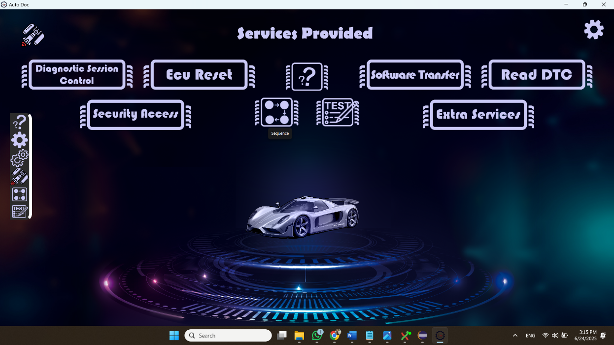
  <br/>
  <em>Figure 69: Home Page, Sidebar, and Tooltips from XDT</em>
</p>


The home page serves as the central dashboard providing access to all tool functionalities through intuitive navigation cards.

---

## Settings & Configuration

### Workspace Handling

<p align="center">
  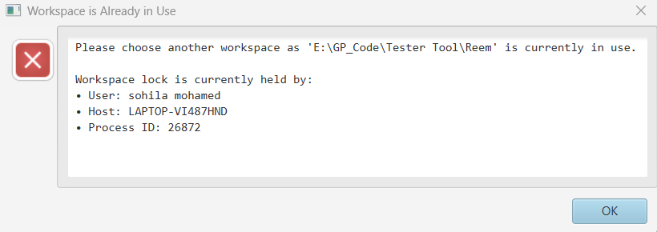
  <br/>
  <em>Figure 70: Warning when workspace is already open</em>
</p>


XDT prevents data corruption by detecting and warning when a workspace is already open in another instance.

### Settings Interface

<p align="center">
  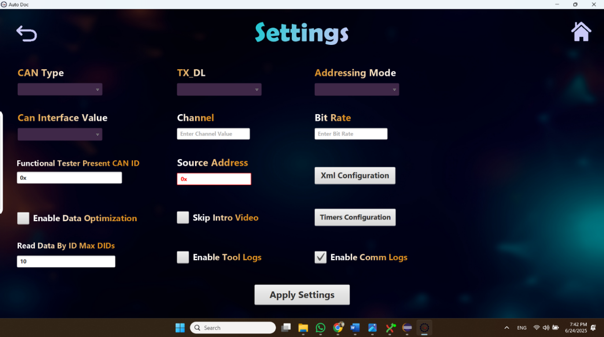
  <br/>
  <em>Figure 74: XDT Settings Interface</em>
</p>


The main settings panel provides comprehensive configuration options for:

- CAN bus parameters (bitrate, type, ID format)
- Timing parameters (P2, P2*, P3, S3)
- OEM-specific address mappings
- Security access configurations

### Timer Configuration

<p align="center">
  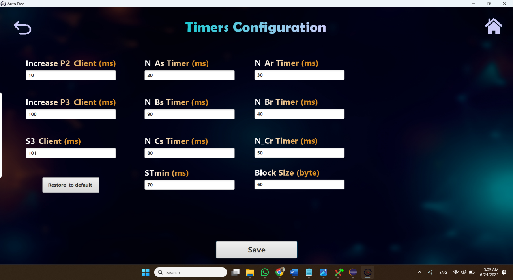
  <br/>
  <em>Figure 75: Timer Configuration Interface</em>
</p>


Fine-tune session timing parameters for different ECU requirements and network conditions.

### XML Configuration

<p align="center">
  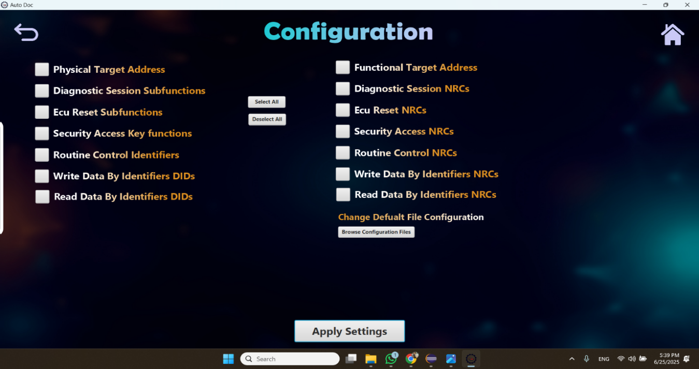
  <br/>
  <em>Figure 76: XML Configuration Scene</em>
</p>


Configure service behaviors and ECU definitions through XML files without modifying source code.

### NRC Configuration

<p align="center">
  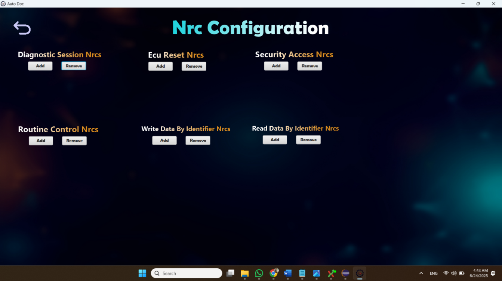
  <br/>
  <em>Figure 77: NRC Configuration Scene</em>
</p>


Customize Negative Response Code handling and user-facing error messages.

### Address Configuration

<p align="center">
  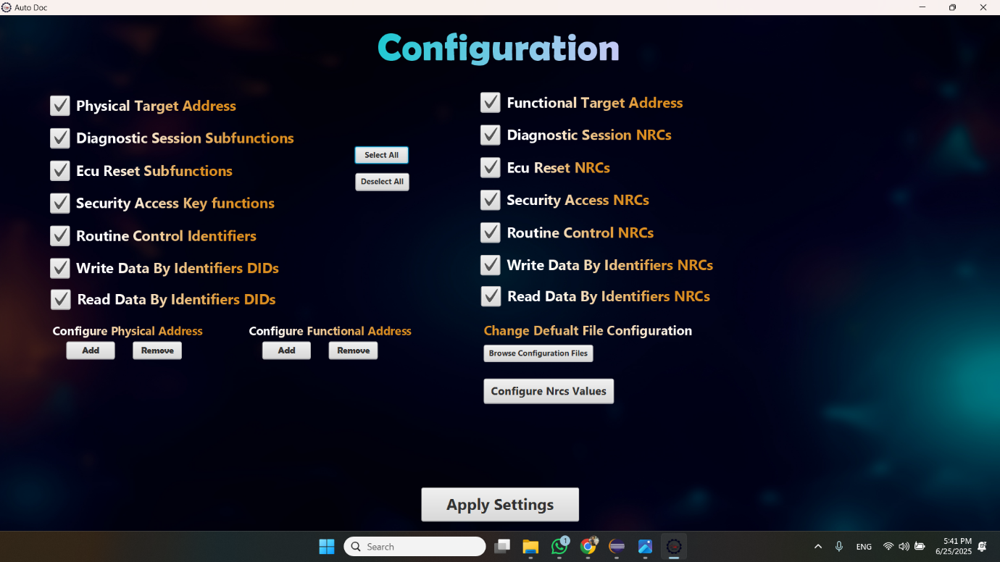
  <br/>
  <em>Figure 78: Configuring Physical and Functional addresses without restarting the tool</em>
</p>


Dynamic address configuration allows runtime changes to communication targets without tool restart.

---

## Diagnostic Services UI

### Input Validation

<p align="center">
  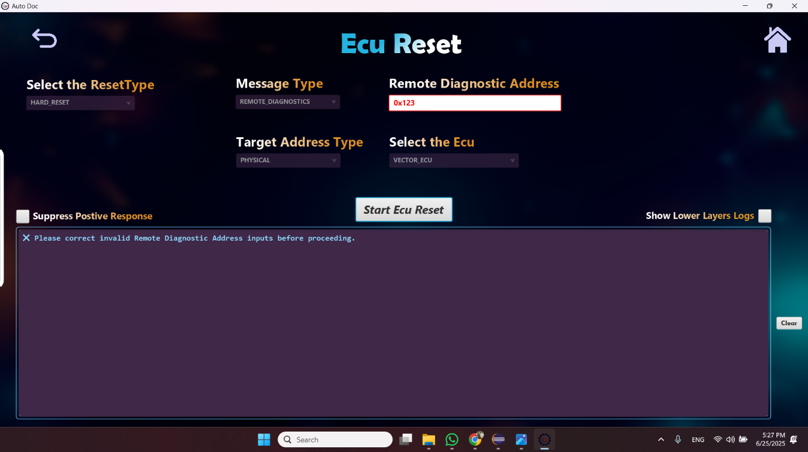
  <br/>
  <em>Figure 72: Real-Time Input Validation During ECU Reset</em>
</p>


Real-time validation ensures users enter correct parameters before sending requests to the ECU.

### Error Handling

<p align="center">
  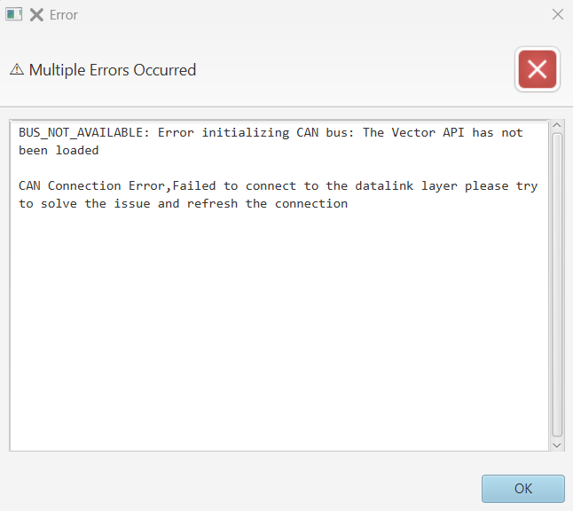
  <br/>
  <em>Figure 73: Tool Modal Error Alert During CAN Initialization Failure</em>
</p>


Clear, actionable error messages guide users through troubleshooting steps when issues occur.

### Dynamic UI Updates

<p align="center">
  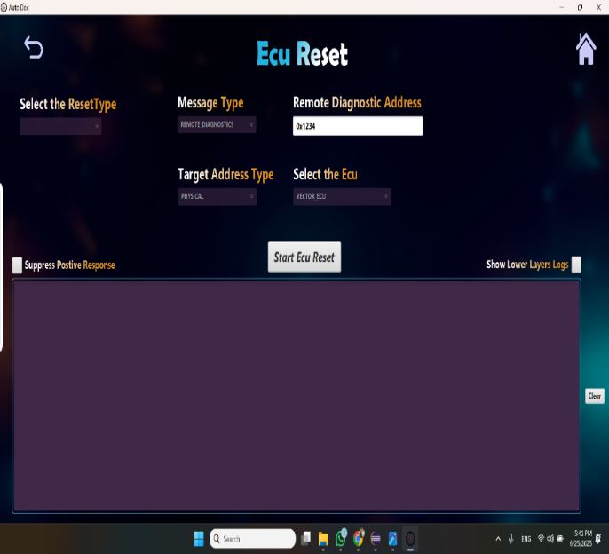
  <br/>
  <em>Figure 79: Dynamic UI Update in ECU Reset Scene</em>
</p>


The interface adapts dynamically based on user selections and ECU responses.

### Extra Services

<p align="center">
  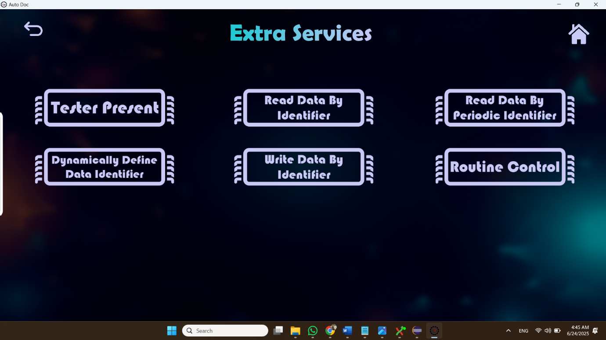
  <br/>
  <em>Figure 80: Extra Services Scene</em>
</p>


Access to additional OEM-specific and extended diagnostic services.

### Diagnostic Session Control Scene

<p align="center">
  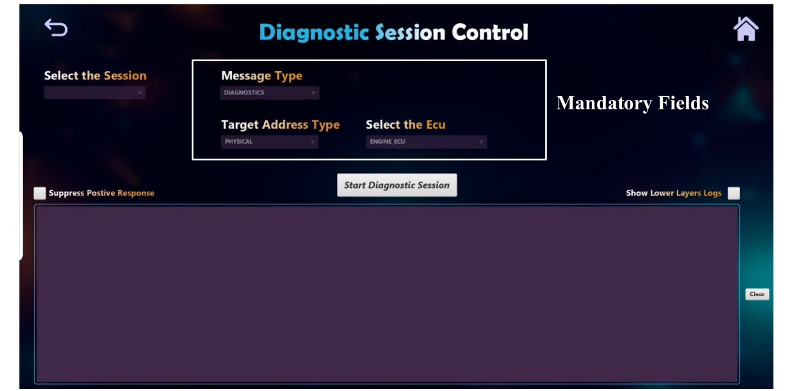
  <br/>
  <em>Figure 81: Diagnostic Session Control Scene demonstrating consistent scene design</em>
</p>


Initiate and manage diagnostic sessions (Default, Programming, Extended, Safety) with clear visual feedback.

### General Request

<p align="center">
  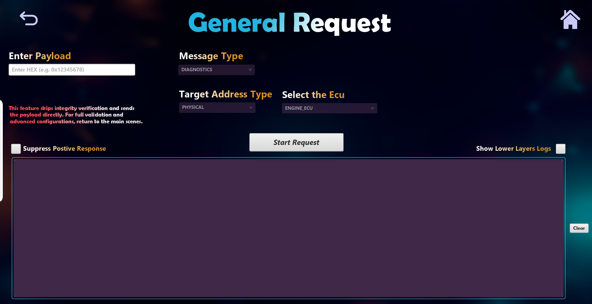
  <br/>
  <em>Figure 82: General Request Scene</em>
</p>


Send custom UDS requests with full control over parameters and payload.

### Security Access — Built-In Mode

<p align="center">
  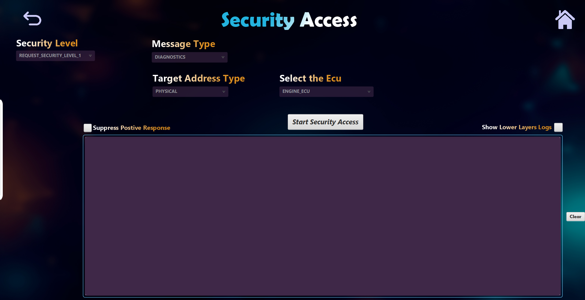
  <br/>
  <em>Figure 83: Security Access – Built-In Mode: Level 1 selected using internal algorithm</em>
</p>


Use pre-configured security algorithms for common OEM implementations.

### Security Access — DLL Mode

<p align="center">
  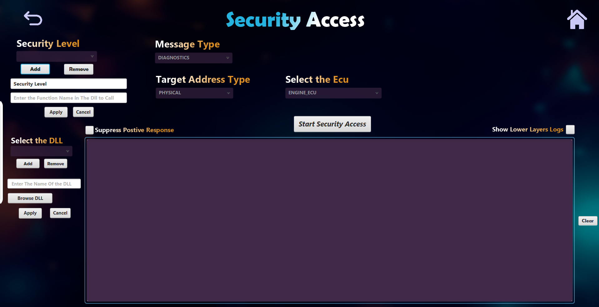
  <br/>
  <em>Figure 84: Security Access – DLL Mode: Custom DLL and Level 19 loaded dynamically</em>
</p>


Load custom security algorithms via external DLLs for proprietary OEM implementations.

---

## Software Transfer

### Software Download Interface

<p align="center">
  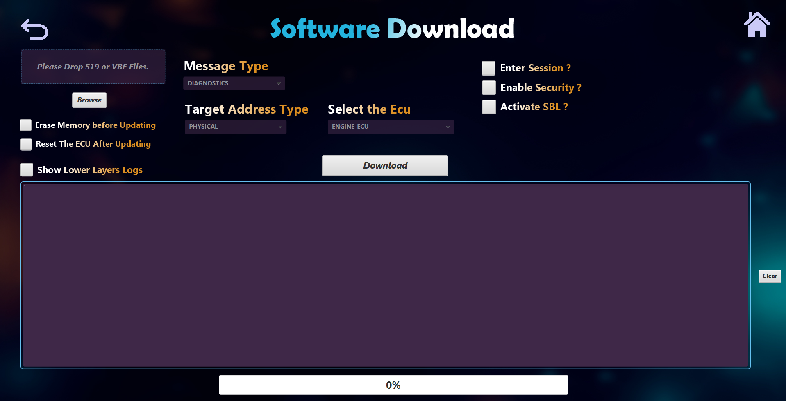
  <br/>
  <em>Figure 85: XDT Software Download Interface</em>
</p>


The main software download interface supports S19 and VBF file formats with comprehensive pre-flash options.

### System Layers View

<p align="center">
  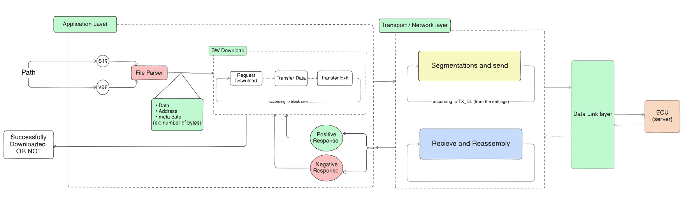
  <br/>
  <em>Figure 86: Shows how the system layers work together to make easy software download</em>
</p>


Visual representation of how all OSI layers collaborate during firmware flashing.

### SBL File Selection

<p align="center">
  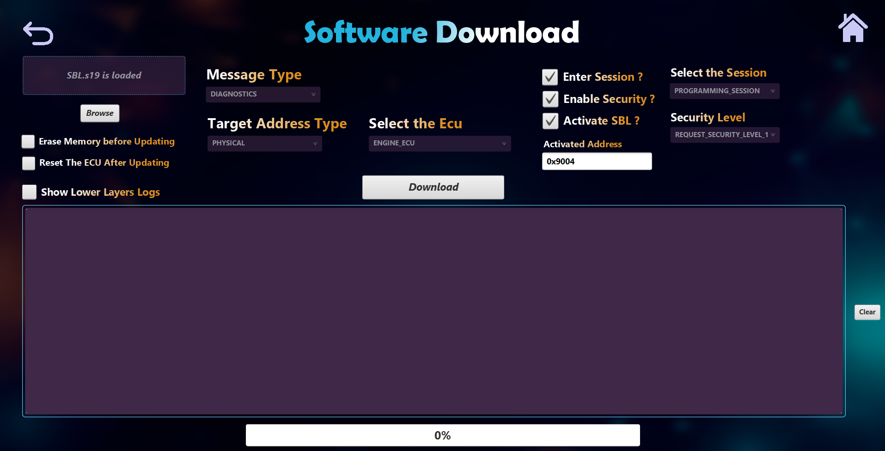
  <br/>
  <em>Figure 87: Selecting and preparing the SBL file for download</em>
</p>


Select and prepare Secondary Boot Loader (SBL) files for ECU programming.

### Download Progress

<p align="center">
  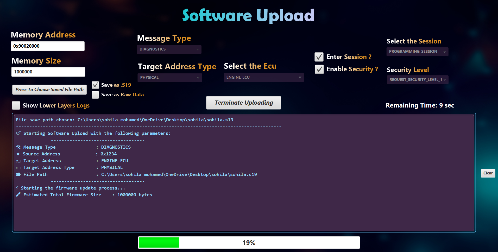
  <br/>
  <em>Figure 88: Software Download in progress with real-time status and cancel option</em>
</p>


Real-time progress tracking with transfer speed, estimated time remaining, and cancel capability.

### Download Success

<p align="center">
  
  <br/>
  <em>Figure 89: Application downloaded with logs showing live message exchange</em>
</p>


Detailed success confirmation with complete transaction logs for verification.

### Software Upload Interface

<p align="center">
  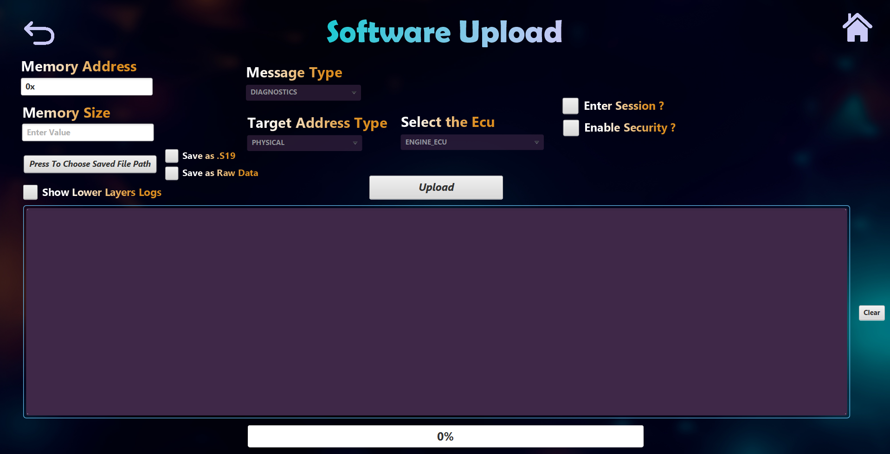
  <br/>
  <em>Figure 90: XDT Software Upload Interface</em>
</p>


Extract and save firmware from ECU memory for backup or analysis.

### Upload Progress

<p align="center">
  
  <br/>
  <em>Figure 91: Software Upload in progress with real-time status and cancel option</em>
</p>


Monitor upload progress with the same real-time feedback as download operations.

### Upload Success

<p align="center">
  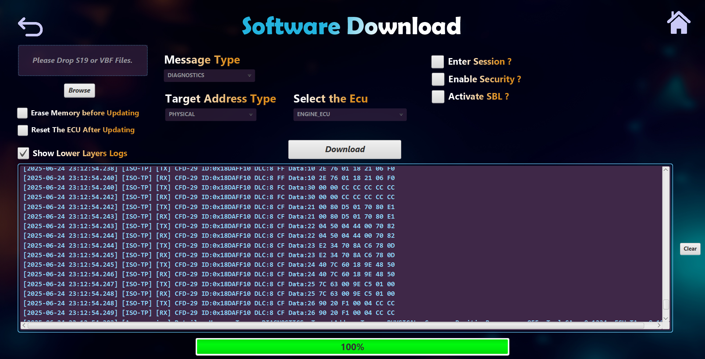
  <br/>
  <em>Figure 92: Uploaded firmware displayed after successful extraction from ECU memory</em>
</p>


View and save extracted firmware data with full integrity verification.

---

## Sequence Automation

### Sequence Workflow

<p align="center">
  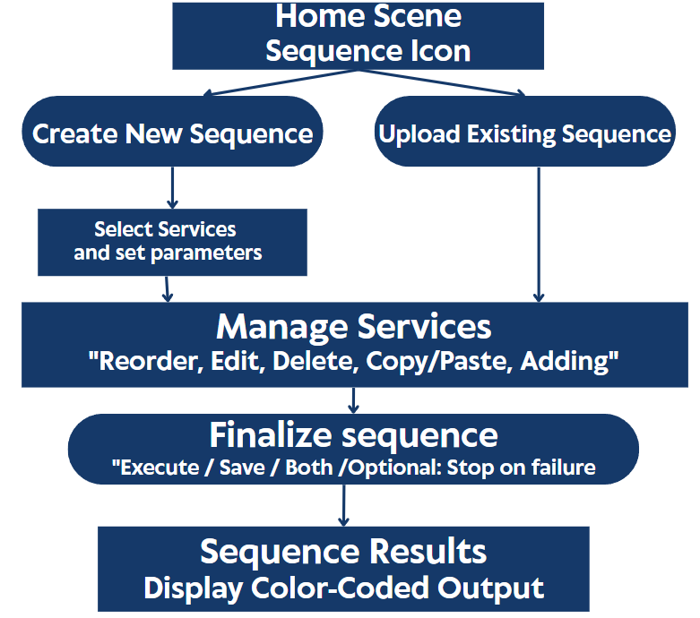
  <br/>
  <em>Figure 93: UDS Sequence Workflow</em>
</p>


Visual workflow for creating, executing, and managing automated service sequences.

### Sequence Creation

<p align="center">
  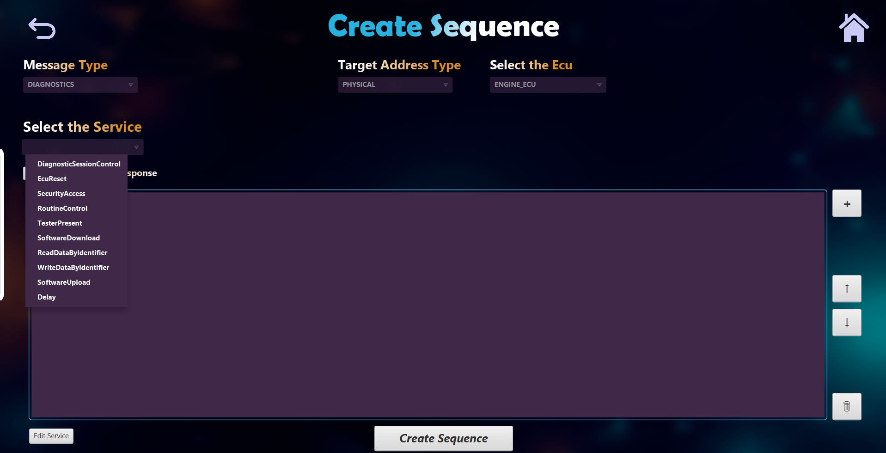
  <br/>
  <em>Figure 94: Sequence creation options screen with all supported services</em>
</p>


Select from all available UDS services to build custom diagnostic sequences.

### Sequence List

<p align="center">
  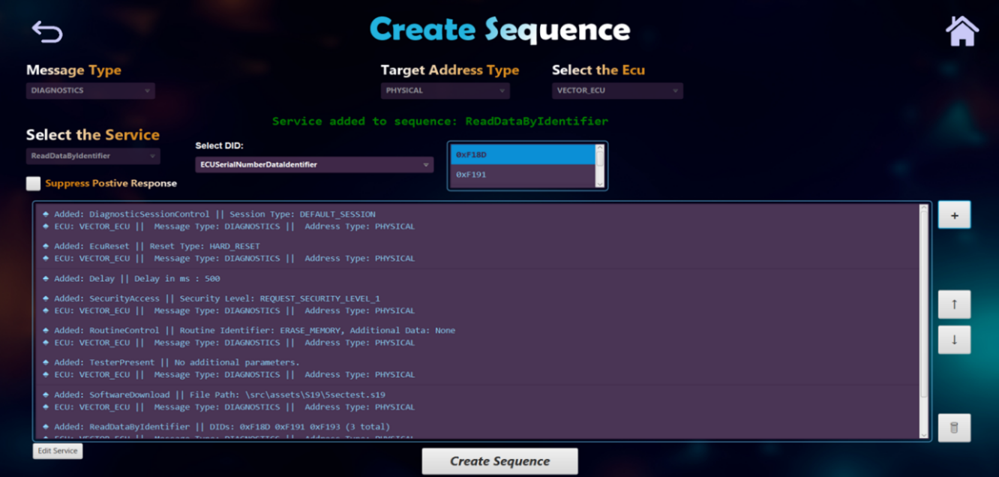
  <br/>
  <em>Figure 95: List services to the list view with their parameters</em>
</p>


Organize and configure service parameters in a structured list view.

### Sequence Execution

<p align="center">
  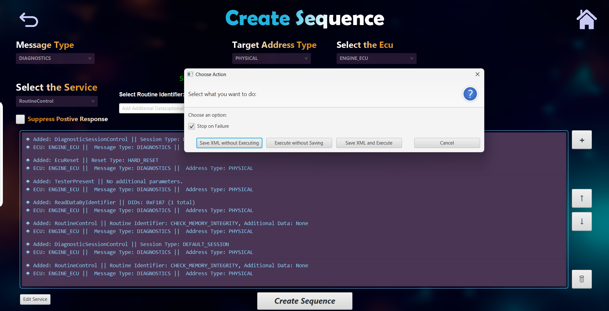
  <br/>
  <em>Figure 96: Sequence creation options screen, allowing user to execute, save, or both</em>
</p>


Execute sequences immediately, save for later, or both.

### Configuration Mismatch

<p align="center">
  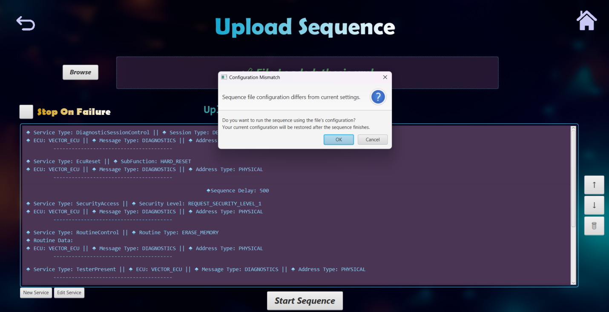
  <br/>
  <em>Figure 97: Handle configuration mismatch</em>
</p>


Detect and resolve configuration conflicts when loading saved sequences.

### Empty Upload

<p align="center">
  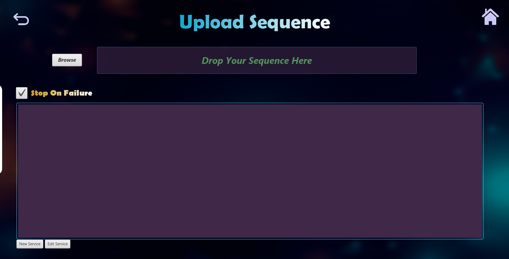
  <br/>
  <em>Figure 98: Empty upload scene for selecting a saved sequence file</em>
</p>


Interface for loading previously saved sequence configurations.

### Uploaded Sequence

<p align="center">
  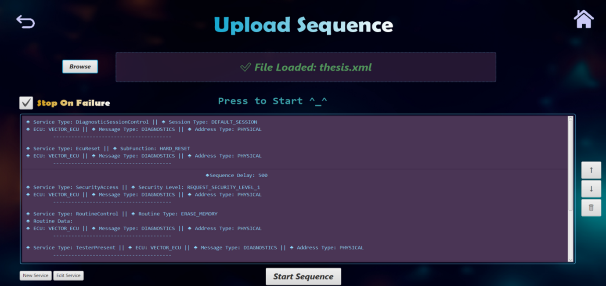
  <br/>
  <em>Figure 99: Uploaded sequence populated with services and available for editing</em>
</p>


Loaded sequences are populated with services ready for review and modification.

### Add Service

<p align="center">
  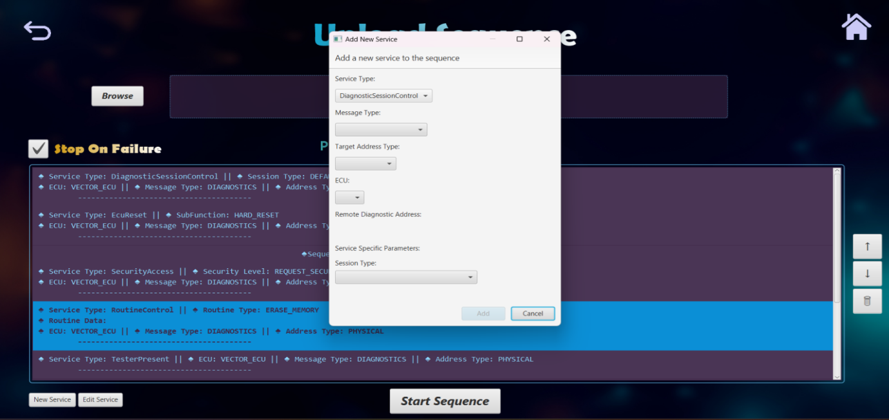
  <br/>
  <em>Figure 100: Adding a UDS service to a sequence with validation to a saved sequence</em>
</p>


Add new services to existing sequences with full parameter validation.

### Edit Service

<p align="center">
  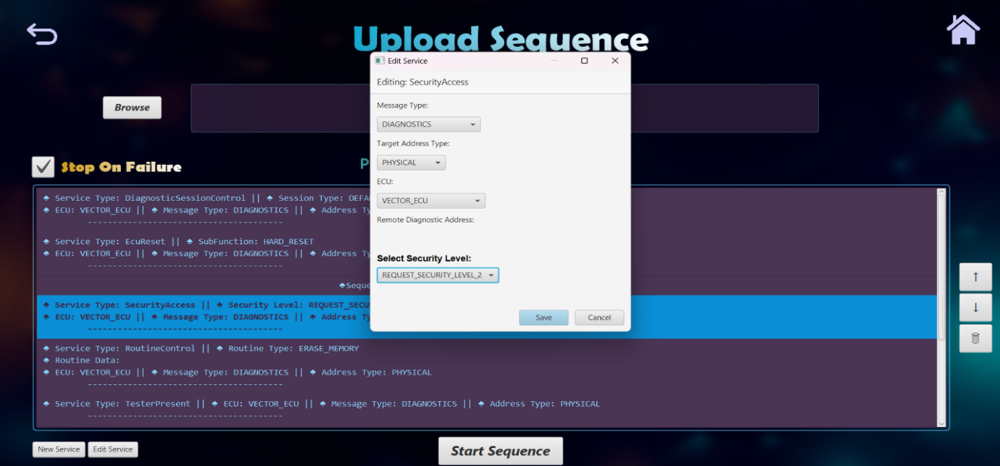
  <br/>
  <em>Figure 101: Edit added service from the list to have full control on the sequence</em>
</p>


Modify service parameters and execution order for complete sequence control.

### XML Changes

<p align="center">
  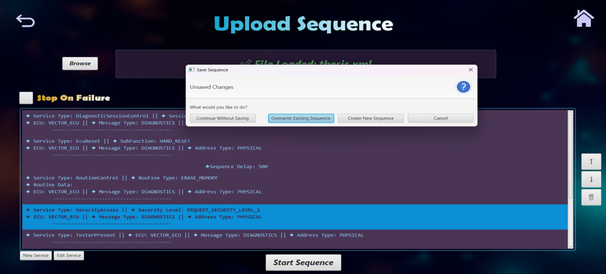
  <br/>
  <em>Figure 102: Handle changes in the uploaded XML files</em>
</p>


Manage and merge changes when sequence XML files are modified externally.

### Color-Coded Results

<p align="center">
  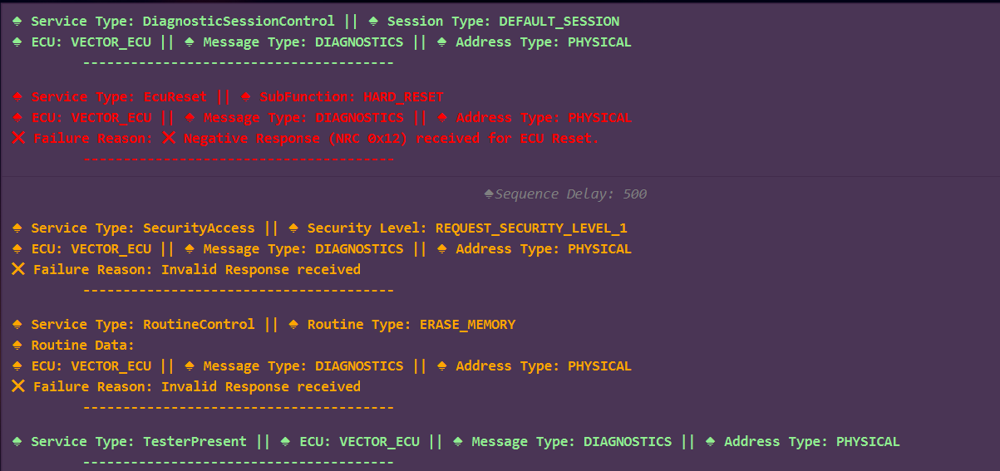
  <br/>
  <em>Figure 103: Color-coded execution results showing success or failure of each service</em>
</p>


Instant visual feedback with green (success) and red (failure) indicators for each service execution.

---

## ECU Testing

### Test Workflow

<p align="center">
  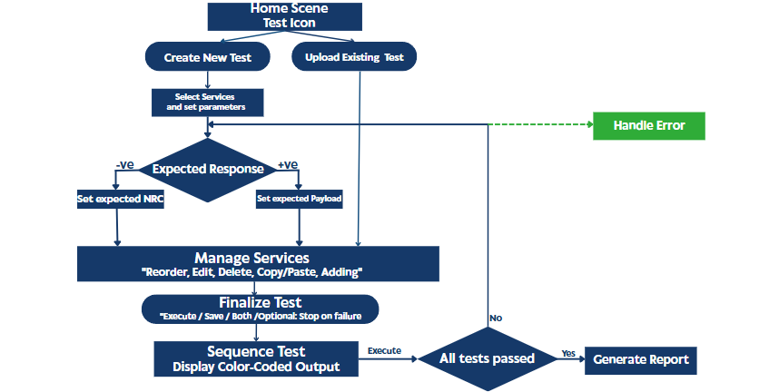
  <br/>
  <em>Figure 104: ECU Test Workflow</em>
</p>


Structured workflow for creating, executing, and reporting automated ECU tests.

### Empty Test Creation

<p align="center">
  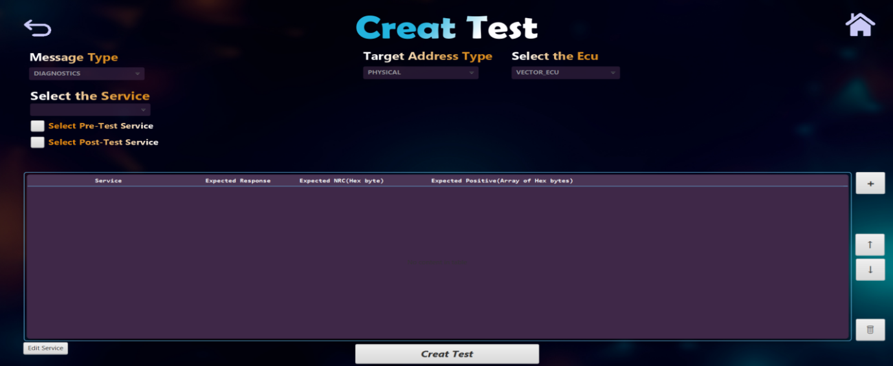
  <br/>
  <em>Figure 105: Empty test creation view before any services are added</em>
</p>


Start with a clean slate to build custom test cases from scratch.

### Test Table

<p align="center">
  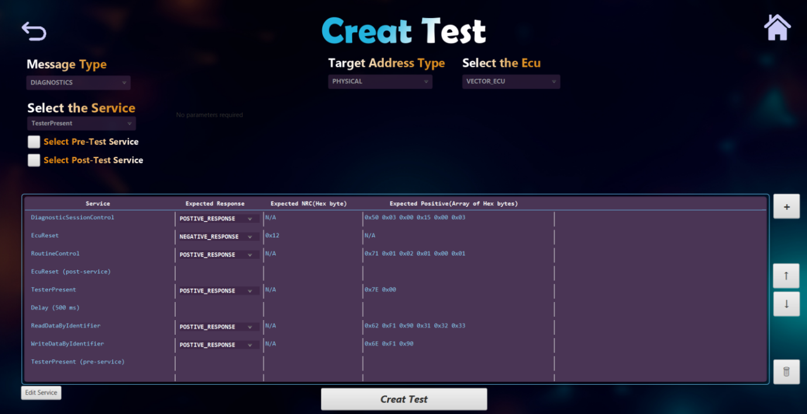
  <br/>
  <em>Figure 106: Test table view showing UDS services and their expected responses</em>
</p>


Structured table view for defining test cases with expected vs. actual responses.

### Pre and Post Services

<p align="center">
  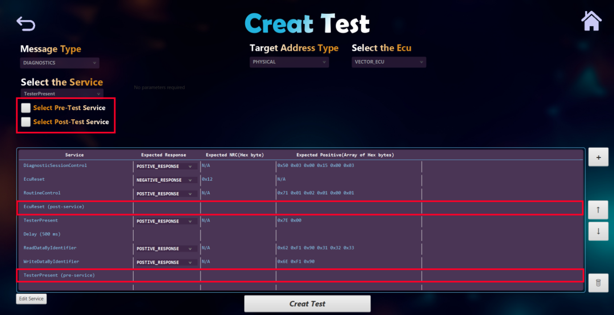
  <br/>
  <em>Figure 107: Pre and Post service checkboxes with services with no expectations</em>
</p>


Configure setup and cleanup services that run before and after main test cases.

### Test Upload

<p align="center">
  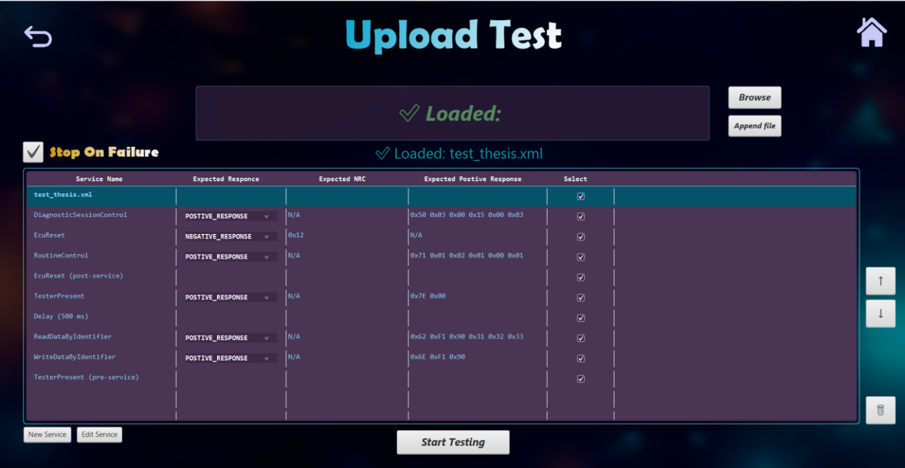
  <br/>
  <em>Figure 108: Test upload scene populated with test cases and ready for execution</em>
</p>


Load pre-defined test configurations and prepare for execution.

### Edit Test

<p align="center">
  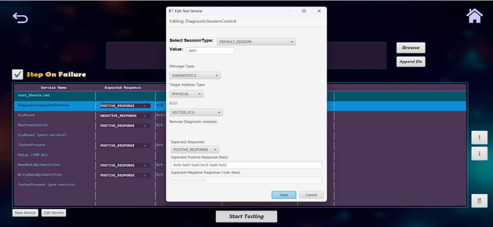
  <br/>
  <em>Figure 109: Editing a test case to update service parameters or expectations</em>
</p>


Fine-tune test parameters and expected outcomes for precise validation.

### Add Test

<p align="center">
  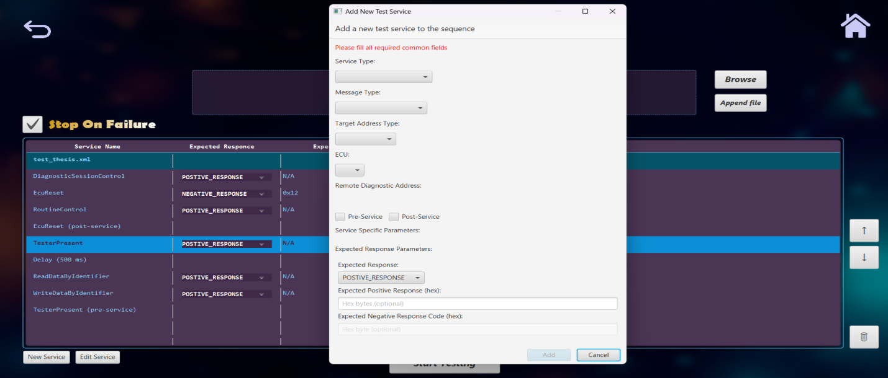
  <br/>
  <em>Figure 110: Adding a new test case with defined parameters and expected outcome</em>
</p>


Create new test cases with comprehensive parameter and expectation definitions.

### Test Status

<p align="center">
  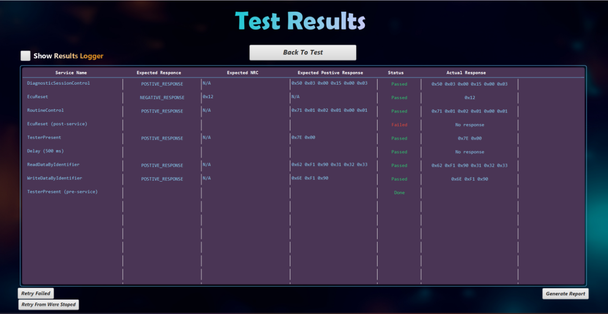
  <br/>
  <em>Figure 111: Real-time status updates for test case execution</em>
</p>


Live progress tracking with pass/fail status for each test case.

### HTML Report

<p align="center">
  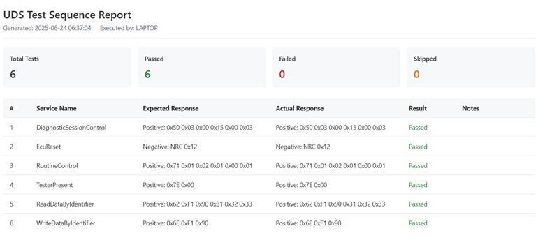
  <br/>
  <em>Figure 112: Automatically generated HTML report summarizing test results and statistics</em>
</p>


Professional HTML reports with statistics, charts, and detailed results for documentation and sharing.

---

## Advanced Features

### Logging System

<p align="center">
  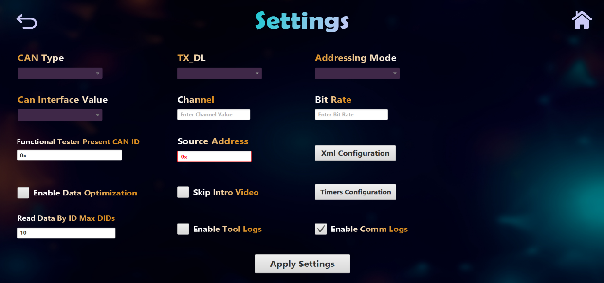
  <br/>
  <em>Figure 113: GUI checkboxes for controlling logging type</em>
</p>


Selective logging controls for different protocol layers and verbosity levels.

### Log Folder Structure

<p align="center">
  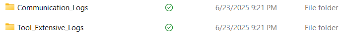
  <br/>
  <em>Figure 114: Log folder structure in our workspace</em>
</p>


Organized log storage with date-based hierarchy for easy retrieval and analysis.

### Multi-ECU Support

<p align="center">
  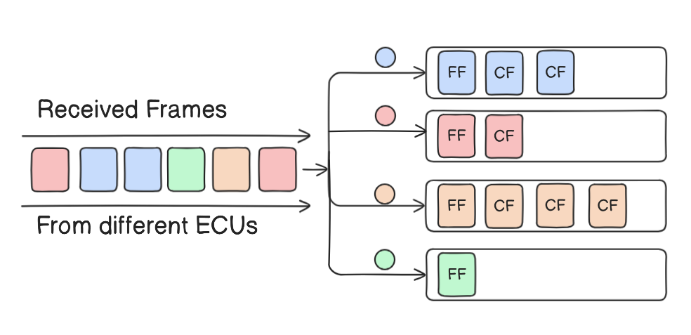
  <br/>
  <em>Figure 115: Receiving process from different ECUs</em>
</p>


Simultaneous communication with multiple ECUs with robust message routing and reassembly.

### Full-Duplex Operation

<p align="center">
  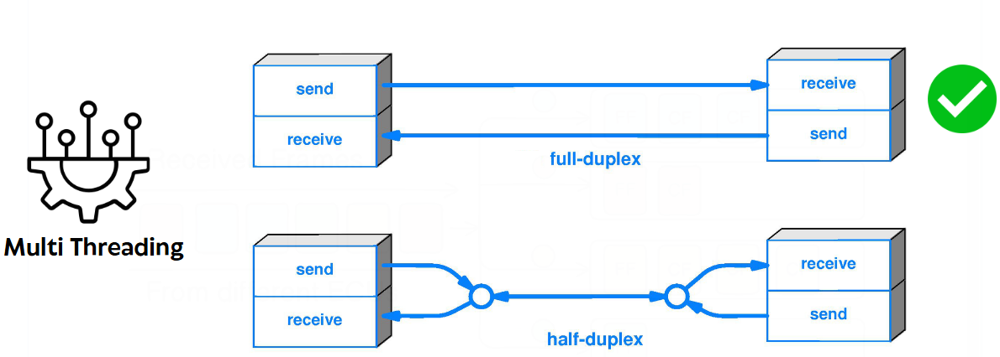
  <br/>
  <em>Figure 116: Half-duplex vs Full-duplex</em>
</p>


Comparison showing XDT's full-duplex capability enabling concurrent send and receive operations.

### AI Copilot Query

<p align="center">
  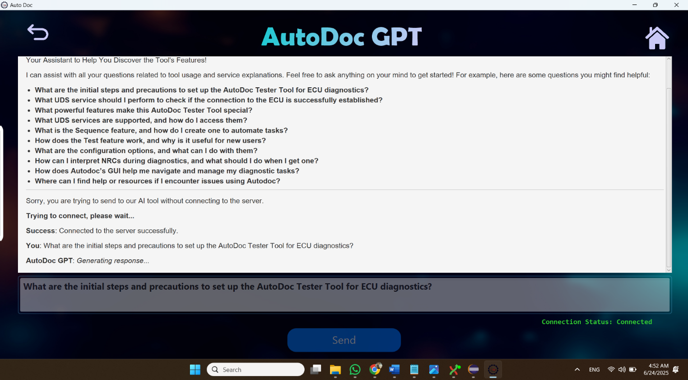
  <br/>
  <em>Figure 117: AI Copilot interface after submitting a user query, showing real-time typing</em>
</p>


Submit natural language queries to the AI assistant for diagnostic guidance.

### AI Copilot Response

<p align="center">
  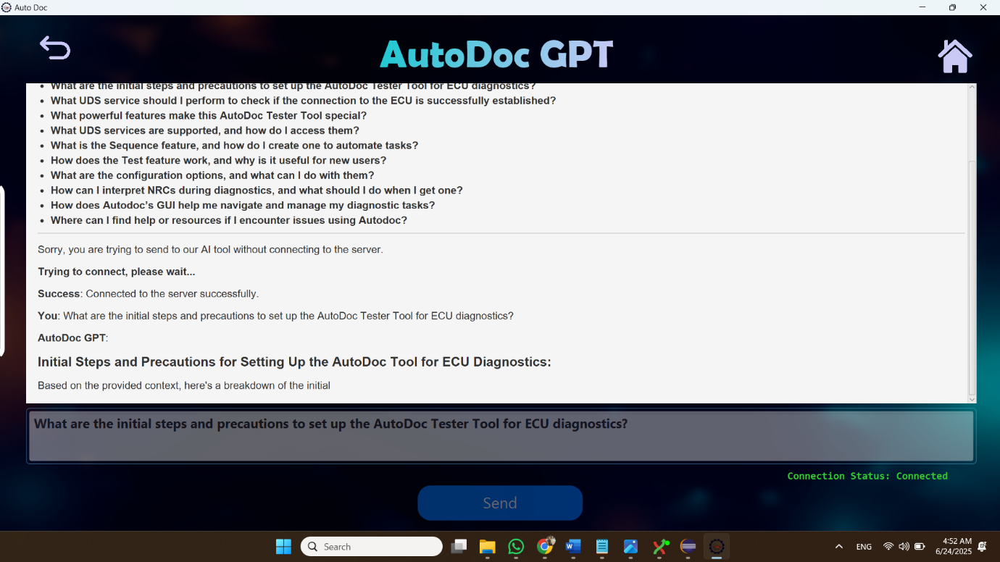
  <br/>
  <em>Figure 118: AI Copilot displaying the live-streamed response in formatted Markdown</em>
</p>


Receive intelligent, formatted responses with code suggestions and protocol explanations.

---

## Performance & Memory Management

### Memory Before Fix

<p align="center">
  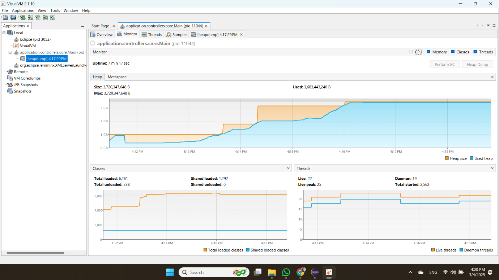
  <br/>
  <em>Figure 119: Memory usage graph before applying memory management fixes</em>
</p>


Profiling data showing memory consumption patterns before optimization.

### Memory After Fix

<p align="center">
  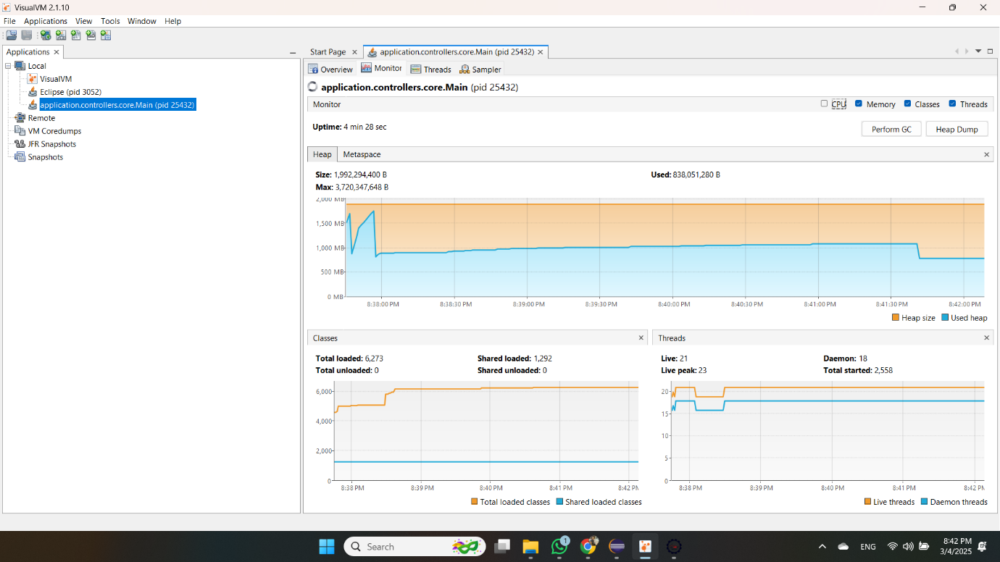
  <br/>
  <em>Figure 120: Memory usage graph after implementing garbage collection</em>
</p>


Improved memory profile after implementing targeted garbage collection and object pooling optimizations.

---

## 8.6. Styling, Responsiveness, and Accessibility

### CSS Theming

- Consistent color scheme across all scenes
- Dark theme optimized for workshop environments
- High contrast for readability

### Responsive Design

- Adaptive layouts for different screen resolutions
- Minimum supported resolution: 1280×720
- Optimal resolution: 1920×1080

### Accessibility Features

- Keyboard navigation support
- Screen reader compatibility
- Clear visual feedback for all actions

---

## 8.7. Development Tools and Backend Integration

### Development Workflow

1. **Design in SceneBuilder**: Visual layout creation with FXML
2. **Implement Controllers**: Java classes for event handling
3. **Connect to Backend**: Via GuiHelper APIs
4. **Style with CSS**: Consistent theming
5. **Test & Iterate**: Eclipse IDE debugging

### Backend Integration

Controllers communicate with backend layers through:

- **GuiHelper APIs**: Abstracted service calls
- **Event Listeners**: Real-time UI updates
- **Background Threads**: Non-blocking operations

---

## 8.8. Design Decisions and Trade-offs

### 8.8.1. JavaFX Selection

**Why JavaFX over Swing/SWT:**

- Modern UI components and animations
- Better CSS styling support
- FXML for declarative UI design
- Active community and Oracle support

### 8.8.2. Scene Preloading Strategy

- Critical scenes preloaded at startup
- Secondary scenes loaded on demand
- Balance between startup time and navigation speed

### 8.8.3. IDE and Development Environment

**Eclipse IDE chosen for:**

- Strong JavaFX plugin support
- Team collaboration features
- Integrated debugging and profiling

### 8.8.4. Use of FXML and SceneBuilder

**Benefits:**

- Designers can modify UI without touching Java code
- Visual prototyping accelerates development
- Clean separation of view and logic

### 8.8.5. Theming and Visual Design

- Automotive-inspired dark theme
- Color-coded status indicators (green=success, red=error, yellow=warning)
- Consistent iconography and typography

### 8.8.6. Java Runtime Environment Bundling

- Ensures consistent execution across target machines
- Eliminates "Java not installed" issues
- Increases package size but improves reliability

---

## 8.9. Performance Optimization and System Requirements

### System Requirements

| Requirement | Minimum           | Recommended       |
| ----------- | ----------------- | ----------------- |
| **OS**      | Windows 10        | Windows 11        |
| **RAM**     | 4 GB              | 8 GB              |
| **CPU**     | Dual-core 2.0 GHz | Quad-core 2.5 GHz |
| **Storage** | 500 MB            | 1 GB              |
| **USB**     | USB 2.0           | USB 3.0           |
| **Display** | 1280×720          | 1920×1080         |

### Performance Optimizations

| Technique          | Benefit                                      |
| ------------------ | -------------------------------------------- |
| Scene preloading   | Faster navigation between common screens     |
| Lazy loading       | Reduced startup time for infrequent features |
| Background threads | Responsive UI during long operations         |
| Memory management  | Garbage collection tuning, object pooling    |
| Image caching      | Reduced disk I/O for repeated assets         |

---

## 8.10. Error Handling and Input Validation

### Input Validation

| Validation Type       | Implementation                            |
| --------------------- | ----------------------------------------- |
| **Real-time**         | Input fields validated as user types      |
| **Range checking**    | Hex values, numeric ranges enforced       |
| **Format validation** | CAN IDs, addresses, data lengths verified |
| **Cross-field**       | Related fields validated together         |

### Error Display

| Error Type                     | UI Response                                        |
| ------------------------------ | -------------------------------------------------- |
| **CAN initialization failure** | Modal error alert with troubleshooting steps       |
| **Invalid service parameters** | Inline field highlighting with tooltip explanation |
| **ECU timeout**                | Status bar notification with retry option          |
| **Security access denied**     | Guided unlock procedure prompt                     |

### User Feedback Patterns

- **Progress bars**: For long operations (flashing, data transfer)
- **Status indicators**: Real-time connection state
- **Log panels**: Detailed operation history
- **Toast notifications**: Brief success/error messages

---

## 8.11. Final Overview

The XDT GUI successfully balances:

- **Professional appearance** with automotive industry standards
- **Ease of use** for technicians without deep protocol knowledge
- **Powerful features** for advanced users and developers
- **Extensibility** for OEM-specific customizations
- **Reliability** through robust error handling and validation

---

## 🔗 Navigation

⬅️ **[Chapter 7: File Parsing](../07-File-Parsing/README.md)** — Firmware file formats (S19, VBF)  
➡️ **[Chapter 9: Main Features](../09-Main-Features/README.md)** — Core tool features and workflows

---

<p align="center">
  
</p>


<p align="center">
  <strong>One Tool. All ECUs.</strong>
</p>


<p align="center">
  <sub>© 2025 Cairo University — Faculty of Engineering. All rights reserved.</sub>
</p>

