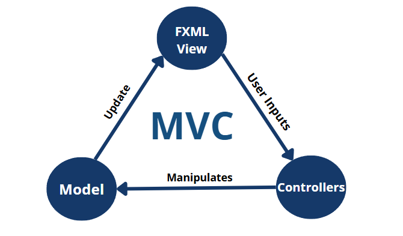
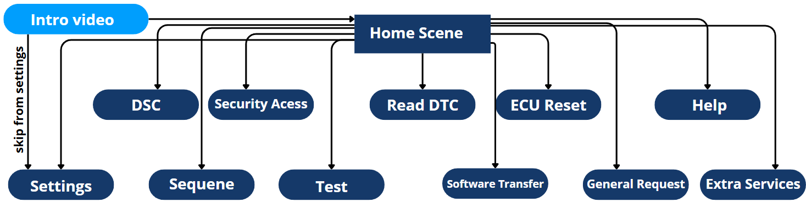

# Chapter 8: Graphical User Interface (GUI)

> **Modern, Responsive, and Professional Diagnostic Interface**

<p align="center">
  
  <br/>
  <em>Figure 67: MVC Architecture Diagram — FXML View, Model, and Controllers</em>
</p>


---

## 📌 Table of Contents

1. [Introduction](#81-introduction)
2. [Design Principles](#82-design-principles)
3. [Technology Stack](#83-technology-stack)
4. [GUI Architecture](#84-gui-architecture)
5. [Layout and Navigation](#85-layout-and-navigation-design)
6. [Styling and Responsiveness](#86-styling-responsiveness-and-accessibility)
7. [Development Tools](#87-development-tools-and-backend-integration)
8. [Design Decisions](#88-design-decisions-and-trade-offs)
9. [Performance Optimization](#89-performance-optimization-and-system-requirements)
10. [Error Handling](#810-error-handling-and-input-validation)
11. [Final Overview](#811-final-overview)

---

## 8.1. Introduction

The XDT GUI provides an interactive interface for automotive technicians, engineers, and technical service personnel. It simplifies complex diagnostic workflows while providing:

- Diagnostic data visualization
- ECU response management
- Runtime parameter configuration
- Guided tool workflows

---

## 8.2. Design Principles

The GUI follows **Object-Oriented Programming (OOP)** principles:

| Principle             | Application                                |
| --------------------- | ------------------------------------------ |
| **Modularity**        | Independent UI components for each feature |
| **Maintainability**   | Clean separation between view and logic    |
| **Extensibility**     | Easy to add new services and screens       |
| **Memory Efficiency** | Optimized for resource-constrained systems |
| **Thread Safety**     | Smooth operation during long-running tasks |

---

## 8.3. Technology Stack

| Technology       | Purpose                                                      |
| ---------------- | ------------------------------------------------------------ |
| **Java**         | Core programming language                                    |
| **JavaFX**       | Primary UI framework — modern, responsive desktop applications |
| **FXML**         | XML-based declarative UI design                              |
| **SceneBuilder** | Visual drag-and-drop UI design tool                          |
| **CSS**          | Consistent styling and theming                               |
| **Eclipse IDE**  | Development environment                                      |

### JavaFX Advantages

- Dynamic interfaces with real-time updates
- Multimedia integration (intro videos, animations)
- Cross-platform compatibility (Windows 10/11 target)
- Rich set of UI controls

### Application Bundle

- Bundled with **Java Runtime Environment (JRE)**
- No external dependencies required
- Lightweight **~150MB** package

---

## 8.4. GUI Architecture

XDT follows the **Model-View-Controller (MVC)** pattern:

<p align="center">
  
  <br/>
  <em>Figure 67: MVC Architecture — Separation of concerns</em>
</p>


### Architecture Components

| Component      | Responsibility                                               | Technology                                                   |
| -------------- | ------------------------------------------------------------ | ------------------------------------------------------------ |
| **View**       | Visual structure and rendering                               | FXML, JavaFX components (buttons, text fields, labels, ImageView) |
| **Controller** | User interaction handling, event logic, backend communication | Java classes linked to each FXML view                        |
| **Model**      | User configurations and runtime state                        | Java objects, configuration files                            |

### Communication Flow

```
User Input → Controller → Model (update state) → View (refresh display)
     ↑_____________________________________________________|
```

### Utility Classes

- **GuiHelper**: Common backend API communication
- **Configuration Loader**: Runtime settings management
- **Validation Helpers**: Input validation and error checking

---

## 8.5. Layout and Navigation Design

<p align="center">
  
  <br/>
  <em>Figure 68: Layout and Navigation Design — Scene hierarchy</em>
</p>


### Scene Structure

1. **Intro Video** (MediaView-based)
   - Auto-plays on application launch
   - Click to skip to welcome screen

2. **Welcome Screen**
   - Welcome image
   - Navigation link to home screen

3. **Home Scene** (Central Dashboard)
   - 11 CU-themed ImageView components
   - Each navigates to a key functionality

4. **Feature Scenes**
   - DSC, Security Access, Read DTC, ECU Reset, Software Transfer, etc.

### Navigation Elements

| Element                 | Location  | Function                              |
| ----------------------- | --------- | ------------------------------------- |
| **Home Button**         | Top right | Return to home scene                  |
| **Back Button**         | Top left  | Return to previous scene              |
| **Collapsible Sidebar** | Left edge | Expands on hover for quick access     |
| **Keyboard Shortcuts**  | Global    | Quick actions (e.g., Ctrl+H for home) |
| **Tooltips**            | Hover     | Contextual help for each element      |

### Supported Scenes

| Scene             | Purpose                                          |
| ----------------- | ------------------------------------------------ |
| Settings          | Tool configuration, timing parameters, OEM setup |
| DSC               | Diagnostic Session Control                       |
| Security Access   | Seed-Key authentication                          |
| Read DTC          | Diagnostic Trouble Code retrieval                |
| ECU Reset         | ECU restart operations                           |
| Sequence          | Multi-service automation                         |
| Test              | Automated ECU testing                            |
| Software Transfer | Firmware download/upload                         |
| General Request   | Custom UDS service requests                      |
| Extra Services    | Additional OEM-specific services                 |
| Help              | Documentation and guidance                       |

---

## 8.6. Styling, Responsiveness, and Accessibility

### CSS Theming

- Consistent color scheme across all scenes
- Dark theme optimized for workshop environments
- High contrast for readability

### Responsive Design

- Adaptive layouts for different screen resolutions
- Minimum supported resolution: 1280×720
- Optimal resolution: 1920×1080

### Accessibility Features

- Keyboard navigation support
- Screen reader compatibility
- Clear visual feedback for all actions

---

## 8.7. Development Tools and Backend Integration

### Development Workflow

1. **Design in SceneBuilder**: Visual layout creation with FXML
2. **Implement Controllers**: Java classes for event handling
3. **Connect to Backend**: Via GuiHelper APIs
4. **Style with CSS**: Consistent theming
5. **Test & Iterate**: Eclipse IDE debugging

### Backend Integration

Controllers communicate with backend layers through:

- **GuiHelper APIs**: Abstracted service calls
- **Event Listeners**: Real-time UI updates
- **Background Threads**: Non-blocking operations

---

## 8.8. Design Decisions and Trade-offs

### 8.8.1. JavaFX Selection

**Why JavaFX over Swing/SWT:**

- Modern UI components and animations
- Better CSS styling support
- FXML for declarative UI design
- Active community and Oracle support

### 8.8.2. Scene Preloading Strategy

- Critical scenes preloaded at startup
- Secondary scenes loaded on demand
- Balance between startup time and navigation speed

### 8.8.3. IDE and Development Environment

**Eclipse IDE chosen for:**

- Strong JavaFX plugin support
- Team collaboration features
- Integrated debugging and profiling

### 8.8.4. Use of FXML and SceneBuilder

**Benefits:**

- Designers can modify UI without touching Java code
- Visual prototyping accelerates development
- Clean separation of view and logic

### 8.8.5. Theming and Visual Design

- Automotive-inspired dark theme
- Color-coded status indicators (green=success, red=error, yellow=warning)
- Consistent iconography and typography

### 8.8.6. Java Runtime Environment Bundling

- Ensures consistent execution across target machines
- Eliminates "Java not installed" issues
- Increases package size but improves reliability

---

## 8.9. Performance Optimization and System Requirements

### System Requirements

| Requirement | Minimum           | Recommended       |
| ----------- | ----------------- | ----------------- |
| **OS**      | Windows 10        | Windows 11        |
| **RAM**     | 4 GB              | 8 GB              |
| **CPU**     | Dual-core 2.0 GHz | Quad-core 2.5 GHz |
| **Storage** | 500 MB            | 1 GB              |
| **USB**     | USB 2.0           | USB 3.0           |
| **Display** | 1280×720          | 1920×1080         |

### Performance Optimizations

| Technique          | Benefit                                      |
| ------------------ | -------------------------------------------- |
| Scene preloading   | Faster navigation between common screens     |
| Lazy loading       | Reduced startup time for infrequent features |
| Background threads | Responsive UI during long operations         |
| Memory management  | Garbage collection tuning, object pooling    |
| Image caching      | Reduced disk I/O for repeated assets         |

---

## 8.10. Error Handling and Input Validation

### Input Validation

| Validation Type       | Implementation                            |
| --------------------- | ----------------------------------------- |
| **Real-time**         | Input fields validated as user types      |
| **Range checking**    | Hex values, numeric ranges enforced       |
| **Format validation** | CAN IDs, addresses, data lengths verified |
| **Cross-field**       | Related fields validated together         |

### Error Display

| Error Type                     | UI Response                                        |
| ------------------------------ | -------------------------------------------------- |
| **CAN initialization failure** | Modal error alert with troubleshooting steps       |
| **Invalid service parameters** | Inline field highlighting with tooltip explanation |
| **ECU timeout**                | Status bar notification with retry option          |
| **Security access denied**     | Guided unlock procedure prompt                     |

### User Feedback Patterns

- **Progress bars**: For long operations (flashing, data transfer)
- **Status indicators**: Real-time connection state
- **Log panels**: Detailed operation history
- **Toast notifications**: Brief success/error messages

---

## 8.11. Final Overview

The XDT GUI successfully balances:

- **Professional appearance** with automotive industry standards
- **Ease of use** for technicians without deep protocol knowledge
- **Powerful features** for advanced users and developers
- **Extensibility** for OEM-specific customizations
- **Reliability** through robust error handling and validation

---

## 🔗 Navigation

⬅️ **[Chapter 7: File Parsing](../07-File-Parsing/README.md)** — Firmware file formats (S19, VBF)  
➡️ **[Chapter 9: Main Features](../09-Main-Features/README.md)** — Core tool features and workflows

---

<p align="center">
  <sub>© 2025 Cairo University — Faculty of Engineering. All rights reserved.</sub>
</p>

