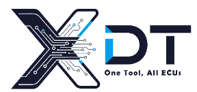
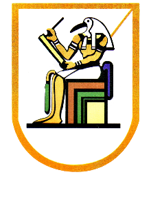
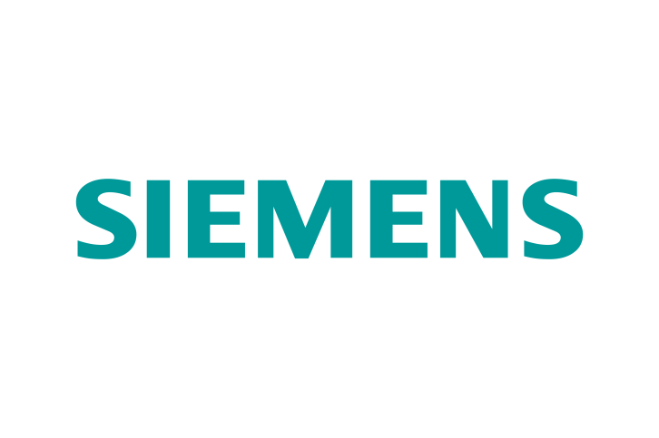

<div align="center">



# 🚗 XDT — eXpert Diagnostic Tool

### Professional Automotive Diagnostic Platform

**Unified Diagnostic Services (UDS) Tester Tool**

*Designed for ECU Diagnostics, Firmware Flashing, Vehicle Validation, and Automotive Development*

<br>


### 🔧 One Tool. All ECUs.

</div>

---

<div align="center">

<table>
<tr>

<td align="center">
<br>
<b>Cairo University</b>
</td>

<td align="center">
<br>
<b>Faculty of Engineering</b>
</td>

<td align="center">
<br>
<b>Siemens DISW</b>
</td>

</tr>
</table>

</div>

---

# 📋 Project Overview

**XDT (eXpert Diagnostic Tool)** is a professional desktop application developed for off-board automotive diagnostics using the Unified Diagnostic Services (UDS) protocol over Diagnostic Communication over CAN (DoCAN).

The project was developed as a Graduation Project at Cairo University – Faculty of Engineering – Electronics and Electrical Communications Department under the sponsorship of Siemens Digital Industries Software (DISW).

This repository contains the complete technical documentation of the project.

> ⚠️ Source code is proprietary and not publicly available.

---

# 🌟 Why XDT?

Modern vehicles contain dozens of Electronic Control Units (ECUs) requiring standardized diagnostic communication for development, validation, maintenance, and software updates.

XDT provides a complete diagnostic ecosystem that enables engineers to:

* 🚗 Communicate with ECUs using ISO-standardized UDS services
* 🔐 Perform Security Access authentication
* 📊 Monitor vehicle data in real time
* 🛠 Flash ECU firmware
* 🧪 Automate ECU testing procedures
* 📈 Analyze communication logs
* 🤖 Receive AI-assisted diagnostic guidance

---

# ✨ Highlights

| Feature                     | Description                       |
| --------------------------- | --------------------------------- |
| 🚗 UDS Diagnostics          | Full ISO 14229 implementation     |
| 🌐 DoCAN Support            | Complete ISO 15765-2 stack        |
| ⚡ Full Duplex Communication | Simultaneous TX/RX                |
| 🔧 ECU Flashing             | S19 & VBF support                 |
| 🧩 XML Configuration        | OEM adaptable                     |
| 🤖 AI Copilot               | Intelligent diagnostic assistance |
| 📊 Advanced Logging         | Structured reports                |
| 🚀 Multi-ECU Support        | Parallel communication            |

---

# 📈 Project Metrics

| Metric                 | Value        |
| ---------------------- | ------------ |
| Programming Language   | Java         |
| GUI Framework          | JavaFX       |
| ISO Standards          | 5            |
| UDS Services Supported | 20+          |
| ECU Support            | Multi-ECU    |
| Team Members           | 7            |
| Development Duration   | 8 Months     |
| Sponsor                | Siemens DISW |

---

# 🖥️ Application Screenshots

<div align="center">

| Dashboard                                     | Diagnostic Console                                     |
| --------------------------------------------- | ------------------------------------------------------ |
|  |  |

| ECU Configuration                              | Flashing Manager                             |
| ---------------------------------------------- | -------------------------------------------- |
|  |  |

</div>

> Replace placeholders with actual screenshots.

---

# 🏗️ System Architecture

<p align="center">

</p>

XDT follows a layered architecture inspired by the OSI model.

```text
GUI (JavaFX)
      │
Application Layer (ISO 14229-1)
      │
Session Layer (ISO 14229-2)
      │
Network/Transport Layer (ISO 15765-2)
      │
CAN Data Link Layer
      │
USB-to-CAN Interface
      │
ECU
```

---

# 📂 Repository Structure

```text
XDT-Documentation/
│
├── README.md
├── images/
│
├── 01-Introduction/
├── 02-Project-Overview/
├── 03-Application-Layer/
├── 04-Session-Layer/
├── 05-Network-Transport-Layer-DoCAN/
├── 06-Data-Link-Layer/
├── 07-File-Parsing/
├── 08-Graphical-User-Interface/
├── 09-Main-Features/
├── 10-Challenges-and-Solutions/
├── 11-Future-Work/
└── 12-Appendix/
```

---

# 🚀 Supported Diagnostic Services

| Service                          | SID  |
| -------------------------------- | ---- |
| Diagnostic Session Control       | 0x10 |
| ECU Reset                        | 0x11 |
| Security Access                  | 0x27 |
| Communication Control            | 0x28 |
| Tester Present                   | 0x3E |
| Read Data By Identifier          | 0x22 |
| Read Data By Periodic Identifier | 0x2A |
| Dynamically Define DID           | 0x2C |
| Write Data By Identifier         | 0x2E |
| Read DTC Information             | 0x19 |
| Routine Control                  | 0x31 |
| Request Download                 | 0x34 |
| Request Upload                   | 0x35 |
| Transfer Data                    | 0x36 |
| Request Transfer Exit            | 0x37 |

---

# 🔥 Advanced Features

### Firmware Flashing

* S19 Support
* VBF Support
* Download Workflow
* Upload Workflow

### ECU Testing Framework

* Automated Test Cases
* Pass/Fail Reports
* Regression Testing

### XML Configuration Engine

* OEM Adaptability
* ECU Profiles
* Service Definitions

### AI Copilot

* Diagnostic Guidance
* Error Explanation
* Service Recommendations

### Logging System

* Structured Logs
* Session Tracking
* Diagnostic Reports

---

# 📜 Standards Compliance

| Standard    | Description                 |
| ----------- | --------------------------- |
| ISO 14229-1 | Unified Diagnostic Services |
| ISO 14229-2 | Session Layer Services      |
| ISO 15765-2 | DoCAN                       |
| ISO 11898-1 | CAN Data Link Layer         |
| ISO 11898-2 | CAN Physical Layer          |

---

# 🛠️ Technology Stack

| Layer              | Technology           |
| ------------------ | -------------------- |
| Front-End          | JavaFX               |
| UI Definition      | FXML                 |
| Styling            | CSS                  |
| Application Layer  | ISO 14229            |
| Session Layer      | ISO 14229-2          |
| Transport Layer    | ISO 15765-2          |
| CAN Interface      | Python CAN           |
| Gateway            | Py4J                 |
| IDE                | Eclipse              |
| Build System       | Maven / Gradle       |
| Project Management | Jira, Git, Bitbucket |

---

# 📊 Development Timeline

| Phase   | Focus                   |
| ------- | ----------------------- |
| Phase 1 | Learning & Research     |
| Phase 2 | Requirements Analysis   |
| Phase 3 | Architecture Design     |
| Phase 4 | Core Development        |
| Phase 5 | Testing & Documentation |

---

# 🎓 Academic Information

| Field        | Details                                 |
| ------------ | --------------------------------------- |
| University   | Cairo University                        |
| Faculty      | Faculty of Engineering                  |
| Department   | Electronics & Electrical Communications |
| Project Type | Graduation Project                      |
| Sponsor      | Siemens DISW                            |
| Supervisor   | Prof. Neamat Abdel Kader                |
| Mentor       | Eng. Islam Gamal                        |

---

# 👥 Team Members

* Karim Ayman Refaat
* Gomaa Mohamed Gamal
* Mohamed Ahmed Mohamed Ahmed
* Mohamed Shawky
* Janna Wael Ali Ali
* Sohaila Mohamed Nasr
* Reem Mohy Eldin Abdelrahman

---

# 🏅 Skills Demonstrated

* Automotive Diagnostics (UDS)
* CAN Communication
* Protocol Stack Development
* Layered Software Architecture
* Java Desktop Development
* ECU Flashing Mechanisms
* Automotive Cybersecurity Concepts
* XML Configuration Systems
* Multi-threading
* Software Testing & Validation

---

# 📖 Documentation Guide

1. Start with **01-Introduction**
2. Continue to **02-Project-Overview**
3. Explore the protocol stack layers
4. Review File Parsing and GUI sections
5. Examine Features and Challenges
6. Finish with Future Work and Appendix

---


<div align="center">


## XDT — eXpert Diagnostic Tool

### Professional Automotive Diagnostic Platform

**One Tool. All ECUs.**

© 2025 Cairo University – Faculty of Engineering

</div>
